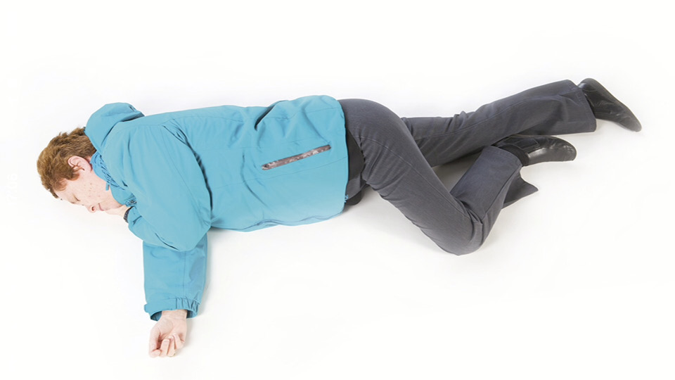

Annex 7. First aid on the road
==============================

Information about first aid on the road, including dealing with danger, getting help, helping those involved, and providing emergency care. 

The following information was compiled with the help of St John Ambulance, the British Heart Foundation and the British Red Cross. It’s intended as a general guide for those without first-aid training but shouldn’t be considered a substitute for proper training. Any first aid given at the scene of an incident should be looked on only as a temporary measure until the emergency services arrive.

1. Deal with danger
-------------------

 

Further collisions and fire are the main dangers following a crash. Approach any vehicle involved with care, watching out for spilt oil or broken glass. Switch off all engines and, if possible, warn other traffic. If you have a vehicle, switch on your hazard warning lights. Stop anyone from smoking, and put on the gloves from your first-aid kit if you have one.

 

2. Get help
-----------

 

If you can do so safely, try to get the help of bystanders. Get someone to call the appropriate emergency services on 999 or 112 as soon as possible. They’ll need to know the exact location
of the incident (including the direction of traffic, for example, northbound) and the number of vehicles involved. Try to give information about the condition of any casualties, for example, if anyone is having difficulty breathing, is bleeding heavily, is trapped in a vehicle or doesn’t respond when spoken to.

 

3. Help those involved
----------------------

 

**DO NOT** move casualties from their vehicles unless there’s the threat of further danger. **DO NOT** remove a motorcyclist’s helmet unless it’s essential. **DO** try to keep casualties warm, dry and as comfortable as you can. **DO** give reassurance confidently and try not to leave them alone or let them wander into the path of other traffic. **DO NOT** give them anything to eat or drink.

 

4. Provide emergency care
-------------------------

 

Remember the letters **D** **R** **A** **B** **C**:

**D - Danger** Check that it’s safe to approach.

**R - Response** Try to get a response by gently shaking the casualty’s shoulders and asking loudly ‘Are you all right?’ If they respond, check for injuries.

**A - Airway** If there’s no response, open the casualty’s airway by placing your fingers under their chin and lifting it forward.

If the casualty is unconscious and breathing, place them in the recovery position until medical help arrives**B - Breathing** Check that the casualty is breathing normally. Look for chest movements, look and listen for breathing, and feel for breath on your cheek.

If there are no signs of breathing, start CPR. Interlock your fingers, place them in the centre of the casualty’s chest and press down hard and fast – around 5 to 6 centimetres and about twice a second. You may only need one hand for a child and shouldn’t press down as far. For infants, use two fingers in the middle of the chest and press down about a third of the chest depth. Don’t stop until the casualty starts breathing again or a medical professional takes over.

**C - Circulation** If the casualty is responsive and breathing, check for signs of bleeding. Protect yourself from exposure to blood and check for anything that may be in the wound, such as glass. Don’t remove anything that’s stuck in the wound. Taking care not to press on the object, build up padding on either side of the object. If nothing is embedded, apply firm pressure over the wound to stem the flow of blood. As soon as practical, fasten a pad to the wound with a bandage or length of cloth. Use the cleanest material available.

### Burns

Put out any flames, taking care for your own safety. Cool the burn for at least 20 minutes with plenty of clean, cool water. Cover the burn with cling film if available. Don’t try to remove
anything that’s sticking to the burn.

### Be prepared

Always carry a first aid kit – you might never need it, but it could save a life. Learn first aid – you can get first aid training from a qualified organisation such as [St John Ambulance](http://www.sja.org.uk/sja/default.aspx), [St Andrew’s First Aid](http://www.firstaid.org.uk), [British Red Cross](http://www.redcross.org.uk/What-we-do/First-aid/First-aid-training), or any suitable, qualified body.
