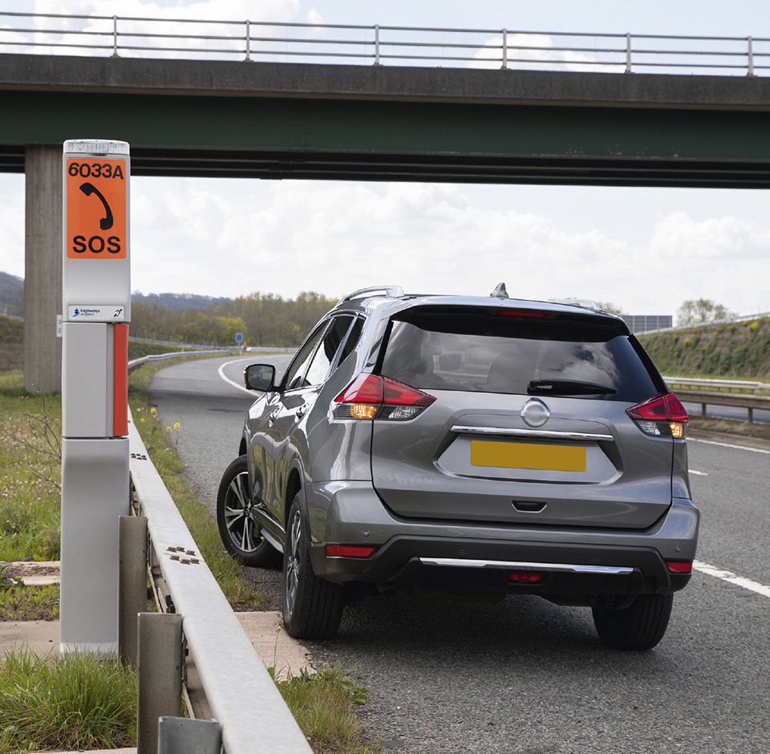
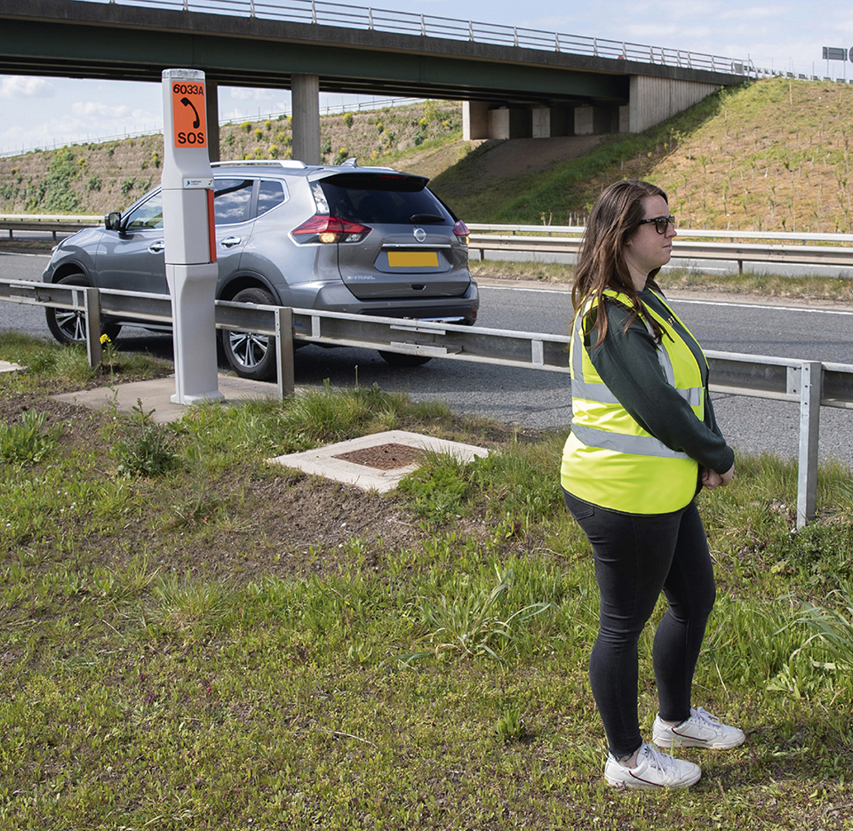
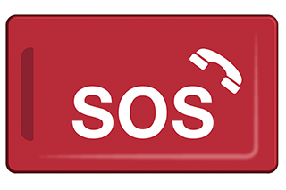
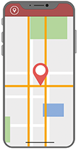
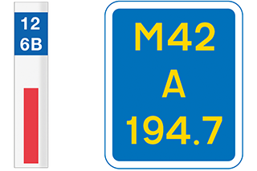
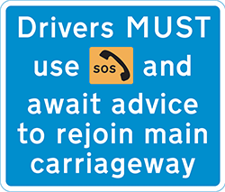

Breakdowns and incidents (275 to 287)
=====================================

Rules for breakdowns and incidents, including rules for motorways, obstructions, incidents, incidents involving dangerous goods and documents.

Place of relative safety (rule 275)
-----------------------------------

### Rule 275

If you need to stop your vehicle in the event of a breakdown or incident, try to stop in a place of relative safety. A place of relative safety is where you, your passengers and your vehicle are less likely to be at risk from moving traffic.

The safest place to stop is a location which is designed for parking. On motorways and other high-speed roads, the safest place to stop is a service area. Other places of relative safety include

* lay-bys
* emergency areas (see [Rule 270](/pages/motorways-253-to-273.md#rule-270))
* hard shoulders (see [Rule 269](/pages/motorways-253-to-273.md#rule-269)).

Be aware that hard shoulders provide less protection than other places of relative safety because they are so close to high-speed traffic.

You and your passengers should, where possible, keep well away from your vehicle and moving traffic. Otherwise moving traffic could collide with your vehicle, forcing it into you and your passengers.

Breakdowns (rule 276)
---------------------

### Rule 276

If your vehicle breaks down, think first of all other road users and

* get your vehicle off the road if possible
* warn other traffic by using your hazard warning lights if your vehicle is causing an obstruction
* help other road users see you by wearing light-coloured or fluorescent clothing in daylight and reflective clothing at night or in poor visibility
* put a warning triangle on the road at least 45 metres (147 feet) behind your broken-down vehicle on the same side of the road, or use other permitted warning devices if you have them. Always take great care when placing or retrieving them, but never use them on motorways
* if possible, keep your sidelights on if it is dark or visibility is poor
* do not stand (or let anybody else stand) between your vehicle and oncoming traffic
* at night or in poor visibility do not stand where you will prevent other road users seeing your lights

Additional rules for motorways (rules 277 to 278)
-------------------------------------------------

### Rule 277

If your vehicle develops a problem, leave the carriageway at the next exit or pull into a service area if possible (see [Rule 275](/pages/breakdowns-and-incidents-274-to-287.md#rule-275) for places of relative safety). If you cannot, you should

**Go left**

* move into the left lane
* pull into an emergency area or onto a hard shoulder if you can
* stop as far to the left as possible, leaving space to exit your vehicle and with your wheels turned to the left
* if you can, stop just beyond an emergency telephone
* switch your hazard warning lights on
* if it’s dark or visibility is poor, use sidelights.

**Get safe**

* exit your vehicle by the side furthest from traffic, if it is safe and possible to do so, and ensure passengers do the same

If you can’t

* get your vehicle to the left lane or a place of relative safety (see [Rule 275](/pages/breakdowns-and-incidents-274-to-287.md#rule-275)), and
* exit your vehicle safely to get well away from it and moving traffic,

you should

* stay in your vehicle
* keep your seatbelts and hazard warning lights on
* call 999 immediately and ask for the police. Alternatively, press your SOS button if your vehicle has one and ask for the police.

* put on high-visibility clothing if you have it and it is within easy reach
* get behind a safety barrier where there is one, but be aware of any unseen hazards such as sudden drops, uneven ground or debris
* **DO NOT** stand in a place where your vehicle could be forced into you if moving traffic collides with it
* **DO NOT** return to your vehicle even if it’s raining, cold or dark
* remain alert and aware of vehicles or debris coming towards you
* keep passengers away from the carriageway and children under control
* **DO NOT** attempt repairs on your vehicle
* **DO NOT** place a warning triangle on the carriageway
* animals **MUST** be kept in the vehicle or, in an emergency, under control on the verge.

Rule 277: Keep well away from your vehicle and moving traffic

Rule 277: Keep well away from your vehicle and moving traffic**Get help**

* use the free emergency telephone to obtain advice and assistance
* contact a breakdown recovery service
* always face the traffic when you speak to remain aware of vehicles or debris coming towards you
* inform them if you are a vulnerable motorist such as disabled, older or travelling alone
* wait well away from your vehicle and moving traffic, behind the safety barrier where there is one
* if you are unable to exit your vehicle or if you have not stopped near a free emergency telephone, call 999 immediately and ask for the police. Alternatively, press your SOS button if your vehicle has one and ask for the police.

**Communicating your location.** How to identify your location to the emergency services.

||
| --- | --- |
| **eCall**. Press the SOS button if your vehicle has one. |  |
| **App**. Use a mobile telephone mapping application. |  |
| **Marker post or driver location sign**. Quote the numbers and letters on marker posts or driver location signs which are located along the edge of the road. |  |

**Laws [MT(E&W)R reg 14](https://www.legislation.gov.uk/uksi/1982/1163/regulation/14/made) & [MT(S)R reg 12](https://www.legislation.gov.uk/uksi/1995/2507/regulation/12/made)**

### Rule 278

To rejoin the carriageway after a breakdown from

* a hard shoulder, build up speed, indicate and watch for a safe gap in the traffic. Be aware that vehicles, obstructions or debris may be present on the hard shoulder
* an emergency area, you **MUST** use the emergency telephone provided and follow the operator’s advice for exiting the emergency area. A lane may need to be closed so that you can rejoin the carriageway safely.

Rule 278: Emergency area information sign**Law [RTA 1988 sect 36](https://www.legislation.gov.uk/ukpga/1988/52/section/36/enacted)**

### Rule 279

**Disabled drivers.** If you have a disability that prevents you from following the above advice in [Rules 277](/pages/breakdowns-and-incidents-274-to-287.md#rule-277) and [278](/pages/breakdowns-and-incidents-274-to-287.md#rule-278), you should

* switch on your hazard warning lights
* stay in your vehicle and keep your seat belt on
* call 999 immediately and ask for the police. Alternatively, press your SOS button if your vehicle has one and ask for the police.

If you are deaf, hard of hearing or speech impaired, it is recommended that you register for the 999 text service (emergencySMS.net) before making a journey.

Obstructions (rule 280)
-----------------------

### Rule 280

If anything falls from a vehicle on to a motorway or other high-speed road, **DO NOT** remove the obstruction yourself. Stop in a place of relative safety (see [Rule 275](/pages/breakdowns-and-incidents-274-to-287.md#rule-275)) and call the emergency services on 999.

On other roads, you should only remove obstructions if it is safe to do so.

Incidents (rules 281 to 283)
----------------------------

### Rule 281

**Warning signs or flashing lights.** If you see emergency or incident support vehicles displaying flashing lights in the distance, be aware there may be an incident ahead (see [Rule 219](/pages/road-users-requiring-extra-care-204-to-225.md#rule-219)). You should slow down and be prepared to move safely into another lane or stop.

The emergency services, traffic officers and recovery workers may be required to work in the carriageway; for example, dealing with debris, collisions or conducting rolling roadblocks. You **MUST** follow any directions given by police or traffic officers as to whether you can safely pass the incident or obstruction.

**Laws [RTA 1988 sects 35](https://www.legislation.gov.uk/ukpga/1988/52/section/35/enacted) & [163](https://www.legislation.gov.uk/ukpga/1988/52/section/163/enacted) as amended by [TMA sect 6](https://www.legislation.gov.uk/ukpga/2004/18/section/6/enacted)**

### Rule 282

When passing the scene of an incident, remain alert for hazards (such as debris or slow-moving vehicles) and do not slow down unnecessarily (for example, if an incident is on the other side of a dual carriageway). You should focus on the road ahead when passing an incident because a lack of attention may cause a further incident, collision or congestion (see also [Rule 283](/pages/breakdowns-and-incidents-274-to-287.md#rule-283), below).

### Rule 283

If you are involved in an incident or collision or stop to give assistance

* if possible, stop in a place of relative safety (see [Rule 275](/pages/breakdowns-and-incidents-274-to-287.md#rule-275))
* use your hazard warning lights to warn other traffic
* put on high-visibility clothing if you have it
* ask drivers to switch off their engines
* ask drivers and passengers to stop smoking
* contact the emergency services on 999 and provide full details of the incident location and any casualties. Use an emergency telephone, a mobile telephone, or press the SOS button if your vehicle has one (see [Rule 277](/pages/breakdowns-and-incidents-274-to-287.md#rule-277) on how to identify your location on a motorway or other high-speed road)
* move uninjured people away from the vehicles to a place of relative safety (see [Rule 275](/pages/breakdowns-and-incidents-274-to-287.md#rule-275))
* **DO NOT** move injured people from their vehicles unless they are in immediate danger
* **DO NOT** remove a motorcyclist’s helmet unless it is essential and you are trained to do so
* be prepared to give first aid (see [Annex 7](/pages/annex-7-first-aid-on-the-road.md) and [Useful websites](/pages/other-information.md#websites))
* stay at the scene until the emergency services arrive
* be prepared to exchange details (see [Rule 286](/pages/breakdowns-and-incidents-274-to-287.md#rule-286)).

If you are involved in any other medical emergency, you should contact the emergency services in the same way.

Incidents involving dangerous goods (rules 284 to 285)
------------------------------------------------------

### Rule 284

Vehicles carrying dangerous goods in packages will be marked with plain orange reflective plates. Road tankers and vehicles carrying tank containers of dangerous goods will have hazard warning plates (see ‘[Vehicle markings](/pages/vehicle-markings.md)’).

### Rule 285

If an incident involves a vehicle containing dangerous goods, follow the advice in [Rule 283](#rule-283) and, in particular

* switch off engines and **DO NOT SMOKE**
* keep well away from the vehicle and do not be tempted to try to rescue casualties as you yourself could become one
* call the emergency services and give as much information as possible about the labels and markings on the vehicle. **DO NOT** use a mobile phone close to a vehicle carrying flammable loads.

Documentation (rules 286 to 287)
--------------------------------

### Rule 286

If you are involved in a collision which causes damage or injury to any other person, vehicle, animal or property, you **MUST**

* stop. If possible, stop in a place of relative safety (see [Rule 275](/pages/breakdowns-and-incidents-274-to-287.md#rule-275)
* give your own and the vehicle owner’s name and address, and the registration number of the vehicle, to anyone having reasonable grounds for requiring them
* if you do not give your name and address at the time of the collision, report it to the police as soon as reasonably practicable, and in any case within 24 hours.

**Law [RTA 1988 sect 170](http://www.legislation.gov.uk/ukpga/1988/52/section/170)**

### Rule 287

If another person is injured and you do not produce your insurance certificate at the time of the crash to a police officer or to anyone having reasonable grounds to request it, you **MUST**

* report it to the police as soon as possible and in any case within 24 hours
* produce your insurance certificate for the police within seven days.

**Law [RTA 1988 sect 170](http://www.legislation.gov.uk/ukpga/1988/52/section/170)**
