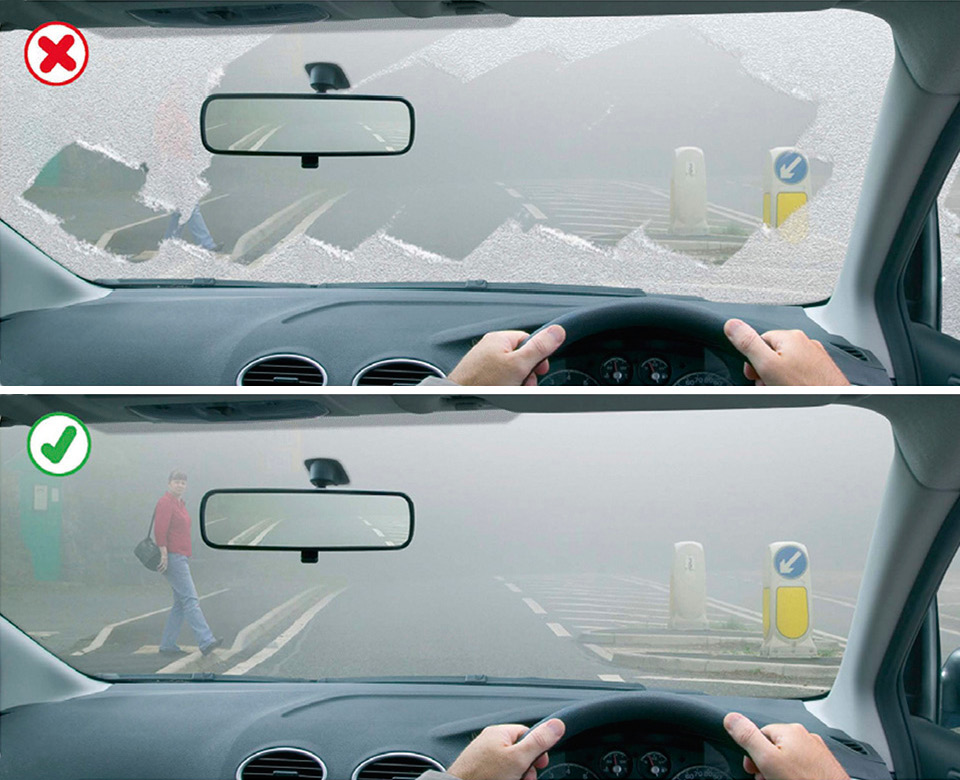

Driving in adverse weather conditions (226 to 237)
==================================================

Rules for driving in adverse weather conditions, including wet weather, icy and snowy weather, windy weather, fog and hot weather.

Overview (rule 226)
-------------------

### Rule 226

You **MUST** use headlights when visibility is seriously reduced, generally when you cannot see for more than 100 metres (328 feet). You may also use front or rear fog lights but you **MUST** switch them off when visibility improves (see [Rule 236](#rule-236)).

**Law [RVLR regs 25](http://www.legislation.gov.uk/uksi/1989/1796/regulation/25/made) & [27](http://www.legislation.gov.uk/uksi/1989/1796/regulation/27/made)**

Wet weather (rule 227)
----------------------

### Rule 227

**Wet weather.** In wet weather, stopping distances will be at least double those required for stopping on dry roads (see [‘Typical stopping distances’](/pages/general-rules-techniques-and-advice-for-all-drivers-and-riders-103-to-158.md#rule-126)). This is because your tyres have less grip on the road. In wet weather

* you should keep well back from the vehicle in front. This will increase your ability to see and plan ahead
* if the steering becomes unresponsive, it probably means that water is preventing the tyres from gripping the road. Ease off the accelerator and slow down gradually
* the rain and spray from vehicles may make it difficult to see and be seen
* be aware of the dangers of spilt diesel that will make the surface very slippery (see [Vehicle maintenance, safety and security](/pages/annex-6-vehicle-maintenance-safety-and-security.md))
* take extra care around pedestrians, cyclists, motorcyclists and horse riders.

Icy and snowy weather (rules 228 to 231)
----------------------------------------

### Rule 228

In winter check the local weather forecast for warnings of icy or snowy weather. **DO NOT** drive in these conditions unless your journey is essential. If it is, take great care and allow more time for your journey. Take an emergency kit of de-icer and ice scraper, torch, warm clothing and boots, first aid kit, jump leads and a shovel, together with a warm drink and emergency food in case you get stuck or your vehicle breaks down.

### Rule 229

Before you set off

* you **MUST** be able to see, so clear all snow and ice from all your windows
* you **MUST** ensure that lights are clean and number plates are clearly visible and legible
* make sure the mirrors are clear and the windows are demisted thoroughly
* remove all snow that might fall off into the path of other road users
* check your planned route is clear of delays and that no further snowfalls or severe weather are predicted.

**Laws [CUR reg 30](http://www.legislation.gov.uk/uksi/1986/1078/regulation/30/made), [RVLR reg 23](http://www.legislation.gov.uk/uksi/1989/1796/regulation/23/made), [VERA sect 43](http://www.legislation.gov.uk/ukpga/1994/22/section/43) & [RV(DRM)R reg 11](http://www.legislation.gov.uk/uksi/2001/561/regulation/11/made)**

Rule 229: Make sure your windscreen is completely clear

### Rule 230

**When driving** in icy or snowy weather

* drive with care, even if the roads have been treated
* keep well back from the road user in front as stopping distances can be ten times greater than on dry roads
* take care when overtaking vehicles spreading salt or other de-icer, particularly if you are riding a motorcycle or cycle
* watch out for snowploughs which may throw out snow on either side. Do not overtake them unless the lane you intend to use has been cleared
* be prepared for the road conditions to change over relatively short distances
* listen to travel bulletins and take note of variable message signs that may provide information about weather, road and traffic conditions ahead.

### Rule 231

**Drive extremely carefully** when the roads are icy. Avoid sudden actions as these could cause loss of control. You should

* drive at a slow speed in as high a gear as possible; accelerate and brake very gently
* drive particularly slowly on bends where loss of control is more likely. Brake progressively on the straight before you reach a bend. Having slowed down, steer smoothly round the bend, avoiding sudden actions
* check your grip on the road surface when there is snow or ice by choosing a safe place to brake gently. If the steering feels unresponsive this may indicate ice and your vehicle losing its grip on the road. When travelling on ice, tyres make virtually no noise.

Windy weather (rules 232 to 233)
--------------------------------

### Rule 232

High-sided vehicles are most affected by windy weather, but strong gusts can also blow a car, cyclist, motorcyclist or horse rider off course. This can happen on open stretches of road exposed to strong crosswinds, or when passing bridges or gaps in hedges.

### Rule 233

In very windy weather your vehicle may be affected by turbulence created by large vehicles. Motorcyclists are particularly affected, so keep well back from them when they are overtaking a high-sided vehicle.

Fog (rules 234 to 236)
----------------------

### Rule 234

**Before entering fog** check your mirrors then slow down.

If ‘Fog’ is shown on a sign but the road is clear, be prepared for a bank of fog or drifting patchy fog ahead. Even if it seems to be clearing, you can suddenly find yourself in thick fog.

### Rule 235

**When driving in fog** you should

* use your lights as required (see [Rule 226](#rule-226))
* keep a safe distance behind the vehicle in front. Rear lights can give a false sense of security
* be able to pull up well within the distance you can see clearly. This is particularly important on motorways and dual carriageways, as vehicles are travelling faster
* use your windscreen wipers and demisters
* beware of other drivers not using headlights
* not accelerate to get away from a vehicle which is too close behind you
* check your mirrors before you slow down. Then use your brakes so that your brake lights warn drivers behind you that you are slowing down
* stop in the correct position at a junction with limited visibility and listen for traffic. When you are sure it is safe to emerge, do so positively and do not hesitate in a position that puts you directly in the path of approaching vehicles.

### Rule 236

You **MUST NOT** use front or rear fog lights unless visibility is seriously reduced (see [Rule 226](#rule-226)) as they dazzle other road users and can obscure your brake lights. You **MUST** switch them off when visibility improves.

**Law [RVLR regs 25](http://www.legislation.gov.uk/uksi/1989/1796/regulation/25/made) & [27](http://www.legislation.gov.uk/uksi/1989/1796/regulation/27/made)**

Hot weather (rule 237)
----------------------

### Rule 237

Keep your vehicle well ventilated to avoid drowsiness. Be aware that the road surface may become soft or if it rains after a dry spell it may become slippery. These conditions could affect your steering and braking. If you are dazzled by bright sunlight, slow down and if necessary, stop.
