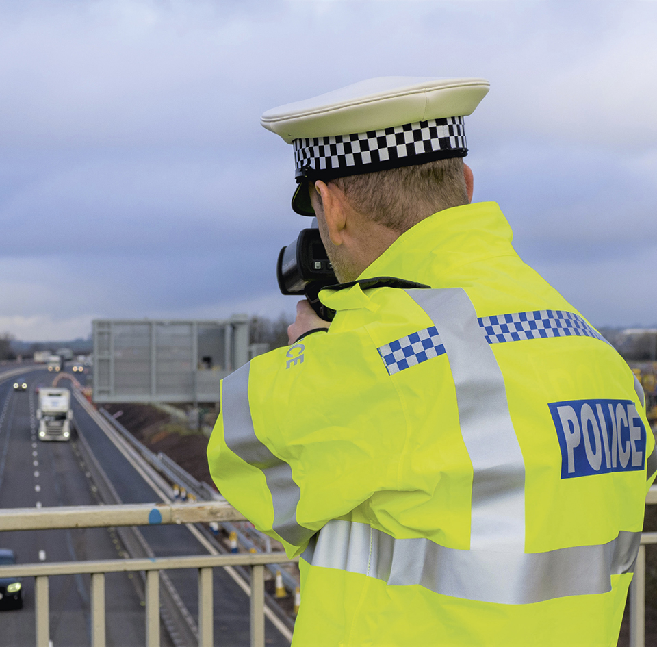
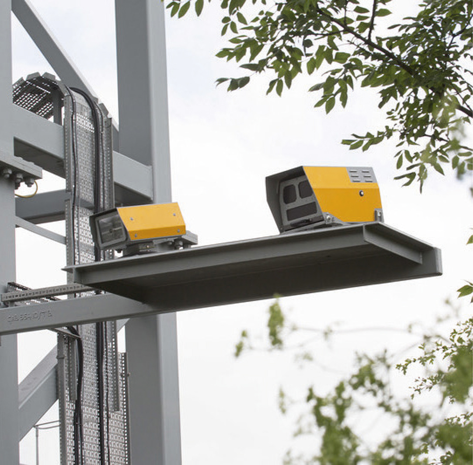
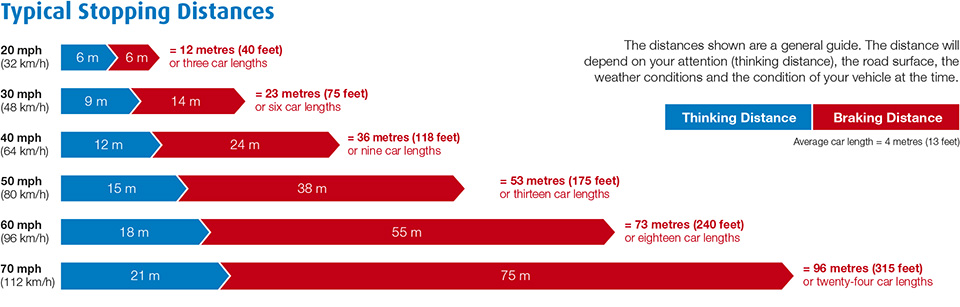
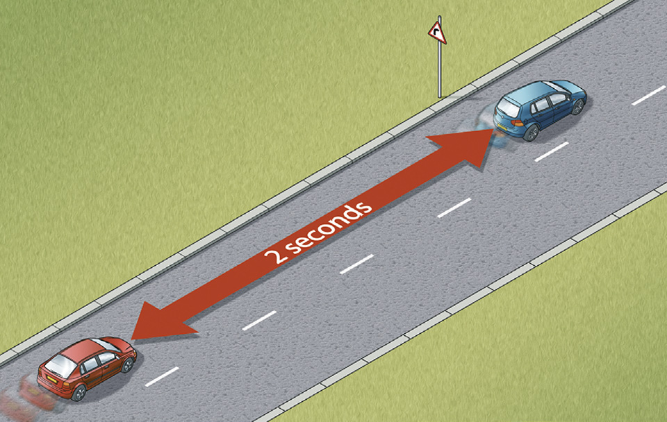
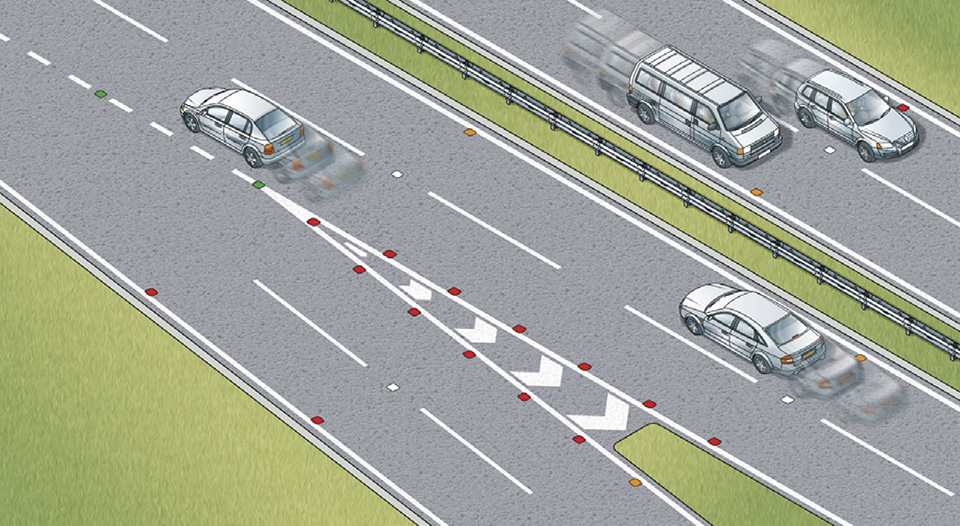
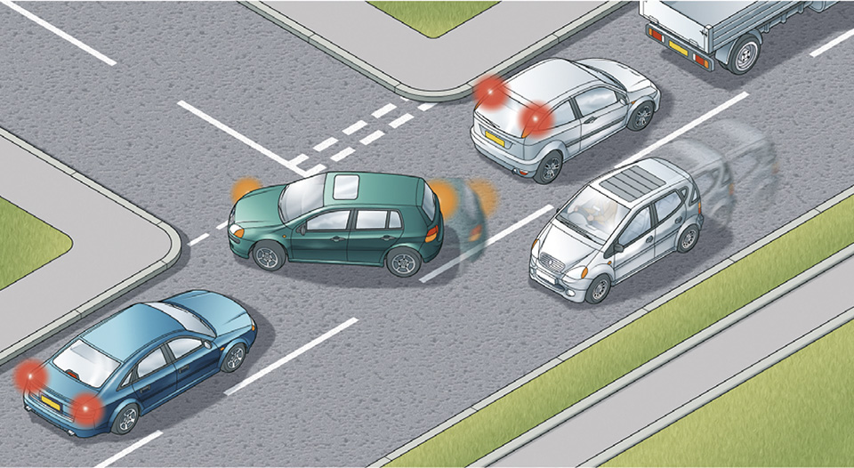
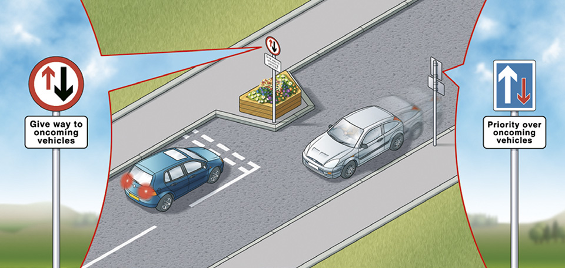

General rules, techniques and advice for all drivers and riders (103 to 158)
============================================================================

Signals, stopping procedures, lighting, control of the vehicle, speed limits, stopping distances, lines and lane markings and multi-lane carriageways, smoking, mobile phones and sat nav.

This section should be read by all drivers, motorcyclists, cyclists and horse riders. The rules in **The Highway Code** do not give you the right of way in any circumstance, but they advise you when you should give way to others. Always give way if it can help to avoid an incident.

Signals (rules 103 to 106)
--------------------------

 

### Rule 103

Signals warn and inform other road users, including pedestrians (see ‘[Signals to other road users](/pages/signals-to-other-road-users.md)), of your intended actions. You should always

* give clear signals in plenty of time, having checked it is not misleading to signal at that time
* use them to advise other road users before changing course or direction, stopping or moving off
* cancel them after use
* make sure your signals will not confuse others. If, for instance, you want to stop after a side road, do not signal until you are passing the road. If you signal earlier it may give the impression that you intend to turn into the road. Your brake lights will warn traffic behind you that you are slowing down
* use an arm signal to emphasise or reinforce your signal if necessary. Remember that signalling does not give you priority.

### Rule 104

You should also

* watch out for signals given by other road users and proceed only when you are satisfied that it is safe
* be aware that an indicator on another vehicle may not have been cancelled.

### Rule 105

You **MUST** obey signals given by police officers, traffic officers, traffic wardens (see ‘[Signals by authorised persons](/pages/signals-by-authorised-persons.md)’) and signs used by school crossing patrols.

**Laws [RTRA sect 28](http://www.legislation.gov.uk/ukpga/1984/27/section/28), [RTA 1988 sect 35](http://www.legislation.gov.uk/ukpga/1988/52/section/35), [TMA sect 6](http://www.legislation.gov.uk/ukpga/2004/18/part/6) & [FTWO art 3](http://www.legislation.gov.uk/uksi/2002/2975/made)**

### Rule 106

**Police stopping procedures.** If the police want to stop your vehicle they will, where possible, attract your attention by

* flashing blue lights, headlights or sounding their siren or horn, usually from behind
* directing you to pull over to the side by pointing and/or using the left indicator.

You **MUST** then pull over and stop as soon as it is safe to do so. Then switch off your engine.

**Law [RTA 1988 sect 163](http://www.legislation.gov.uk/ukpga/1988/52/section/163/enacted)**

 

Other stopping procedures (rules 107 to 112)
--------------------------------------------

 

### Rule 107

**Driver and Vehicle Standards Agency officers** have the power to stop vehicles on all roads, including motorways and trunk roads. They will attract your attention by flashing amber lights

* either from the front requesting you to follow them to a safe place to stop
* or from behind directing you to pull over to the side by pointing and/or using the left indicator.

It is an offence not to comply with their directions. You **MUST** obey any signals given (see ‘[Signals by authorised persons](/pages/signals-by-authorised-persons.md)’).

**Laws [RTA 1988 sect 67](http://www.legislation.gov.uk/ukpga/1988/52/section/67/enacted), & [PRA sect 41](http://www.legislation.gov.uk/ukpga/2002/30/section/41) & [sched 5(8)](http://www.legislation.gov.uk/ukpga/2002/30/schedule/5)**

### Rule 108

**Traffic officers** have powers to stop vehicles on most motorways and some ‘A’ class roads, in England and Wales. If traffic officers in uniform want to stop your vehicle on safety grounds (e.g. an insecure load) they will, where possible, attract your attention by

* flashing amber lights, usually from behind
* directing you to pull over to the side by pointing and/or using the left indicator.

You **MUST** then pull over and stop as soon as it is safe to do so. Then switch off your engine. It is an offence not to comply with their directions (see ‘[Signals by authorised persons](/pages/signals-by-authorised-persons.md)’).

**Law [RTA 1988 sects 35](http://www.legislation.gov.uk/ukpga/1988/52/section/35) & [163](http://www.legislation.gov.uk/ukpga/1988/52/section/163) as amended by [TMA sect 6](http://www.legislation.gov.uk/ukpga/2004/18/section/6)**

### Rule 109

**Traffic light signals and traffic signs.** You **MUST** obey all traffic light signals (see ‘[Light signals controlling traffic](/pages/light-signals-controlling-traffic.md)’) and traffic signs giving orders, including temporary signals & signs (see ‘[Traffic signs](/pages/traffic-signs.md)’). Make sure you know, understand and act on all other traffic and information signs and road markings (see ‘[Traffic signs](/pages/traffic-signs.md)’, ‘[Road markings](/pages/road-markings.md)’ and ‘[Vehicle markings](/pages/vehicle-markings.md)’).

**Laws [RTA 1988 sect 36](http://www.legislation.gov.uk/ukpga/1988/52/section/36) & [TSRGD schedule 3 part 4](https://www.legislation.gov.uk/uksi/2002/3113/schedule/3/made), [schedule 9 parts 7 and 8](https://www.legislation.gov.uk/uksi/2002/3113/schedule/9/made), [schedule 14 parts 1 and 5](https://www.legislation.gov.uk/uksi/2002/3113/schedule/14/made), [schedule 7 part 6](https://www.legislation.gov.uk/uksi/2002/3113/schedule/7/made), [schedule 15 part 1](https://www.legislation.gov.uk/uksi/2002/3113/schedule/15/made)**

### Rule 110

**Flashing headlights.** Only flash your headlights to let other road users know that you are there. Do not flash your headlights to convey any other message or intimidate other road users.

### Rule 111

Never assume that flashing headlights is a signal inviting you to proceed. Use your own judgement and proceed carefully.

### Rule 112

**The horn.** Use only while your vehicle is moving and you need to warn other road users of your presence. Never sound your horn aggressively. You **MUST NOT** use your horn

* while stationary on the road
* when driving in a built-up area between the hours of 11.30 pm and 7.00 am

**except** when another road user poses a danger.

**Law [CUR reg 99](http://www.legislation.gov.uk/uksi/1986/1078/regulation/99/made)**

 

Lighting requirements (rules 113 to 116)
----------------------------------------

 

### Rule 113

You **MUST**

* ensure all sidelights and rear registration plate lights are lit between sunset and sunrise
* use headlights at night, except on a road which has lit street lighting. These roads are generally restricted to a speed limit of 30 mph (48 km/h) unless otherwise specified
* use headlights when visibility is seriously reduced (see [Rule 226](/pages/driving-in-adverse-weather-conditions-226-to-237.md#rule-226)).

Night (the hours of darkness) is defined as the period between half an hour after sunset and half an hour before sunrise.

**Laws [RVLR regs 3](http://www.legislation.gov.uk/uksi/1989/1796/regulation/3/made), [24](http://www.legislation.gov.uk/uksi/1989/1796/regulation/24/made) & [25](http://www.legislation.gov.uk/uksi/1989/1796/part/III/made) (In Scotland - [RTRA sect 82 (as amended by NRSWA, para 59 of sched 8)](http://www.legislation.gov.uk/ukpga/1991/22/schedule/8/made)**)

### Rule 114

You **MUST NOT**

* use any lights in a way which would dazzle or cause discomfort to other road users, including pedestrians, cyclists and horse riders
* use front or rear fog lights unless visibility is seriously reduced. You **MUST** switch them off when visibility improves to avoid dazzling other road users (see [Rule 226](/pages/driving-in-adverse-weather-conditions-226-to-237.md#rule-226)).

In stationary queues of traffic, drivers should apply the parking brake and, once the following traffic has stopped, take their foot off the footbrake to deactivate the vehicle brake lights. This will minimise glare to road users behind until the traffic moves again.

**Law [RVLR reg 27](http://www.legislation.gov.uk/uksi/1989/1796/regulation/27/made)**

### Rule 115

You should also

* use dipped headlights, or dim-dip if fitted, at night in built-up areas and in dull daytime weather, to ensure that you can be seen
* keep your headlights dipped when overtaking until you are level with the other vehicle and then change to main beam if necessary, unless this would dazzle oncoming road users
* slow down, and if necessary stop, if you are dazzled by oncoming headlights.

### Rule 116

**Hazard warning lights.** These may be used when your vehicle is stationary, to warn that it is temporarily obstructing traffic. Never use them as an excuse for dangerous or illegal parking. You **MUST NOT** use hazard warning lights while driving or being towed unless you are on a motorway or unrestricted dual carriageway and you need to warn drivers behind you of a hazard or obstruction ahead. Only use them for long enough to ensure that your warning has been observed.

**Law [RVLR reg 27](http://www.legislation.gov.uk/uksi/1989/1796/regulation/27/made)**

 

Control of the vehicle (rules 117 to 126)
-----------------------------------------

 

### Braking

### Rule 117

**In normal circumstances.** The safest way to brake is to do so early and lightly. Brake more firmly as you begin to stop. Ease the pressure off just before the vehicle comes to rest to avoid a jerky stop.

### Rule 118

**In an emergency.** Brake immediately. Try to avoid braking so harshly that you lock your wheels. Locked wheels can lead to loss of control.

### Rule 119

**Skids**. Skidding is usually caused by the driver braking, accelerating or steering too harshly or driving too fast for the road conditions. If skidding occurs, remove the cause by releasing the brake pedal fully or easing off the accelerator. Turn the steering wheel in the direction of the skid. For example, if the rear of the vehicle skids to the right, steer immediately to the right to recover.

Rule 119: Rear of the car skids to the right. Driver steers to the right### Rule 120

**ABS.** If your vehicle is fitted with anti-lock brakes, you should follow the advice given in the vehicle handbook. However, in the case of an emergency, apply the footbrake firmly; do not release the pressure until the vehicle has slowed to the desired speed. The ABS should ensure that steering control will be retained, but do not assume that a vehicle with ABS will stop in a shorter distance.

### Rule 121

**Brakes affected by water.** If you have driven through deep water your brakes may be less effective. Test them at the first safe opportunity by pushing gently on the brake pedal to make sure that they work. If they are not fully effective, gently apply light pressure while driving slowly. This will help to dry them out.

### Rule 122

**Coasting.** This term describes a vehicle travelling in neutral or with the clutch pressed down. It can reduce driver control because

* engine braking is eliminated
* vehicle speed downhill will increase quickly
* increased use of the footbrake can reduce its effectiveness
* steering response will be affected, particularly on bends and corners
* it may be more difficult to select the appropriate gear when needed.

### Rule 123

**The Driver and the Environment.** You **MUST NOT** leave a parked vehicle unattended with the engine running or leave a vehicle engine running unnecessarily while that vehicle is stationary on a public road. Generally, if the vehicle is stationary and is likely to remain so for more than a couple of minutes, you should apply the parking brake and switch off the engine to reduce emissions and noise pollution. However it is permissible to leave the engine running if the vehicle is stationary in traffic or for diagnosing faults.

**Law [CUR regs 98](http://www.legislation.gov.uk/uksi/1986/1078/regulation/98/made) & [107](http://www.legislation.gov.uk/uksi/1986/1078/regulation/107/made)**

### Rule 124

You **MUST NOT** exceed the maximum speed limits for the road and for your vehicle (see the [speed limits table](#speedlimits)). A speed limit of 30 mph (48 km/h) generally applies to all roads with street lights (excluding motorways) unless signs show otherwise.

### Speed limits

| Speed Limits | Built-up areas | Single carriageways | Dual carriageways | Motorways |
| --- | --- | --- | --- | --- |
| **Type of vehicle** | mph (km/h) | mph (km/h) | mph (km/h) | mph (km/h) |
| **Cars & motorcycles** (including car derived vans up to 2 tonnes maximum laden weight) | **30** (48) | **60** (96) | **70** (112) | **70** (112) |
| **Cars towing caravans or trailers** (including car derived vans and motorcycles) | **30** (48) | **50** (80) | **60** (96) | **60** (96) |
| **Motorhomes or motor caravans** (not exceeding 3.05 tonnes maximum unladen weight) | **30** (48) | **60** (96) | **70** (112) | **70** (112) |
| **Motorhomes or motor caravans** (exceeding 3.05 tonnes maximum unladen weight) | **30** (48) | **50** (80) | **60** (96) | **70** (112) |
| **Buses, coaches and minibuses** (not exceeding 12 metres in overall length) | **30** (48) | **50** (80) | **60** (96) | **70†** (112) |
| **Goods vehicles** (not exceeding 7.5 tonnes maximum laden weight) | **30** (48) | **50** (80) | **60** (96) | **70††** (112) |
| **Goods vehicles** (exceeding 7.5 tonnes maximum laden weight) in England and Wales | **30** (48) | **50** (80) | **60** (96) | **60** (96) |
| **Goods vehicles** (exceeding 7.5 tonnes maximum laden weight) in Scotland | **30** (48) | **40** (64) | **50** (80) | **60** (96) |

† 60 mph (96 km/h) if exceeding 12 metres in overall length.

†† 60 mph (96 km/h) if articulated or towing a trailer.

For speed limits that apply to special types of vehicles, such as oversized vehicles, see [Further reading.](/pages/other-information.md#reading)

**Locally set speed limits** may apply, for example

* 20 mph (32 km/h) in some built-up areas
* 50 mph (80 km/h) on single carriageways with known hazards
* variable speed limit signs are used on some motorways and dual carriageways to change the maximum speed limit.

**Speed limits are enforced by the police.**

**Law [RTRA sects 81](http://www.legislation.gov.uk/ukpga/1984/27/part/VI), [86](http://www.legislation.gov.uk/ukpga/1984/27/part/VI), [89](http://www.legislation.gov.uk/ukpga/1984/27/part/VI) & [sched 6](http://www.legislation.gov.uk/ukpga/1984/27/schedule/6) as amended by [MV(VSL)(E&W)](http://www.legislation.gov.uk/uksi/2014/3552/contents/made)**

Rule 124: Examples of speed enforcement

Rule 124: Examples of speed enforcement### Rule 125

The speed limit is the absolute maximum and does not mean it is safe to drive at that speed irrespective of conditions. Unsafe speed increases the chances of causing a collision (or being unable to avoid one), as well as its severity. Inappropriate speeds are also intimidating, deterring people from walking, cycling or riding horses. Driving at speeds too fast for the road and traffic conditions is dangerous. You should always reduce your speed when

* the road layout or condition presents hazards, such as bends
* sharing the road with pedestrians, particularly children, older adults or disabled people, cyclists and horse riders, horse drawn vehicles and motorcyclists
* weather conditions make it safer to do so
* driving at night as it is more difficult to see other road users.

### Rule 126

[Download ‘Typical stopping distances’ (PDF, 124KB)](https://assets.digital.cabinet-office.gov.uk/media/559afb11ed915d1595000017/the-highway-code-typical-stopping-distances.pdf)

**Stopping distances.** Drive at a speed that will allow you to stop well within the distance you can see to be clear.

You should

* leave enough space between you and the vehicle in front so that you can pull up safely if it suddenly slows down or stops. The safe rule is never to get closer than the overall stopping distance (see Typical Stopping Distances diagram)
* allow at least a two-second gap between you and the vehicle in front on high-speed roads and in tunnels where visibility is reduced. The gap should be at least doubled on wet roads and up to ten times greater on icy roads
* remember, large vehicles and motorcycles need a greater distance to stop. If driving a large vehicle in a tunnel, you should allow a four-second gap between you and the vehicle in front

If you have to stop in a tunnel, leave at least a 5-metre gap between you and the vehicle in front.

Rule 126: Use a fixed point such as a sign to help measure a two-second gap**Tailgating** is where the gap between you and the vehicle in front is too small for you to be able to stop safely if the vehicle in front suddenly brakes.

Tailgating is dangerous, intimidating and can cause collisions, especially when driving at speed. Keeping a safe distance from the vehicle in front gives you time to react and stop if necessary. Dangerous and careless driving offences, such as tailgating, are enforced by the police.

 

Lines and lane markings on the road (rules 127 to 132)
------------------------------------------------------

 

See ‘[Road markings](/pages/road-markings.md)’ to see diagrams of all lines.

### Rule 127

**A broken white line.** This marks the centre of the road. When this line lengthens and the gaps shorten, it means that there is a hazard ahead. Do not cross it unless you can see the road is clear and wish to overtake or turn off.

### Rule 128

**Double white lines where the line nearest to you is broken.** This means you may cross the lines to overtake if it is safe, provided you can complete the manoeuvre before reaching a solid white line on your side. White direction arrows on the road indicate that you need to get back onto your side of the road.

### Rule 129

**Double white lines where the line nearest you is solid.** This means you **MUST NOT** cross or straddle it unless it is safe and you need to enter adjoining premises or a side road. You may cross the line if necessary, provided the road is clear, to pass a stationary vehicle, or overtake a pedal cycle, horse or road maintenance vehicle, if they are travelling at 10 mph (16 km/h) or less.

**Laws [RTA 1988 sect 36](http://www.legislation.gov.uk/ukpga/1988/52/section/36) & [TSRGD schedule 9 part 8](https://www.legislation.gov.uk/uksi/2002/3113/schedule/9/made)**

### Rule 130

**Areas of white diagonal stripes** or chevrons painted on the road. These are to separate traffic lanes or to protect traffic turning right.

* If the area is bordered by a broken white line, you should not enter the area unless it is necessary and you can see that it is safe to do so.
* If the area is marked with chevrons and bordered by solid white lines you **MUST NOT** enter it except in an emergency.

**Laws [MT(E&W)R regs 5](http://www.legislation.gov.uk/uksi/1982/1163/contents/made), [9](http://www.legislation.gov.uk/uksi/1982/1163/contents/made), [10](http://www.legislation.gov.uk/uksi/1982/1163/contents/made) & [16](http://www.legislation.gov.uk/uksi/1982/1163/contents/made), [MT(S)R regs 4](http://www.legislation.gov.uk/uksi/1995/2507/regulation/4/made), [8](http://www.legislation.gov.uk/uksi/1995/2507/regulation/8/made), [9](http://www.legislation.gov.uk/uksi/1995/2507/regulation/9/made) & [14](http://www.legislation.gov.uk/uksi/1995/2507/regulation/14/made), [RTA 1988 sect 36](http://www.legislation.gov.uk/ukpga/1988/52/section/36) & [TSRGD schedule 9 part 8](https://www.legislation.gov.uk/uksi/2002/3113/schedule/9/made)**

### Rule 131

**Lane dividers.** These are short, broken white lines which are used on wide carriageways to divide them into lanes. You should keep between them.

### Rule 132

**Reflective road studs** may be used with white lines.

* White studs mark the lanes or the middle of the road.
* Red studs mark the left edge of the road.
* Amber studs mark the central reservation of a dual carriageway or motorway.
* Green studs mark the edge of the main carriageway at lay-bys and slip roads.
* Green/yellow studs indicate temporary adjustments to lane layouts, e.g. where road works are taking place.

Rule 132: Reflective road studs mark the lanes and edge of the carriageway

 

Multi-lane carriageways (rules 133 to 143)
------------------------------------------

 

### Lane discipline

### Rule 133

If you need to change lane, first use your mirrors and if necessary take a quick sideways glance to make sure you will not force another road user to change course or speed. When it is safe to do so, signal to indicate your intentions to other road users and when clear, move over.

### Rule 134

You should follow the signs and road markings and get into the lane as directed. In congested road conditions do not change lanes unnecessarily. Merging in turn is recommended but only if safe and appropriate when vehicles are travelling at a very low speed, e.g. when approaching road works or a road traffic incident. It is not recommended at high speed.

### Single carriageway

### Rule 135

Where a single carriageway has three lanes and the road markings or signs do not give priority to traffic in either direction

* use the middle lane only for overtaking or turning right. Remember, you have no more right to use the middle lane than a driver coming from the opposite direction
* do not use the right-hand lane.

### Rule 136

Where a single carriageway has four or more lanes, use only the lanes that signs or markings indicate.

### Dual carriageways

A dual carriageway is a road which has a central reservation to separate the carriageways.

### Rule 137

On a two-lane dual carriageway you should stay in the left-hand lane. Use the right-hand lane for overtaking or turning right. After overtaking, move back to the left-hand lane when it is safe to do so.

### Rule 138

On a dual carriageway with three or more lanes, you may use the middle lanes or the right-hand lane to overtake but you should return to the middle lanes and then the left-hand lane when it is safe to do so.

### Rule 139

**Climbing and crawler lanes.** These are provided on some hills. Use this lane if you are driving a slow-moving vehicle or if there are vehicles behind you wishing to overtake. Be aware of the signs and road markings which indicate the lane is about to end.

### Rule 140

**Cycle lanes and cycle tracks**. Cycle lanes are shown by road markings and signs. You **MUST NOT** drive or park in a cycle lane marked by a solid white line during its times of operation. Do not drive or park in a cycle lane marked by a broken white line unless it is unavoidable. You **MUST NOT** park in any cycle lane whilst waiting restrictions apply.

You should give way to any cyclists in a cycle lane, including when they are approaching from behind you – do not cut across them when you are turning or when you are changing lane (see [Rule H3](/pages/introduction.md#rule-h3)). Be prepared to stop and wait for a safe gap in the flow of cyclists before crossing the cycle lane.

Cycle tracks are routes for cyclists that are physically protected or located away from motor traffic, other than where they cross side roads. Cycle tracks may be shared with pedestrians.

You should give way to cyclists approaching or using the cycle track when you are turning into or out of a junction (see [Rule H3](/pages/introduction.md#rule-h3)). Be prepared to stop and wait for a safe gap in the flow of cyclists before crossing the cycle track, which may be used by cyclists travelling in both directions.

Bear in mind that cyclists are not obliged to use cycle lanes or cycle tracks.

**Law [RTRA sects 5](http://www.legislation.gov.uk/ukpga/1984/27/section/5) & [8](http://www.legislation.gov.uk/ukpga/1984/27/section/8)**

### Rule 141

**Bus lanes.** These are shown by road markings and signs that indicate which (if any) other vehicles are permitted to use the bus lane. Unless otherwise indicated, you should not drive in a bus lane during its period of operation. You may enter a bus lane to stop, to load or unload where this is not prohibited.

### Rule 142

**High-occupancy vehicle lanes and other designated vehicle lanes.** Lanes may be restricted for use by particular types of vehicle; these restrictions may apply some or all of the time. The operating times and vehicle types will be indicated on the accompanying traffic signs. You **MUST NOT** drive in such lanes during their times of operation unless signs indicate that your vehicle is permitted (see ‘[Traffic signs](/pages/traffic-signs.md)’).

Vehicles permitted to use designated lanes may or may not include cycles, buses, taxis, licensed private hire vehicles, motorcycles, heavy goods vehicles (HGVs) and high-occupancy vehicles (HOVs).

Where HOV lanes are in operation, they **MUST ONLY** be used by

* vehicles containing at least the minimum number of people indicated on the traffic signs
* any other vehicles, such as buses and motorcycles, as indicated on signs prior to the start of the lane, irrespective of the number of occupants.

**Laws [RTRA sects 5](http://www.legislation.gov.uk/ukpga/1984/27/section/5) & [8](http://www.legislation.gov.uk/ukpga/1984/27/section/8), & [RTA 1988 sect 36](http://www.legislation.gov.uk/ukpga/1988/52/section/36)**

### Rule 143

**One-way streets.** Traffic **MUST** travel in the direction indicated by signs. Buses and/or cycles may have a contraflow lane. Choose the correct lane for your exit as soon as you can. Do not change lanes suddenly. Unless road signs or markings indicate otherwise, you should use

* the left-hand lane when going left
* the right-hand lane when going right
* the most appropriate lane when going straight ahead. Remember – traffic could be passing on both sides.

**Laws [RTA 1988 sect 36](http://www.legislation.gov.uk/ukpga/1988/52/section/36) & [RTRA sects 5](http://www.legislation.gov.uk/ukpga/1984/27/section/5) & [8](http://www.legislation.gov.uk/ukpga/1984/27/section/8)**

 

General advice (rules 144 to 158)
---------------------------------

 

### Rule 144

You **MUST NOT**

* drive dangerously
* drive without due care and attention
* drive without reasonable consideration for other road users.

Driving requires focus and attention at all times. Remember, you may be driving dangerously or travelling too fast even if you don’t mean to.

**Law [RTA 1988 sects 2 & 3](http://www.legislation.gov.uk/ukpga/1988/52) as amended by [RTA 1991](http://www.legislation.gov.uk/ukpga/1991/40/contents)**

### Rule 145

You **MUST NOT** drive on or over a pavement, footpath or bridleway except to gain lawful access to property, or in the case of an emergency.

**Laws [HA 1835 sect 72](http://www.legislation.gov.uk/ukpga/Will4/5-6/50/section/72) & [RTA 1988 sect 34](http://www.legislation.gov.uk/ukpga/1988/52/section/34)**

### Rule 146

**Adapt your driving** to the appropriate type and condition of road you are on. In particular

* do not treat speed limits as a target. It is often not appropriate or safe to drive at the maximum speed limit
* take the road and traffic conditions into account. Be prepared for unexpected or difficult situations, for example, the road being blocked beyond a blind bend. Be prepared to adjust your speed as a precaution
* where there are junctions, be prepared for road users emerging
* in side roads and country lanes look out for unmarked junctions where nobody has priority
* be prepared to stop at traffic control systems, road works, pedestrian crossings or traffic lights as necessary
* try to anticipate what pedestrians and cyclists might do. If pedestrians, particularly children, are looking the other way, they may step out into the road without seeing you.

### Rule 147

**Be considerate.** Be careful of and considerate towards all types of road users, especially those requiring extra care (see [Rule 204](/pages/road-users-requiring-extra-care-204-to-225.md#rule-204)).

* you **MUST NOT** throw anything out of a vehicle; for example, food or food packaging, cigarette ends, cans, paper or carrier bags. This can endanger other road users, particularly motorcyclists and cyclists.
* try to be understanding if other road users cause problems; they may be inexperienced or not know the area well.
* be patient; remember that anyone can make a mistake.
* do not allow yourself to become agitated or involved if someone is behaving badly on the road. This will only make the situation worse. Pull over, calm down and, when you feel relaxed, continue your journey.
* slow down and hold back if a road user pulls out into your path at a junction. Allow them to get clear. Do not over-react by driving too close behind to intimidate them.

**Law [EPA sect 87](http://www.legislation.gov.uk/ukpga/1990/43/section/87)**

### Rule 148

**Safe driving and riding needs concentration.** Avoid distractions when driving or riding such as

* loud music (this may mask other sounds)
* trying to read maps
* starting or adjusting any music or radio
* arguing with your passengers or other road users
* eating and drinking
* smoking

You **MUST NOT** smoke in public transport vehicles or in vehicles used for work purposes in certain prescribed circumstances. Separate regulations apply to England, Wales and Scotland. In England and Wales, the driver **MUST NOT** smoke or allow anyone to smoke in an enclosed private vehicle carrying someone under 18, including motor caravans. In Scotland it is an offence for anyone aged 18 or over to smoke in a private motor vehicle (unless it is parked and being used as living accommodation) when there is someone under 18 in the vehicle and the vehicle is in a public place.

**Laws [TSf(EV)R](http://www.legislation.gov.uk/uksi/2007/765/contents/made), [TSfP(W)R](http://www.legislation.gov.uk/wsi/2007/787/contents/made), [TPSCP(S)R](http://www.legislation.gov.uk/ssi/2006/90/contents/made), [S-f(PV)R](http://www.legislation.gov.uk/ukdsi/2015/9780111126004/contents), [S-f(W)R](http://www.legislation.gov.uk/wsi/2015/1363/made) & [SP(CIMV)(S)A](http://www.legislation.gov.uk/asp/2016/3/contents)**

### Mobile phones and in-vehicle technology

### Rule 149

You **MUST** exercise proper control of your vehicle at all times. You **MUST NOT** use a hand-held mobile phone, or similar device, when driving or when supervising a learner driver, except to call 999 or 112 in a genuine emergency when it is unsafe or impractical to stop. Never use a hand-held microphone when driving. Using hands-free equipment is also likely to distract your attention from the road. It is far safer not to use any telephone while you are driving or riding - find a safe place to stop first or use the voicemail facility and listen to messages later.

You may park your vehicle using a hand-held remote control app or device. The app or device **MUST** be legal, and you should not put other people in danger when you use it.

**Laws [RTA 1988 sects 2 & 3](http://www.legislation.gov.uk/ukpga/1988/52), & [CUR regs 104](http://www.legislation.gov.uk/uksi/1986/1078/regulation/104/made) & [110](http://www.legislation.gov.uk/uksi/2003/2695/made)**

### Rule 150

There is a danger of driver distraction being caused by in-vehicle systems such as satellite navigation systems, congestion warning systems, PCs, multi-media, etc. You **MUST** exercise proper control of your vehicle at all times. Do not rely on driver assistance systems such as motorway assist, lane departure warnings, or remote control parking. They are available to assist but you should not reduce your concentration levels. Do not be distracted by maps or screen-based information (such as navigation or vehicle management systems) while driving or riding. If necessary find a safe place to stop.

As the driver, you are still responsible for the vehicle if you use a driver assistance system (like motorway assist). This is also the case if you use a hand-held remote control parking app or device. You **MUST** have full control over these systems at all times.

**Laws [RTA 1988 sects 2 & 3](http://www.legislation.gov.uk/ukpga/1988/52), & [CUR reg 104](http://www.legislation.gov.uk/uksi/1986/1078/regulation/104/made) & [110](http://www.legislation.gov.uk/uksi/2018/592/made)**

### Rule 151

**In slow-moving traffic.** You should

* reduce the distance between you and the vehicle ahead to maintain traffic flow
* never get so close to the vehicle in front that you cannot stop safely
* leave enough space to be able to manoeuvre if the vehicle in front breaks down or an emergency vehicle needs to get past
* not change lanes to the left to overtake
* allow access into and from side roads, as blocking these will add to congestion
* allow pedestrians and cyclists to cross in front of you
* be aware of cyclists and motorcyclists who may be passing on either side.

Rule 151: Do not block access to a side road### Driving in built-up areas

### Rule 152

**Residential streets.** You should drive slowly and carefully on streets where there are likely to be pedestrians, cyclists and parked cars. In some areas a 20 mph (32 km/h) maximum speed limit may be in force. Look out for

* vehicles emerging from junctions or driveways
* vehicles moving off
* car doors opening
* pedestrians
* children running out from between parked cars
* cyclists and motorcyclists.

### Rule 153

**Traffic-calming measures.** On some roads there are features such as road humps, chicanes and narrowings which are intended to slow you down. When you approach these features reduce your speed. Allow cyclists and motorcyclists room to pass through them. Maintain a reduced speed along the whole of the stretch of road within the calming measures. Give way to oncoming road users if directed to do so by signs. You should not overtake other moving road users while in these areas.

Rule 153: Chicanes may be used to slow traffic down### Country roads

### Rule 154

Take extra care on country roads and reduce your speed at approaches to bends, which can be sharper than they appear, and at junctions and turnings, which may be partially hidden. Be prepared for pedestrians, horse riders, cyclists, slow-moving farm vehicles or mud on the road surface. Make sure you can stop within the distance you can see to be clear. You should also reduce your speed where country roads enter villages.

### Rule 155

**Single-track roads.** These are only wide enough for one vehicle. They may have special passing places. If you see a vehicle coming towards you, or the driver behind wants to overtake, pull into a passing place on your left, or wait opposite a passing place on your right. Give way to road users coming uphill whenever you can. If necessary, reverse until you reach a passing place to let the other vehicle pass. Slow down when passing pedestrians, cyclists and horse riders.

### Rule 156

Do not park in passing places.

### Vehicles prohibited from using roads and pavements

### Rule 157

Certain motorised vehicles do not meet the construction and technical requirements for road vehicles and are generally not intended, not suitable and not legal for road, pavement, footpath, cycle path or bridleway use. These include most types of miniature motorcycles, also called mini motos, and motorised scooters, also called go peds, which are powered by electric or internal combustion engines. These types of vehicle **MUST NOT** be used on roads, pavements, footpaths or bridleways.

**Laws [RTA 1988 sects 34](http://www.legislation.gov.uk/ukpga/1988/52/section/34), [41a](http://www.legislation.gov.uk/ukpga/1988/52/section/41A), [42](http://www.legislation.gov.uk/ukpga/1988/52/section/42), [47](http://www.legislation.gov.uk/ukpga/1988/52/section/47), [63](http://www.legislation.gov.uk/ukpga/1988/52/section/63/enacted) & [66](http://www.legislation.gov.uk/ukpga/1988/52/section/66), [HA 1835 sect 72](http://www.legislation.gov.uk/ukpga/Will4/5-6/50/section/72) & [R(S)A sect 129](http://www.legislation.gov.uk/ukpga/1984/54/section/129)**

### Rule 158

Certain models of motorcycles, motor tricycles and quadricycles, also called quad bikes, are suitable only for off-road use and do not meet legal standards for use on roads. Vehicles that do not meet these standards **MUST NOT** be used on roads. They **MUST NOT** be used on pavements, footpaths, cycle paths or bridleways either. You **MUST** make sure that any motorcycle, motor tricycle, quadricycle or any other motor vehicle meets legal standards and is properly registered, taxed and insured before using it on the roads. Even when registered, taxed and insured for the road, vehicles **MUST NOT** be used on pavements.

**Laws [RTA 1988 sects 34](http://www.legislation.gov.uk/ukpga/1988/52/section/34), [41a](http://www.legislation.gov.uk/ukpga/1988/52/section/41A), [42](http://www.legislation.gov.uk/ukpga/1988/52/section/42), [47](http://www.legislation.gov.uk/ukpga/1988/52/section/47), [63](http://www.legislation.gov.uk/ukpga/1988/52/section/63), [66](http://www.legislation.gov.uk/ukpga/1988/52/section/66) & [156](http://www.legislation.gov.uk/ukpga/1988/52/section/156), [HA 1835 sect 72](http://www.legislation.gov.uk/ukpga/Will4/5-6/50/section/72), [R(S)A sect 129](http://www.legislation.gov.uk/ukpga/1984/54/section/129) & [VERA sects 1](http://www.legislation.gov.uk/ukpga/1994/22/section/1), [29](http://www.legislation.gov.uk/ukpga/1994/22/section/29), [31A](http://www.legislation.gov.uk/ukpga/1994/22/section/31A) & [43A](http://www.legislation.gov.uk/ukpga/1994/22/section/43A)**
