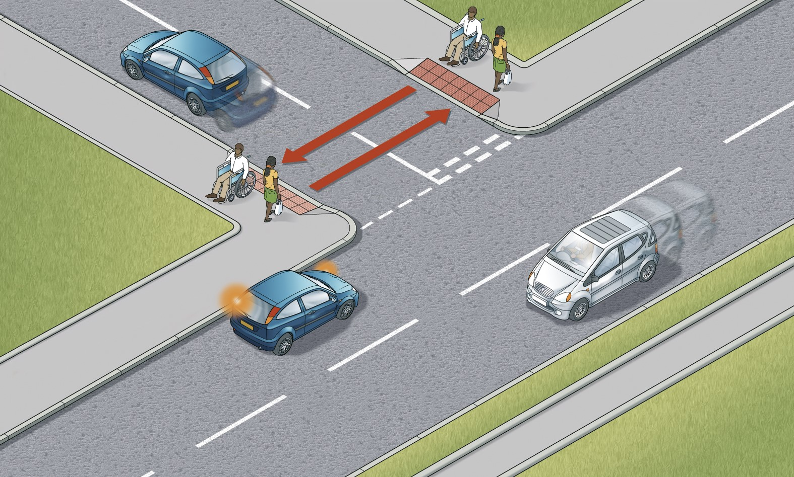
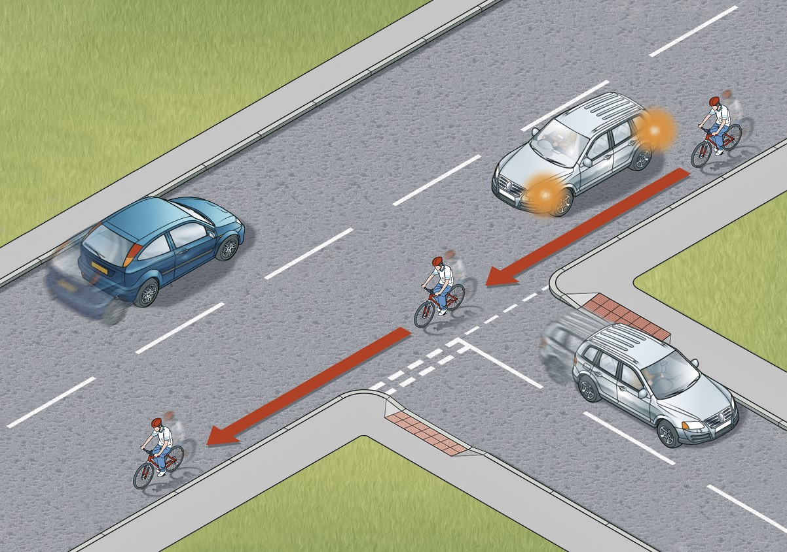

Introduction
============

Who The Highway Code is for, how it's worded, the consequences of not following the rules, and the hierarchy of road users (Rules H1 to H3).

Introduction
------------

This Highway Code applies to England, Scotland and Wales. The Highway Code is essential reading for everyone.

The aim of The Highway Code is to promote safety on the road, whilst also supporting a healthy, sustainable and efficient transport system.

Wording of The Highway Code
---------------------------

Many of the rules in the Code are legal requirements, and if you disobey these rules you are committing a criminal offence. You may be fined, given penalty points on your licence or be disqualified from driving. In the most serious cases you may be sent to prison. Such rules are identified by the use of the words ‘**MUST/MUST NOT**’. In addition, the rule includes an abbreviated reference to the legislation which creates the offence. See an [explanation of the abbreviations](/pages/annex-4-the-road-user-and-the-law.md#abbrev).

Although failure to comply with the other rules of the Code will not, in itself, cause a person to be prosecuted, The Highway Code may be used in evidence in any court proceedings under the Traffic Acts (see [The road user and the law](/pages/annex-4-the-road-user-and-the-law.md#roaduserlaw)) to establish liability. This includes rules which use advisory wording such as ‘should/should not’ or ‘do/do not’.

Knowing and applying the rules
------------------------------

Knowing and applying the rules contained in The Highway Code could significantly reduce road casualties. Cutting the number of deaths and injuries that occur on our roads every day is a responsibility we all share. The Highway Code can help us discharge that responsibility. Further information on driving/riding techniques can be found in ‘[The Official DVSA Guide to Driving - the essential skills](https://www.safedrivingforlife.info/shop/official-dvsa-guide-driving-essential-skills/)’ and ‘[The Official DVSA Guide to Riding - the essential skills](https://www.safedrivingforlife.info/shop/official-dvsa-guide-riding-essential-skills/)’.

Hierarchy of Road Users
-----------------------

The ‘hierarchy of road users’ is a concept that places those road users most at risk in the event of a collision at the top of the hierarchy. The hierarchy does not remove the need for everyone to behave responsibly. The road users most likely to be injured in the event of a collision are pedestrians, cyclists, horse riders and motorcyclists, with children, older adults and disabled people being more at risk. The following H rules clarify this concept.

### Rule H1

It is important that ALL road users are aware of The Highway Code, are considerate to other road users and understand their responsibility for the safety of others.

Everyone suffers when road collisions occur, whether they are physically injured or not. But those in charge of vehicles that can cause the greatest harm in the event of a collision bear the greatest responsibility to take care and reduce the danger they pose to others. This principle applies most strongly to drivers of large goods and passenger vehicles, vans/minibuses, cars/taxis and motorcycles.

Cyclists, horse riders and drivers of horse drawn vehicles likewise have a responsibility to reduce danger to pedestrians.

None of this detracts from the responsibility of ALL road users, including pedestrians, cyclists and horse riders, to have regard for their own and other road users’ safety.

Always remember that the people you encounter may have impaired sight, hearing or mobility and that this may not be obvious.

### Rule H2 - Rule for drivers, motorcyclists, horse drawn vehicles, horse riders and cyclists

At a junction you should give way to pedestrians crossing or waiting to cross a road into which or from which you are turning.

You **MUST** give way to pedestrians on a zebra crossing, and to pedestrians and cyclists on a parallel crossing (see [Rule 195](/pages/using-the-road-159-to-203.md#rule-195)).

Pedestrians have priority when on a zebra crossing, on a parallel crossing or at light controlled crossings when they have a green signal.

You should give way to pedestrians waiting to cross a zebra crossing, and to pedestrians and cyclists waiting to cross a parallel crossing.

Horse riders should also give way to pedestrians on a zebra crossing, and to pedestrians and cyclists on a parallel crossing.

Cyclists should give way to pedestrians on shared use cycle tracks and to horse riders on bridleways.

Only pedestrians may use the pavement. Pedestrians include wheelchair and mobility scooter users.

Pedestrians may use any part of the road and use cycle tracks as well as the pavement, unless there are signs prohibiting pedestrians.

Rule H2: Wait for the pedestrian to cross the junction before turning. This applies if you are turning right or left into the junction.

**Laws [TSRGD Schedule 14 part 1 and part 5](https://www.legislation.gov.uk/uksi/2016/362/schedule/14/made) & [HA 1835 sect 72](https://www.legislation.gov.uk/ukpga/Will4/5-6/50/section/72), [R(S)A 1984, sect 129](https://www.legislation.gov.uk/ukpga/1984/54/section/129) & [Countryside Act 1968 Sect 1 part 30](https://www.legislation.gov.uk/ukpga/1968/41/section/30)**

### Rule H3 - Rule for drivers and motorcyclists

You should not cut across cyclists, horse riders or horse drawn vehicles going ahead when you are turning into or out of a junction or changing direction or lane, just as you would not turn across the path of another motor vehicle. This applies whether they are using a cycle lane, a cycle track, or riding ahead on the road and you should give way to them.

Do not turn at a junction if to do so would cause the cyclist, horse rider or horse drawn vehicle going straight ahead to stop or swerve.

You should stop and wait for a safe gap in the flow of cyclists if necessary. This includes when cyclists are:

* approaching, passing or moving off from a junction
* moving past or waiting alongside stationary or slow-moving traffic
* travelling around a roundabout

Rule H3: Wait for the cyclist to pass the junction before turning. This also applies if there is a cycle lane or cycle track and if you are turning right or left into the junction.
