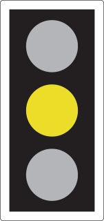
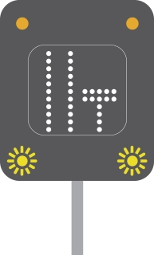

Light signals controlling traffic
=================================

Light signals used to control traffic, including traffic light signals, flashing red lights, motorway signals and lane control signals.

[Download ‘Light signals controlling traffic’ (PDF, 80KB)](https://assets.digital.cabinet-office.gov.uk/media/560aa3f9e5274a036900001c/the-highway-code-light-signals-controlling-traffic.pdf)

Traffic light signals
---------------------

RED means ‘Stop’. Wait behind the stop line on the carriageway

RED AND AMBER also means ‘Stop’. Do not pass through or start until GREEN shows

GREEN means you may go on if the way is clear. Take special care if you intend to turn left or right and give way to pedestrians who are crossing

AMBER means ‘Stop’ at the stop line. You may go on only if the AMBER appears after you have crossed the stop line or are so close to it that to pull up might cause an accident

A GREEN ARROW may be provided in addition to the full green signal if movement in a certain direction is allowed before or after the full green phase. If the way is clear you may go but only in the direction shown by the arrow. You may do this whatever other lights may be showing. White light signals may be provided for trams

Flashing red lights
-------------------

Alternately flashing red lights mean YOU MUST STOP

At level crossings, lifting bridges, airfields, fire stations, etc.

Motorway signals
----------------

These signals are also used on other high-speed roads.

You MUST NOT proceed further in this lane

Change lane

Reduced visibility ahead

Lane ahead closed

Temporary maximum speed advised and information message

You \*\*MUST NOT\*\* enter or proceed in the left lane, temporary mandatory maximum speed limit and information message

Temporary maximum speed advised

End of restriction

Lane control signals
--------------------

Green arrow - lane available to traffic facing the sign

Red crosses - lane closed to traffic facing the sign

White diagonal arrow - change lanes in direction shown
