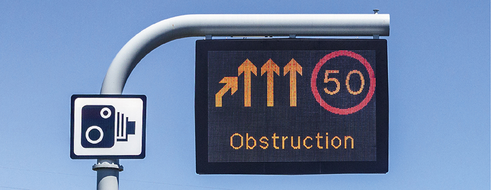
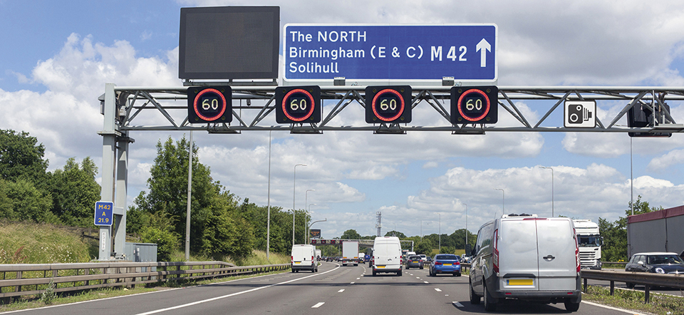
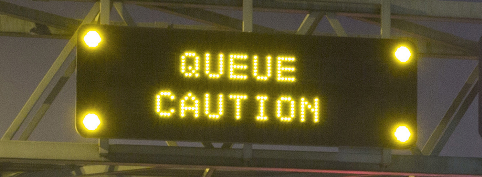
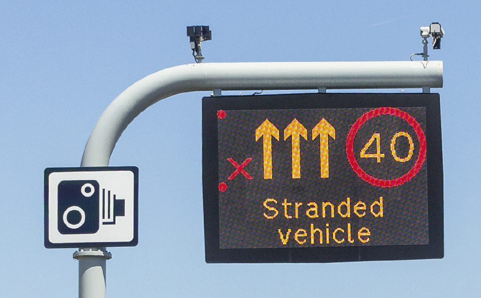
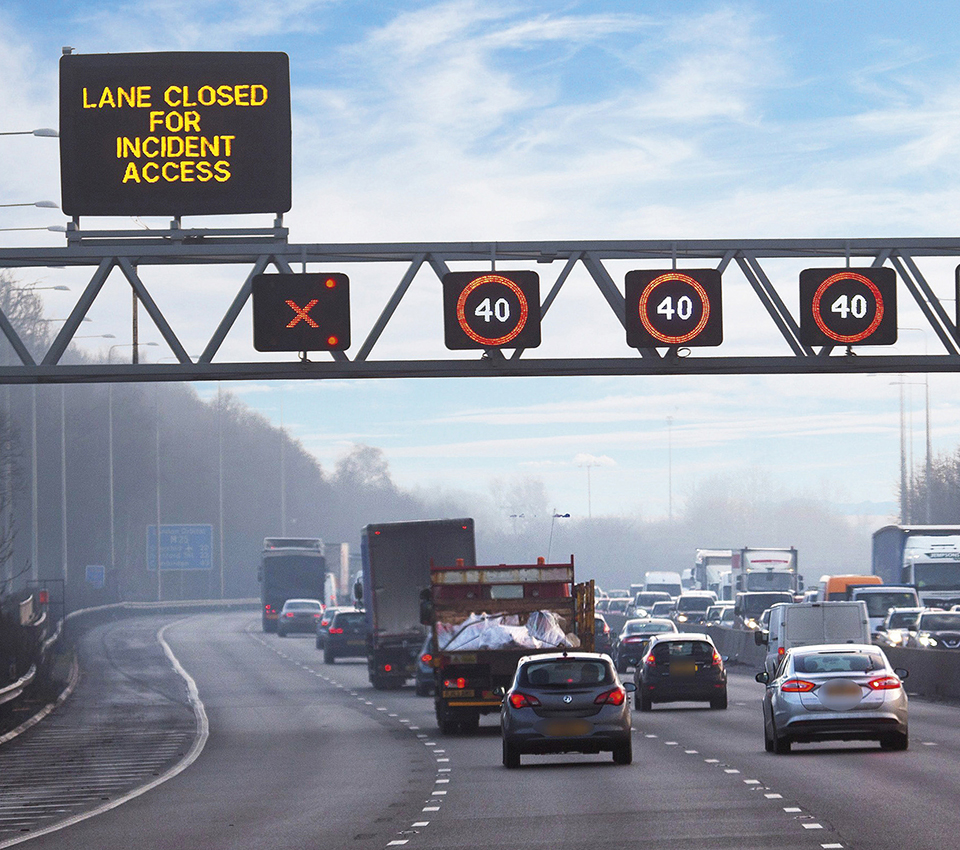
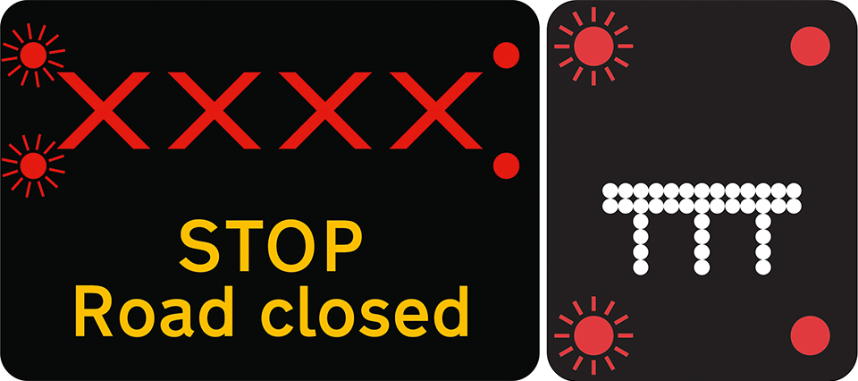
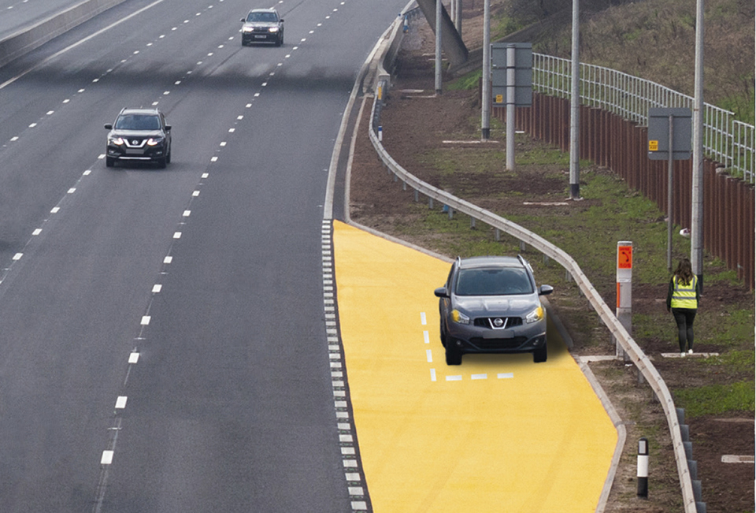
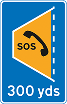

Motorways (253 to 274)
======================

Rules for motorways, including rules for signals, joining the motorway, driving on the motorway, lane discipline, overtaking, stopping and leaving the motorway. A number of the rules for motorways also apply to other high-speed roads.

A number of the rules for motorways also apply to other high-speed roads. Many other Rules apply to motorway driving, either wholly or in part: Rules [46](/pages/rules-for-users-of-powered-wheelchairs-and-mobility-scooters-36-to-46.md#rule-46), [57](/pages/rules-about-animals-47-to-58.md#rule-57), [83](/pages/rules-for-motorcyclists-83-to-88.md#rule-83) to [126](/pages/general-rules-techniques-and-advice-for-all-drivers-and-riders-103-to-158.md#rule-126), [130](/pages/general-rules-techniques-and-advice-for-all-drivers-and-riders-103-to-158.md#rule-130) to [134](/pages/general-rules-techniques-and-advice-for-all-drivers-and-riders-103-to-158.md#rule-134) , [139](/pages/general-rules-techniques-and-advice-for-all-drivers-and-riders-103-to-158.md#rule-139), [144](/pages/general-rules-techniques-and-advice-for-all-drivers-and-riders-103-to-158.md#rule-144), [146](/pages/general-rules-techniques-and-advice-for-all-drivers-and-riders-103-to-158.md#rule-146) to [151](/pages/general-rules-techniques-and-advice-for-all-drivers-and-riders-103-to-158.md#rule-151), [160](/pages/using-the-road-159-to-203.md#rule-160), [161](/pages/using-the-road-159-to-203.md#rule-161), [219](/pages/road-users-requiring-extra-care-204-to-225.md#rule-219), [221](/pages/road-users-requiring-extra-care-204-to-225.md#rule-221) to [222](/pages/road-users-requiring-extra-care-204-to-225.md#rule-222), [225](/pages/road-users-requiring-extra-care-204-to-225.md#rule-225), [226 to 237](/pages/driving-in-adverse-weather-conditions-226-to-237.md#rule-226), [274](/pages/breakdowns-and-incidents-274-to-287.md#rule-274) to [278](/pages/breakdowns-and-incidents-274-to-287.md#rule-278), [280](/pages/breakdowns-and-incidents-274-to-287.md#rule-280) and [281](/pages/breakdowns-and-incidents-274-to-287.md#rule-281) to [290](/pages/road-works-level-crossings-and-tramways-288-to-307.md#rule-290).

General (rules 253 to 254)
---------------------------

### Rule 253

**Prohibited vehicles.** Motorways **MUST NOT** be used by pedestrians, holders of provisional motorcycle licences, riders of motorcycles under 50 cc (4 kW), cyclists, horse riders, certain slow-moving vehicles and those carrying oversized loads (except by special permission), agricultural vehicles, and powered wheelchairs/powered mobility scooters (see [Rules 36 to 46](/pages/rules-for-users-of-powered-wheelchairs-and-mobility-scooters-36-to-46.md#rule-36) inclusive).

Provisional car licence holders **MUST NOT** drive on the motorway unless they are accompanied by a DVSA Approved Driving Instructor (ADI) and are driving a car displaying red L plates (or D plates in Wales) with dual controls.

Laws [HA 1980 sects 16](https://www.legislation.gov.uk/ukpga/1980/66/section/16), [17](https://www.legislation.gov.uk/ukpga/1980/66/section/17) & [sched 4](https://www.legislation.gov.uk/ukpga/1980/66/schedule/4), [MT(E&W)R regs 3(d)](https://www.legislation.gov.uk/uksi/1982/1163/regulation/3/made), [4](https://www.legislation.gov.uk/uksi/1982/1163/regulation/4/made) & [11](https://www.legislation.gov.uk/uksi/1982/1163/regulation/11/made) as amended by [MT(E&W)(A)R 2004](https://www.legislation.gov.uk/uksi/2004/3258/contents/made) & [MT(E&W)(A)R 2018](https://www.legislation.gov.uk/uksi/2018/222/contents/made), [R(S)A sects 7](https://www.legislation.gov.uk/ukpga/1984/54/section/7), [8](https://www.legislation.gov.uk/ukpga/1984/54/section/8) & [sched 3](https://www.legislation.gov.uk/ukpga/1984/54/schedule/3), [RTRA sect 17](https://www.legislation.gov.uk/ukpga/1984/27/section/17) & [MT(S)R reg 10](https://www.legislation.gov.uk/uksi/1995/2507/regulation/10/made) as amended by [MT(S)(A)R 2018](https://www.legislation.gov.uk/uksi/2018/225/contents/made)

### Rule 254

Traffic on motorways usually travels faster than on other roads, so you have less time to react. It is especially important to use your mirrors earlier and look much further ahead than you would on other roads.

Motorway signals (rules 255 to 258)
------------------------------------

### Rule 255

Signs and signals (see ‘[Light signals controlling traffic](/pages/light-signals-controlling-traffic.md)’) are used to warn you of hazards ahead. For example, there may be an incident, fog, a spillage or road workers on the carriageway which you may not immediately be able to see.

### Rule 256

A single sign or signal can display advice, restrictions and warnings for all lanes.

Lane specific signs and signals can display advice, restrictions and warnings that apply to individual lanes.

### Rule 257

**Amber flashing lights.** These signals warn of a hazard ahead. You should

* reduce your speed
* be prepared for the hazard
* only increase your speed when you pass a signal that is not flashing, or a sign displaying a national speed limit or the word ‘END’, and you are sure it is safe to do so.

Rule 257: Signal warning of a hazard### Rule 258

**Red flashing light** signals and a red ‘X’ on a sign identify a closed lane in which people, stopped vehicles or other hazards are present. You

* **MUST** follow the instructions on signs in advance of a closed lane to move safely to an open lane
* **MUST NOT** drive in a closed lane. A sign will inform you when the lane is no longer closed by displaying a speed limit or the word ‘END’.

Rule 258: signals and signs indicating lane closures

Rule 258: signals and signs indicating lane closuresBe aware that

* there can be several hazards in a closed lane
* emergency services and traffic authorities use closed lanes to reach incidents and help people in need
* where the left lane is closed at an exit slip road, this means that the exit cannot be used.

Where **red flashing light** signals and closure of all lanes are shown on a sign, the road is closed. You

* **MUST NOT** go beyond the sign in any lane or use the hard shoulder to avoid the road closure unless directed to do so by a police or traffic officer.

Rule 258: signals and signs indicating lane closuresLane and road closures indicated by red flashing lights are enforced by the police.

**Laws [RTA 1988 sects 35](https://www.legislation.gov.uk/ukpga/1988/52/section/35) & [36](https://www.legislation.gov.uk/ukpga/1988/52/section/36) as amended by [TMA sect 6](https://www.legislation.gov.uk/ukpga/2004/18/section/6), [TSRGD reg 3](https://www.legislation.gov.uk/uksi/2016/362/schedule/3/made) and [sched 15](https://www.legislation.gov.uk/uksi/2016/362/schedule/15/made), [MT(E&W)R reg 9](https://www.legislation.gov.uk/uksi/1982/1163/regulation/9/made) & [MT(S)R reg 8](https://www.legislation.gov.uk/uksi/1995/2507/regulation/8/made).**

Joining the motorway (rule 259)
--------------------------------

### Rule 259

**Joining the motorway.** When you join the motorway you will normally approach it from a road on the left (a slip road) or from an adjoining motorway. You should

* give priority to traffic already on the motorway
* check the traffic on the motorway and match your speed to fit safely into the traffic flow in the left-hand lane
* not cross solid white lines that separate lanes or use the hard shoulder
* stay on the slip road if it continues as an extra lane on the motorway
* remain in the left-hand lane long enough to adjust to the speed of traffic before considering overtaking.

On the motorway (rules 260 to 263)
-----------------------------------

### Rule 260

When you can see well ahead and the road conditions are good, you should

* drive at a steady cruising speed which you and your vehicle can handle safely and is within the speed limit (see [Rule 124](/pages/general-rules-techniques-and-advice-for-all-drivers-and-riders-103-to-158.md#rule-124) and the [Speed limits table](/pages/general-rules-techniques-and-advice-for-all-drivers-and-riders-103-to-158.md#speedlimits))
* keep a safe distance from the vehicle in front and increase the gap on wet or icy roads, or in fog (see Rules [126](/pages/general-rules-techniques-and-advice-for-all-drivers-and-riders-103-to-158.md#rule-126) and [235](/pages/driving-in-adverse-weather-conditions-226-to-237.md#rule-235)).

### Rule 261

You **MUST NOT** exceed

* a speed limit displayed within a red circle on a sign
* the maximum speed limit for the road and for your vehicle (see [Rule 124](/pages/general-rules-techniques-and-advice-for-all-drivers-and-riders-103-to-158.md#rule-124)).

Speed limits are enforced by the police (see [Rule 124](/pages/general-rules-techniques-and-advice-for-all-drivers-and-riders-103-to-158.md#rule-124)).

**Law [RTRA sects 17](http://www.legislation.gov.uk/ukpga/1984/27/section/17), [86](http://www.legislation.gov.uk/ukpga/1984/27/section/86), [89](http://www.legislation.gov.uk/ukpga/1984/27/section/89) & [sched 6](http://www.legislation.gov.uk/ukpga/1984/27/schedule/6)**

### Rule 262

The monotony of driving on motorways and other high-speed roads can make you feel sleepy. To minimise the risk, follow the advice in [Rule 91](/pages/rules-for-drivers-and-motorcyclists-89-to-102.md#rule-91) about ensuring you are fit to drive and taking breaks.

Service areas are located along motorways to allow you to take breaks and to obtain refreshments. Refreshment and rest facilities on the local road network may also be accessible from motorway exits.

### Rule 263

Unless directed to do so by a police or traffic officer, you **MUST NOT**

* reverse along any part of a motorway, including slip roads, hard shoulders and emergency areas
* cross the central reservation
* drive against the traffic flow.

If you have missed your exit, or have taken the wrong route, carry on to the next exit.

**Laws [RTA 1988 sect 35](https://www.legislation.gov.uk/ukpga/1988/52/section/35) as amended by [TMA sect 6](https://www.legislation.gov.uk/ukpga/2004/18/section/6), [MT(E&W)R regs 6](https://www.legislation.gov.uk/uksi/1982/1163/regulation/6/made), [8](https://www.legislation.gov.uk/uksi/1982/1163/regulation/8/made) & [10](https://www.legislation.gov.uk/uksi/1982/1163/regulation/10/made), & [MT(S)R regs 4](https://www.legislation.gov.uk/uksi/1995/2507/regulation/4/made), [5](https://www.legislation.gov.uk/uksi/1995/2507/regulation/5/made), [7](https://www.legislation.gov.uk/uksi/1995/2507/regulation/7/made) & [9](https://www.legislation.gov.uk/uksi/1995/2507/regulation/9/made)**

Lane discipline (rules 264 to 266)
-----------------------------------

### Rule 264

Keep in the left lane unless overtaking.

* If you are overtaking, you should return to the left lane when it is safe to do so (see also [Rules 267](/pages/motorways-253-to-273.md#rule-267) and [268](/pages/motorways-253-to-273.md#rule-268)).
* Be aware of emergency services, traffic officers, recovery workers and other people or vehicles stopped on the hard shoulder or in an emergency area. If you are driving in the left lane, and it is safe to do so, you should move into the adjacent lane to create more space between your vehicle and the people and stopped vehicles.

### Rule 265

The right-hand lane of a motorway with three or more lanes **MUST NOT** be used (except in prescribed circumstances) if you are driving

* any vehicle drawing a trailer
* a goods vehicle with a maximum laden weight exceeding 3.5 tonnes but not exceeding 7.5 tonnes, which is required to be fitted with a speed limiter
* a goods vehicle with a maximum laden weight exceeding 7.5 tonnes
* a passenger vehicle with a maximum laden weight exceeding 7.5 tonnes constructed or adapted to carry more than eight seated passengers in addition to the driver
* a passenger vehicle with a maximum laden weight not exceeding 7.5 tonnes which is constructed or adapted to carry more than eight seated passengers in addition to the driver, which is required to be fitted with a speed limiter.

**Laws [MT(E&W)R reg 12](http://www.legislation.gov.uk/uksi/1982/1163/contents/made), [MT(E&W)(A)R](http://www.legislation.gov.uk/uksi/2004/3258/pdfs/uksi_20043258_en.pdf), [MT(S)R reg 11](http://www.legislation.gov.uk/uksi/1995/2507/regulation/11/made) & [MT(S)(A)R](http://www.legislation.gov.uk/ssi/2004/53/contents/made)**

### Rule 266

**Approaching a junction.** Look well ahead for signals, signs and road markings. Direction signs may be placed over the road. If you need to, you should change lanes well ahead of a junction. At some junctions, a lane may lead directly off the road. Only get in that lane if you wish to go in the direction indicated by signs or road markings.

Overtaking (rules 267 to 269)
------------------------------

### Rule 267

Do not overtake unless you are sure it is safe and legal to do so. Overtake only on the right. You should

* check your mirrors
* take time to judge the speeds correctly
* make sure that the lane you will be joining is sufficiently clear ahead and behind
* take a quick sideways glance into the blind spot area to verify the position of a vehicle that may have disappeared from your view in the mirror
* remember that traffic may be coming up behind you very quickly. Check all your mirrors carefully. Look out for motorcyclists. When it is safe to do so, signal in plenty of time, then move out
* ensure you do not cut in on the vehicle you have overtaken
* be especially careful at night and in poor visibility when it is harder to judge speed and distance.

### Rule 268

Do not overtake on the left or move to a lane on your left to overtake. In congested conditions, where adjacent lanes of traffic are moving at similar speeds, traffic in left-hand lanes may sometimes be moving faster than traffic to the right. In these conditions you may keep up with the traffic in your lane even if this means passing traffic in the lane to your right. Do not weave in and out of lanes to overtake.

### Rule 269

**Hard shoulder** (where present). You **MUST NOT** use a hard shoulder except in an emergency or if directed to do so by the police, traffic officers or a traffic sign.

**Hard shoulder** (where used as an extra lane). The hard shoulder is used as an extra lane on some motorways during periods of congestion. A red ‘X’ or blank sign above the hard shoulder means that you **MUST NOT** use the hard shoulder except in an emergency.

You can only use the hard shoulder as an extra lane when a speed limit is shown above the hard shoulder.

Where the hard shoulder is being used as an extra lane, emergency areas are provided for use in an emergency (see [Rule 270](/pages/motorways-253-to-273.md#rule-270)).

**Laws [MT(E&W)R regs 5](https://www.legislation.gov.uk/uksi/1995/2507/regulation/9/made) & [9](https://www.legislation.gov.uk/uksi/1982/1163/regulation/9/made), [MT(S)R regs 4](https://www.legislation.gov.uk/uksi/1995/2507/regulation/4/made) & [8](https://www.legislation.gov.uk/uksi/1995/2507/regulation/8/made), & [RTA 1988 sects 35](https://www.legislation.gov.uk/ukpga/1988/52/section/35) & [36](https://www.legislation.gov.uk/ukpga/1988/52/section/36) as amended by [TMA sect 6](https://www.legislation.gov.uk/ukpga/2004/18/section/6)**

Stopping (rules 270 to 271)
----------------------------

### Rule 270

**Emergency areas** are located along motorways with no hard shoulder or where the hard shoulder can be used as an extra lane (see [Rule 269](/pages/motorways-253-to-273.md#rule-269)) and **MUST** only be used in an emergency.

They are marked by blue signs with an orange SOS telephone symbol and may have orange surfacing.

Rule 270: emergency area

Rule 270: sign indicating distance to next emergency areaFollow the requirements and advice in

* [Rule 277](/pages/breakdowns-and-incidents-274-to-287.md#rule-277) if your vehicle develops a problem on the motorway
* [Rule 278](/pages/breakdowns-and-incidents-274-to-287.md#rule-278) to rejoin the carriageway from an emergency area.

**Laws [MT(E&W)R reg 9](https://www.legislation.gov.uk/uksi/1982/1163/regulation/9/made) as amended by [MT(E&W)(A)(E)R](https://www.legislation.gov.uk/uksi/2015/392/contents/made), & [MT(S)R reg 8](https://www.legislation.gov.uk/uksi/1995/2507/regulation/8/made)**

### Rule 271

You **MUST NOT** stop on any carriageway, emergency area, hard shoulder, slip road, central reservation or verge except in an emergency, or when told to do so by the police, traffic officers, an emergency sign or by red flashing light signals.

Do not stop on any part of a motorway to make or receive mobile telephone calls, except in an emergency.

**Laws [MT(E&W)R regs 7](https://www.legislation.gov.uk/uksi/1982/1163/regulation/7/made), [9](https://www.legislation.gov.uk/uksi/1982/1163/regulation/9/made), [10](https://www.legislation.gov.uk/uksi/1982/1163/regulation/10/made) & [16](https://www.legislation.gov.uk/uksi/1982/1163/regulation/16/made) as amended by MT(E&W)(A)(E)R, [MT(S)R regs 6(1)](https://www.legislation.gov.uk/uksi/1995/2507/regulation/6/made), [8](https://www.legislation.gov.uk/uksi/1995/2507/regulation/8/made), [9](https://www.legislation.gov.uk/uksi/1995/2507/regulation/9/made) & [14](https://www.legislation.gov.uk/uksi/1995/2507/regulation/14/made), [PRA sect 41](https://www.legislation.gov.uk/ukpga/2002/30/section/41) & [sched 5(8)](https://www.legislation.gov.uk/ukpga/2002/30/schedule/5), [RTA 1988 sects 35](https://www.legislation.gov.uk/ukpga/1988/52/section/35), [36](https://www.legislation.gov.uk/ukpga/1988/52/section/36) & [163](https://www.legislation.gov.uk/ukpga/1988/52/section/163) as amended by [TMA sect 6](https://www.legislation.gov.uk/ukpga/2004/18/section/6), & [CUR reg 110 as amended by CUR(A)(No4)R](https://www.legislation.gov.uk/uksi/2003/2695/regulation/2/made)**

### Rule 272

You **MUST NOT** pick up or set down anyone, or walk on a motorway, except in an emergency.

**Laws [RTRA sect 17](https://www.legislation.gov.uk/ukpga/1984/27/section/17) & [MT(E&W)R reg 15](https://www.legislation.gov.uk/uksi/1982/1163/regulation/15/made)**

Leaving the motorway (rules 273 to 274)
----------------------------------------

### Rule 273

Unless signs indicate that a lane leads directly off the motorway, you will normally leave the motorway by a slip road on your left. You should

* watch for the signs letting you know you are getting near your exit
* move into the left-hand lane well before reaching your exit
* signal left in good time and reduce your speed on the slip road as necessary.

### Rule 274

On leaving the motorway or using a link road between motorways, your speed may be higher than you realise - 50 mph may feel like 30 mph. Check your speedometer and adjust your speed accordingly. Some slip-roads and link roads have sharp bends, so you will need to slow down.
