Road markings
=============

Road markings used, including those across the carriageway, along the carriageway, along the edge of the carriageway, on the kerb or at the edge of the carriageway and other road markings.

[Download ‘Road markings’ (PDF, 715KB)](https://assets.digital.cabinet-office.gov.uk/media/560aa6c7ed915d035900001a/the-highway-code-road-markings.pdf)

Across the carriageway
-----------------------

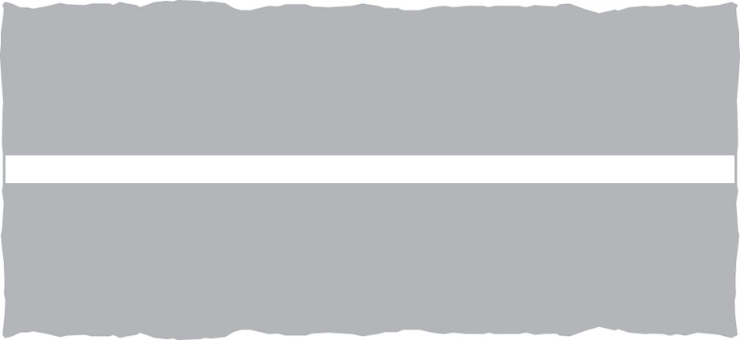

Stop line at signals or police control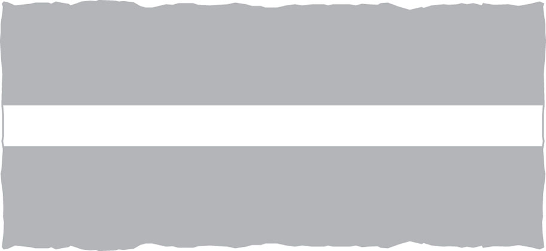

Stop line at ‘Stop’ sign

Stop line for pedestrians at a level crossing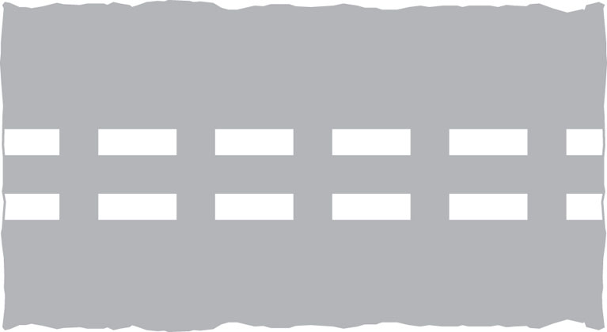

Give way to traffic on major road (can also be used at mini roundabouts)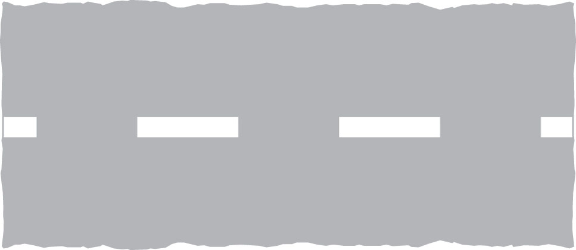

Give way to traffic from the right at a roundabout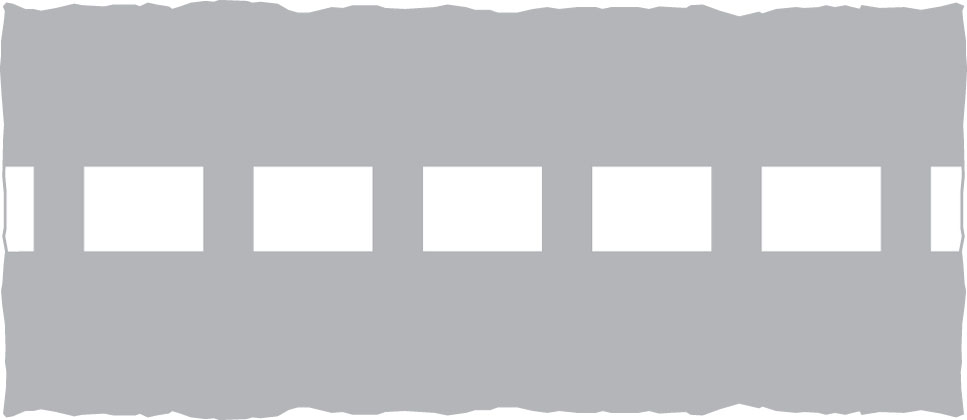

Give way to traffic from the right at a mini-roundabout

Along the carriageway
----------------------

Edge line

 Centre line [See Rule 127](/pages/general-rules-techniques-and-advice-for-all-drivers-and-riders-103-to-158.md#rule-127)

 Hazard warning line [See Rule 127](/pages/general-rules-techniques-and-advice-for-all-drivers-and-riders-103-to-158.md#rule-127)

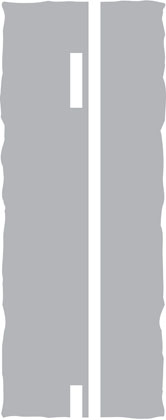

 Double white lines See Rules [128](/pages/general-rules-techniques-and-advice-for-all-drivers-and-riders-103-to-158.md#rule-128) and [129](/pages/general-rules-techniques-and-advice-for-all-drivers-and-riders-103-to-158.md#rule-129)

 Double white lines See Rules [128](/pages/general-rules-techniques-and-advice-for-all-drivers-and-riders-103-to-158.md#rule-128) and [129](/pages/general-rules-techniques-and-advice-for-all-drivers-and-riders-103-to-158.md#rule-129)

 See [Rule 130](/pages/general-rules-techniques-and-advice-for-all-drivers-and-riders-103-to-158.md#rule-130)

 Lane line See [Rule 131](/pages/general-rules-techniques-and-advice-for-all-drivers-and-riders-103-to-158.md#rule-131)

Along the edge of the carriageway
----------------------------------

### Waiting restrictions

Waiting restrictions indicated by yellow lines apply to the carriageway, pavement and verge. You may stop to load or unload (unless there are also loading restrictions as described below) or while passengers board or alight. Double yellow lines mean no waiting at any time, unless there are signs that specifically indicate seasonal restrictions. The times at which the restrictions apply for other road markings are shown on nearby plates or on entry signs to controlled parking zones. If no days are shown on the signs, the restrictions are in force every day including Sundays and Bank Holidays.
White bay markings and upright signs (see below) indicate where parking is allowed.

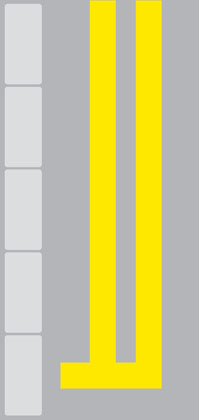

No waiting at any time

No waiting during times shown on sign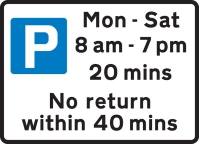

 

Waiting is limited to the duration specified during the days and times shown### Red Route stopping controls

Red lines are used on some roads instead of yellow lines. In London the double and single red lines used on Red Routes indicate that stopping to park, load/unload or to board and alight from a vehicle (except for a licensed taxi or if you hold a Blue Badge) is prohibited. The red lines apply to the carriageway, pavement and verge. The times that the red line prohibitions apply are shown on nearby signs, but the double red line ALWAYS means no stopping at any time. On Red Routes you may stop to park, load/unload in specially marked boxes and adjacent signs specify the times and purposes and duration allowed. A box MARKED IN RED indicates that it may only be available for the purpose specified for part of the day (eg between busy peak periods). A box MARKED IN WHITE means that it is available throughout the day.

RED AND SINGLE YELLOW LINES CAN ONLY GIVE A GUIDE TO THE RESTRICTIONS AND CONTROLS IN FORCE AND SIGNS, NEARBY OR AT A ZONE ENTRY, MUST BE CONSULTED.

 

No stopping at any time

 

No stopping during times shown on sign

 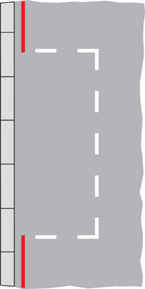

Parking is limited to the duration specified during the days and times shown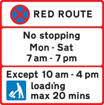

 

Only loading may take place at the times shown for up to a maximum duration of 20 mins

On the kerb or at the edge of the carriageway
----------------------------------------------

### Loading restrictions on roads other than Red Routes

Yellow marks on the kerb or at the edge of the carriageway indicate that loading or unloading is prohibited at the times shown on the nearby black and white plates. You may stop while passengers board or alight. If no days are indicated on the signs the restrictions are in force every day including Sundays and Bank Holidays.

ALWAYS CHECK THE TIMES SHOWN ON THE PLATES.

Lengths of road reserved for vehicles loading and unloading are indicated by a white ‘bay’ marking with the words ‘Loading Only’ and a sign with the white on blue ‘trolley’ symbol. This sign also shows whether loading and unloading is restricted to goods vehicles and the times at which the bay can be used. If no times or days are shown it may be used at any time. Vehicles may not park here if they are not loading or unloading.

 

No loading or unloading at any time

 

No loading or unloading at the times shown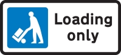

 

Loading bay

Other road markings
--------------------

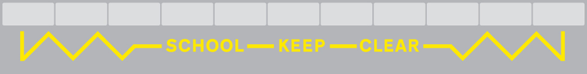

Keep entrance clear of stationary vehicles, even if picking up or setting down children

Warning of ‘Give Way’ just ahead

Parking space reserved for vehicles named

 See [Rule 243](/pages/waiting-and-parking-238-to-252.md#rule-243)

 See [Rule 141](/pages/general-rules-techniques-and-advice-for-all-drivers-and-riders-103-to-158.md#rule-141)

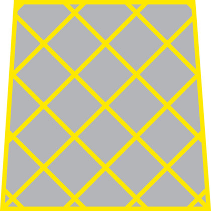

 Box junction - See [Rule 174](/pages/using-the-road-159-to-203.md#rule-174)

Do not block that part of the carriageway indicated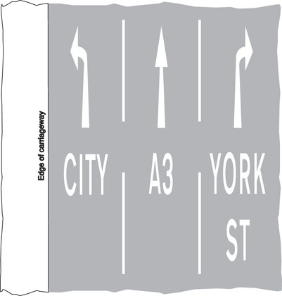

Indication of traffic lanes
