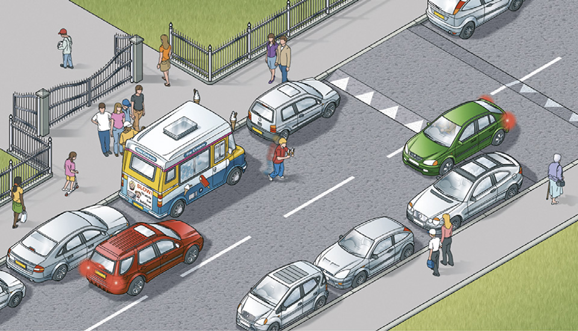
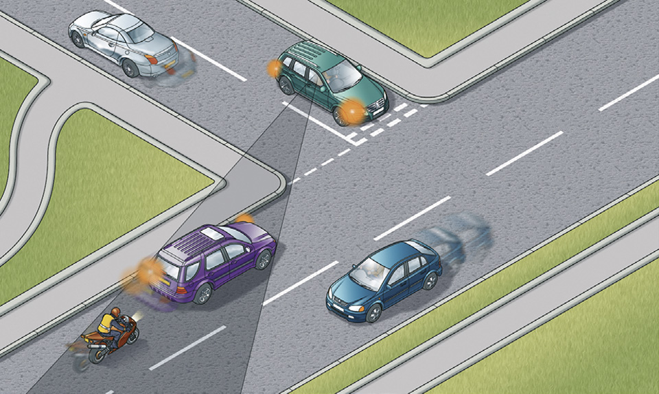
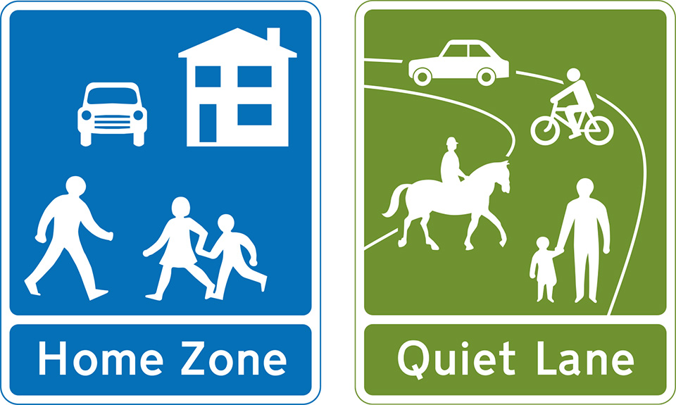
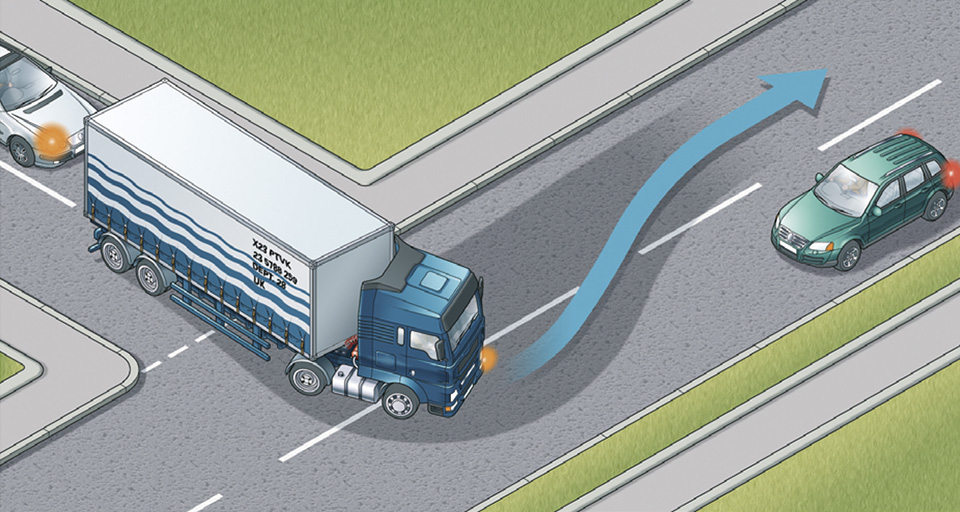

Road users requiring extra care (204 to 225)
==============================================

Rules for road users requiring extra care, including pedestrians, motorcyclists and cyclists, other road users and other vehicles.

Overview (rule 204)
-------------------

### Rule 204

The road users most at risk from road traffic are pedestrians, in particular children, older adults and disabled people, cyclists, horse riders and motorcyclists. It is particularly important to be aware of children, older adults and disabled people, and learner and inexperienced drivers and riders. In any interaction between road users, those who can cause the greatest harm have the greatest responsibility to reduce the danger or threat they pose to others.

Pedestrians (rules 205 to 210)
------------------------------

### Rule 205

There is a risk of pedestrians, especially children, stepping unexpectedly into the road. You should drive with the safety of children in mind at a speed suitable for the conditions.

### Rule 206

**Drive carefully and slowly** when

* in crowded shopping streets, Home Zones and Quiet Lanes (see [Rule 218](/pages/road-users-requiring-extra-care-204-to-225.md#rule-218)) or residential areas
* driving past bus and tram stops; pedestrians may emerge suddenly into the road
* passing parked vehicles, especially ice cream vans; children are more interested in ice cream than traffic and may run into the road unexpectedly
* needing to cross a pavement, cycle lane or cycle track; for example, to reach or leave a driveway or private access. Give way to pedestrians on the pavement and cyclists using a cycle lane or cycle track
* reversing into a side road; look all around the vehicle and give way to any pedestrians who may be crossing the road
* turning at road junctions; you should give way to pedestrians who are crossing or waiting to cross the road into which or from which you are turning
* going through road works or when passing roadside rescue and recovery vehicles, as there may be people working in or at the side of the road
* the pavement is closed due to street repairs and pedestrians are directed to use the road
* approaching pedestrians on narrow rural roads without a footway or footpath. Always slow down and be prepared to stop if necessary, giving them plenty of room as you drive past
* approaching zebra and parallel crossings as you **MUST** give way to pedestrians and cyclists on the crossing (see [Rule 195](/pages/using-the-road-159-to-203.md#rule-195))
* approaching pedestrians who have started to cross the road ahead of you. They have priority when crossing at a junction or side road so you should give way (see [Rule H2](/pages/introduction.md#rule-h2)).

**[Law TSRGD schedule 14 Part 5](http://www.legislation.gov.uk/uksi/2016/362/schedule/14/made)**

Rule 206: Watch out for children in busy areas

### Rule 207

**Particularly vulnerable pedestrians.** These include:

* children and older pedestrians who may not be able to judge your speed and could step into the road in front of you. At 40 mph (64 km/h) your vehicle will probably kill any pedestrians it hits. At 20 mph (32 km/h) there is only a 1 in 20 chance of the pedestrian being killed. So kill your speed
* older pedestrians who may need more time to cross the road. Be patient and allow them to cross in their own time. Do not hurry them by revving your engine or edging forward
* people with disabilities. People with hearing impairments may not be aware of your vehicle approaching. Those with walking difficulties require more time
* blind or partially sighted people, who may be carrying a white cane using a guide dog. They may not be able to see you approaching
* deafblind people who may be carrying a white cane with a red band or using a dog with a red and white harness. They may not see or hear instructions or signals.

### Rule 208

**Near schools.** Drive slowly and be particularly aware of young cyclists and pedestrians. In some places, there may be a flashing amber signal below the ‘School’ warning sign which tells you that there may be children crossing the road ahead. Drive very slowly until you are clear of the area.

### Rule 209

Drive carefully and slowly when passing a stationary bus showing a ‘School Bus’ sign as children may be getting on or off.

School bus (displayed in front and rear window of bus or coach)

### Rule 210

You **MUST** stop when a school crossing patrol shows a ‘Stop for children’ sign (see ‘[Signals by authorised persons](/pages/signals-by-authorised-persons.md)’ and ‘[Traffic signs](/pages/traffic-signs.md)’).

**Law [RTRA sect 28](http://www.legislation.gov.uk/ukpga/1984/27/section/28)**

Motorcyclists and cyclists (rules 211 to 213)
---------------------------------------------

### Rule 211

It is often difficult to see motorcyclists and cyclists, especially when they are waiting alongside you, coming up from behind, coming out of or moving off from junctions, at roundabouts, overtaking you or filtering through traffic. Always look out for them before you emerge from a junction; they could be approaching faster than you think.

Do not turn at a junction if to do so would cause the cyclist going straight ahead to stop or swerve, just as you would do with a motor vehicle.

When turning right across a line of slow-moving or stationary traffic, look out for and give way to cyclists or motorcyclists on the inside of the traffic you are crossing. Be especially careful when moving off, turning, and when changing direction or lane. Be sure to check mirrors and blind spots carefully.

Rule 211: Look out for motorcyclists and cyclists at junctions

### Rule 212

Give motorcyclists, cyclists, horse riders, horse drawn vehicles and pedestrians walking in the road (for example, where there is no pavement), at least as much room as you would when overtaking a car (see [Rules 162 to 167](/pages/using-the-road-159-to-203.md#rule-162)). Drivers should take extra care and give more space when overtaking motorcyclists, cyclists, horse riders, horse drawn vehicles and pedestrians in bad weather (including high winds) and at night. If the rider looks over their shoulder it could mean that they intend to pull out, turn right or change direction. Give them time and space to do so.

### Rule 213

On narrow sections of road, on quiet roads or streets, at road junctions and in slower-moving traffic, cyclists may sometimes ride in the centre of the lane, rather than towards the side of the road. It can be safer for groups of cyclists to ride two abreast in these situations. Allow them to do so for their own safety, to ensure they can see and be seen. Cyclists are also advised to ride at least a door’s width or 1 metre from parked cars for their own safety.

On narrow sections of road, horse riders may ride in the centre of the lane. Allow them to do so for their own safety to ensure they can see and be seen.

Motorcyclists, cyclists, horse riders and horse drawn vehicles may suddenly need to avoid uneven road surfaces and obstacles such as drain covers or oily, wet or icy patches on the road. Give them plenty of room and pay particular attention to any sudden change of direction they may have to make.

Other road users (rules 214 to 218)
-----------------------------------

### Rule 214

**Animals.** When passing animals, drive slowly. Give them plenty of room and be ready to stop. Do not scare animals by sounding your horn, revving your engine or accelerating rapidly once you have passed them. Look out for animals being led, driven or ridden on the road and take extra care. Keep your speed down at bends and on narrow country roads. If a road is blocked by a herd of animals, stop and switch off your engine until they have left the road. Watch out for animals on unfenced roads.

### Rule 215

**Horse riders and horse-drawn vehicles.** Be particularly careful of horse riders and horse-drawn vehicles especially when approaching, overtaking, passing or moving away. Always pass wide and slowly. When you see a horse on a road, you should slow down to a maximum of 10 mph. Be patient, do not sound your horn or rev your engine. When safe to do so, pass wide and slow, allowing at least 2 metres of space.

Feral or semi feral ponies found in areas such as the New Forest, Exmoor and Dartmoor require the same consideration as ridden horses when approaching or passing.

Horse riders are often children, so take extra care and remember riders may ride in double file when escorting a young or inexperienced horse or rider. Look out for horse riders’ and horse drivers’ signals and heed a request to slow down or stop. Take great care and treat all horses as a potential hazard; they can be unpredictable, despite the efforts of their rider/driver. Remember there are three brains at work when you pass a horse; the rider’s, the driver’s and the horse’s. Do not forget horses are flight animals and can move incredibly quickly if startled.

### Rule 216

**Older drivers.** Their reactions may be slower than other drivers. Make allowance for this.

### Rule 217

**Learners and inexperienced drivers.** They may not be so skilful at anticipating and responding to events. Be particularly patient with learner drivers and young drivers. Drivers who have recently passed their test may display a ‘new driver’ plate or sticker (see ‘[Safety code for new drivers](/pages/annex-8-safety-code-for-new-drivers.md)’).

### Rule 218

**Home Zones and Quiet Lanes.** These are places where people could be using the whole of the road for a range of activities such as children playing or for a community event. You should drive slowly and carefully and be prepared to stop to allow people extra time to make space for you to pass them in safety.

Other vehicles (rules 219 to 225)
---------------------------------

### Rule 219

**Emergency and Incident Support vehicles.** You should look and listen for ambulances, fire engines, police, doctors or other emergency vehicles using flashing blue, red or green lights and sirens or flashing headlights, or traffic officer and incident support vehicles using flashing amber lights. When one approaches do not panic. Consider the route of such a vehicle and take appropriate action to let it pass, while complying with all traffic signs. If necessary, pull to the side of the road and stop, but try to avoid stopping before the brow of a hill, a bend or narrow section of road. Do not endanger yourself, other road users or pedestrians and avoid mounting the kerb. Do not brake harshly on approach to a junction or roundabout, as a following vehicle may not have the same view as you.

### Rule 220

**Powered vehicles used by disabled people.** These small vehicles travel at a maximum speed of 8 mph (12 km/h). On a dual carriageway where the speed limit exceeds 50 mph (80 km/h) they **MUST** have a flashing amber beacon, but on other roads you may not have that advance warning (see [Rules 36 to 46](/pages/rules-for-users-of-powered-wheelchairs-and-mobility-scooters-36-to-46.md) inclusive).

**Law [RVLR regs 17(1)](http://www.legislation.gov.uk/uksi/1989/1796/regulation/17/made) & [26](http://www.legislation.gov.uk/uksi/1989/1796/regulation/26/made)**

### Rule 221

**Large vehicles.** These may need extra road space to turn or to deal with a hazard that you are not able to see. If you are following a large vehicle, such as a bus or articulated lorry, be aware that the driver may not be able to see you in the mirrors. Be prepared to stop and wait if it needs room or time to turn.

Rule 221: Large vehicles need extra room

### Rule 222

Large vehicles can block your view. Your ability to see and to plan ahead will be improved if you pull back to increase your separation distance. Be patient, as larger vehicles are subject to lower speed limits than cars and motorcycles. Many large vehicles may be fitted with speed limiting devices which will restrict speed to 56 mph (90 km/h) even on a motorway.

### Rule 223

**Buses, coaches and trams.** Give priority to these vehicles when you can do so safely, especially when they signal to pull away from stops. Look out for people getting off a bus or tram and crossing the road.

### Rule 224

**Electric vehicles.** Be careful of electric vehicles such as milk floats and trams. Trams move quickly but silently and cannot steer to avoid you.

### Rule 225

**Vehicles with flashing amber beacons.** These warn of a slow-moving or stationary vehicle (such as a traffic officer vehicle, salt spreader, snow plough or recovery vehicle) or abnormal loads, so approach with caution. On unrestricted dual carriageways, motor vehicles first used on or after 1 January 1947 with a maximum speed of 25 mph (40 km/h) or less (such as tractors) **MUST** use a flashing amber beacon (also see [Rule 220](#rule-220)).

**Law [RVLR reg 17](http://www.legislation.gov.uk/uksi/1989/1796/regulation/17/made)**
