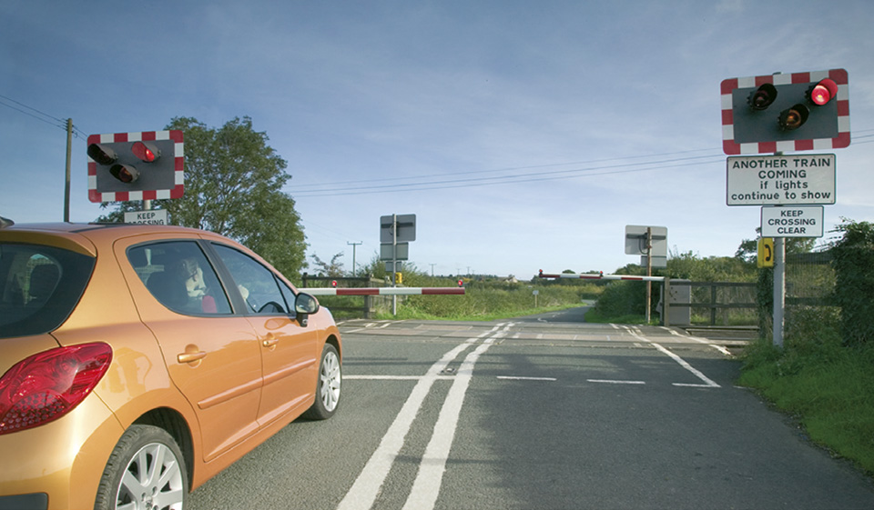

Road works, level crossings and tramways (288 to 307)
=====================================================

Rules for road works (including on motorways and other high-speed roads), level crossings and tramways.

Road works (rule 288)
----------------------

### Rule 288

When the ‘Road Works Ahead’ sign is displayed, take extra care and look for additional signs providing more specific instructions. Observe all signs – they are there for your safety and the safety of road workers.

* You **MUST NOT** exceed any temporary maximum speed limit.
* Keep a safe distance from the vehicle in front (see Rule 126).
* Use your mirrors and get into the correct lane for your vehicle in good time and as signs direct.
* Do not switch lanes to overtake queuing traffic.
* Take extra care near cyclists and motorcyclists as they are vulnerable to skidding on grit, mud or other debris at road works.
* Where lanes are restricted due to road works, merge in turn (see Rule 134).
* Do not drive through an area marked off by traffic cones.
* Watch out for vehicles entering or leaving the works area. Where vehicles are travelling in the road and are displaying amber warning lights, leave extra space and expect them to slow or turn into a works area.
* Concentrate on the road ahead, not the road works.
* Bear in mind that the road ahead may be obstructed by the works or by slow-moving or stationary traffic.

**Law [RTRA sect 16](http://www.legislation.gov.uk/ukpga/1984/27/section/16)**

Additional rules for high-speed roads (rules 289 to 290)
---------------------------------------------------------

### Rule 289

Take special care on motorways and other high-speed dual carriageways.

* Lanes may be closed to traffic and a lower speed limit may apply.
* Works vehicles may be used to close lanes or carriageways for repairs. Where large ‘Keep Left’ or ‘Keep Right’ signs are displayed on the back, you MUST move over and pass the works vehicle on the side indicated and not return to the closed lane until you can see it is safe to do so.
* Where a vehicle displays the sign ‘CONVOY VEHICLE NO OVERTAKING’, you MUST NOT pass the vehicle. A flashing light arrow or red ‘X’ may also be used to make the works vehicle more visible from a distance and give earlier warning to drivers.

**Laws [RTA 1988 sect 36](https://www.legislation.gov.uk/ukpga/1988/52/section/36/), [TSRGD reg 3](https://www.legislation.gov.uk/uksi/2002/3113/regulation/3/made) and [sched 13](https://www.legislation.gov.uk/uksi/2002/3113/schedule/13/made)**

### Rule 290

Road works may contain features that require extra care.

* **Narrow lanes.** Lanes may be narrower than normal and will be marked by studs or temporary road markings. Keep a safe distance (see [Rule 126](/pages/general-rules-techniques-and-advice-for-all-drivers-and-riders-103-to-158.md#rule-126)) from the vehicle in front and make sure you can clearly see the edges of the lane ahead.
* **Contraflow systems**. These mean that you may be travelling in a narrower lane than normal and with no permanent barrier between you and oncoming traffic. At the start and finish of contraflows, you should slow down and increase the distance to the vehicle in front because changes in the camber of the road may affect vehicle stability.
* **Breakdown advice.** If your vehicle breaks down in road works, follow Rules 275, 277 and 278 but be aware that areas marked off by cones contain significant hazards. Where available, you should move your vehicle into a signed road works refuge location. Signs indicate where dedicated recovery services are provided.

Level crossings (rules 291 to 299)
-----------------------------------

### Rule 291

A level crossing is where a road crosses a railway or tramway line. Approach and cross it with care. Never drive onto a crossing until the road is clear on the other side and do not get too close to the car in front. Never stop or park on, or near, a crossing.

### Rule 292

**Overhead electric lines.** It is dangerous to touch overhead electric lines. You **MUST** obey the safe height warning road signs and you should not continue forward onto the railway if your vehicle touches any height barrier or bells. The clearance available is usually 5 metres (16 feet 6 inches) but may be lower.

**Laws [RTA 1988 sect 36](http://www.legislation.gov.uk/ukpga/1988/52/section/36) & [TSRGD reg 17(5)](http://www.legislation.gov.uk/uksi/2002/3113/regulation/17/made)**

### Rule 293

**Controlled Crossings.** Most crossings have traffic light signals with a steady amber light, twin flashing red stop lights (see [‘Light signals controlling traffic’](/pages/light-signals-controlling-traffic.md) and [‘Traffic signs’](/pages/traffic-signs.md)) and an audible alarm for pedestrians. They may have full, half or no barriers.

* You **MUST** always obey the flashing red stop lights.
* You **MUST** stop behind the white line across the road.
* Keep going if you have already crossed the white line when the amber light comes on.
* Do not reverse onto or over a controlled crossing.
* You **MUST** wait if a train goes by and the red lights continue to flash. This means another train will be passing soon.
* Only cross when the lights go off and barriers open.
* Never zig-zag around half-barriers, they lower automatically because a train is approaching.
* At crossings where there are no barriers, a train is approaching when the lights show.

**Laws [RTA 1988 sect 36](http://www.legislation.gov.uk/ukpga/1988/52/section/36) & [TSRGD regs 10](http://www.legislation.gov.uk/uksi/2002/3113/regulation/10/made) & [40](http://www.legislation.gov.uk/uksi/2002/3113/regulation/40/made)**

Rule 293: Stop when the traffic lights show### Rule 294

**Railway telephones.** If you are driving a large or slow- moving vehicle, a long, low vehicle with a risk of grounding, or herding animals, a train could arrive before you are clear of the crossing. You **MUST** obey any sign instructing you to use the railway telephone to obtain permission to cross. You **MUST** also telephone when clear of the crossing if requested to do so.

**Laws [RTA 1988 sect 36](http://www.legislation.gov.uk/ukpga/1988/52/section/36) & [TSRGD regs 10](http://www.legislation.gov.uk/uksi/2002/3113/regulation/10/made) & [16(1)](http://www.legislation.gov.uk/uksi/2002/3113/regulation/16/made)**

### Rule 295

**Crossings without traffic lights.** Vehicles should stop and wait at the barrier or gate when it begins to close and not cross until the barrier or gate opens.

### Rule 296

**User-operated gates or barriers.** Some crossings have ‘Stop’ signs and small red and green lights. You **MUST NOT** cross when the red light is showing, only cross if the green light is on. If crossing with a vehicle, you should

* open the gates or barriers on both sides of the crossing
* check that the green light is still on and cross quickly
* close the gates or barriers when you are clear of the crossing.

**Laws [RTA 1988 sect 36](http://www.legislation.gov.uk/ukpga/1988/52/section/36) & [TSRGD regs 10](http://www.legislation.gov.uk/uksi/2002/3113/regulation/10/made) & [52(2)](http://www.legislation.gov.uk/uksi/2002/3113/regulation/52/made)**

### Rule 297

If there are no lights, follow the procedure in [Rule 296](#rule-296). Stop, look both ways and listen before you cross. If there is a railway telephone, always use it to contact the signal operator to make sure it is safe to cross. Inform the signal operator again when you are clear of the crossing.

### Rule 298

**Open crossings.** These have no gates, barriers, attendant or traffic lights but will have a ‘Give Way’ sign. You should look both ways, listen and make sure there is no train coming before you cross.

### Rule 299

**Incidents and breakdowns.** If your vehicle breaks down, or if you have an incident on a crossing you should

* get everyone out of the vehicle and clear of the crossing immediately
* use a railway telephone if available to tell the signal operator. Follow the instructions you are given
* move the vehicle clear of the crossing if there is time before a train arrives. If the alarm sounds, or the amber light comes on, leave the vehicle and get clear of the crossing immediately.

Tramways (rules 300 to 307)
----------------------------

### Rule 300

You **MUST NOT** enter a road, lane or other route reserved for trams. Take extra care where trams run along the road. You should avoid driving directly on top of the rails and should take care where trams leave the main carriageway to enter the reserved route, to ensure you do not follow them. The width taken up by trams is often shown by tram lanes marked by white lines, yellow dots or by a different type of road surface. Diamond-shaped signs and white light signals give instructions to tram drivers only.

**Law [RTRA sects 5](http://www.legislation.gov.uk/ukpga/1984/27/section/5) & [8](http://www.legislation.gov.uk/ukpga/1984/27/section/8)**

### Rule 301

Take extra care where the track crosses from one side of the road to the other and where the road narrows and the tracks come close to the kerb. Tram drivers usually have their own traffic signals and may be permitted to move when you are not. Always give way to trams. Do not try to race or overtake them or pass them on the inside, unless they are at tram stops or stopped by tram signals and there is a designated tram lane for you to pass.

### Rule 302

You **MUST NOT** park your vehicle where it would get in the way of trams or where it would force other drivers to do so. Do not stop on any part of a tram track, except in a designated bay where this has been provided alongside and clear of the track. When doing so, ensure that all parts of your vehicle are outside the delineated tram path. Remember that a tram cannot steer round an obstruction.

**Law [RTRA sects 5](http://www.legislation.gov.uk/ukpga/1984/27/section/5) & [8](http://www.legislation.gov.uk/ukpga/1984/27/section/8)**

### Rule 303

**Tram stops**. Where the tram stops at a platform, either in the middle or at the side of the road, you **MUST** follow the route shown by the road signs and markings. At stops without platforms you **MUST NOT** drive between a tram and the left-hand kerb when a tram has stopped to pick up passengers. If there is no alternative route signed, do not overtake the tram - wait until it moves off.

**Law [RTRA sects 5](http://www.legislation.gov.uk/ukpga/1984/27/section/5) & [8](http://www.legislation.gov.uk/ukpga/1984/27/section/8)**

### Rule 304

Look out for pedestrians, especially children, running to catch a tram approaching a stop.

### Rule 305

Always give priority to trams, especially when they signal to pull away from stops, unless it would be unsafe to do so. Remember that they may be carrying large numbers of standing passengers who could be injured if the tram had to make an emergency stop. Look out for people getting off a bus or tram and crossing the road.

### Rule 306

All road users, but particularly cyclists and motorcyclists, should take extra care when driving or riding close to or crossing the tracks, especially if the rails are wet. You should take particular care when crossing the rails at shallow angles, on bends and at junctions. It is safest to cross the tracks directly at right angles. Other road users should be aware that cyclists and motorcyclists may need more space to cross the tracks safely.

### Rule 307

**Overhead electric lines.** Tramway overhead wires are normally 5.8 metres above any carriageway, but can be lower. You should ensure that you have sufficient clearance between the wire and your vehicle (including any load you are carrying) before driving under an overhead wire. Drivers of vehicles with extending cranes, booms, tipping apparatus or other types of variable height equipment should ensure that the equipment is fully lowered. Where overhead wires are set lower than 5.8 metres, these will be indicated by height clearance markings - similar to ‘low bridge’ signs. The height clearances on these plates should be carefully noted and observed. If you are in any doubt as to whether your vehicle will pass safely under the wires, you should always contact the local police or the tramway operator. Never take a chance as this can be extremely hazardous.
