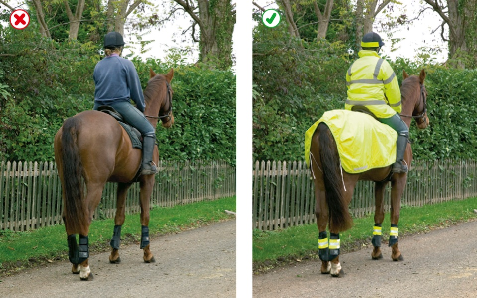

Rules about animals (47 to 58)
================================

Rules about animals, including horse-drawn vehicles, horse riders and other animals.

Horse-drawn vehicles (rules 47 to 48)
-------------------------------------

### Rule 47

Horse-drawn vehicles used on the highway should be operated and maintained in accordance with standards set out in the Department for Transport’s [Code of Practice for Horse-Drawn Vehicles](https://www.gov.uk/government/publications/code-of-practice-for-horse-drawn-vehicles). This Code lays down the requirements for a road driving assessment and includes a comprehensive list of safety checks to ensure that a carriage and its fittings are safe and in good working order. The standards set out in the Road Driving Assessment may be required to be met by a Local Authority if an operator wishes to obtain a local authority licence to operate a passenger-carrying service.

### Rule 48

**Safety equipment and clothing.** All horse-drawn vehicles should have two red rear reflectors. It is safer not to drive at night but if you do, a light showing white to the front and red to the rear **MUST** be fitted.

**Law [RVLR reg 4](http://www.legislation.gov.uk/uksi/1989/1796/regulation/4/made)**

Horse riders (rules 49 to 55)
-----------------------------

### Rule 49

**Safety equipment.** Children under the age of 14 **MUST** wear a helmet which complies with the Regulations. It **MUST** be fastened securely. Other riders should also follow these requirements. These requirements do not apply to a child who is a follower of the Sikh religion while wearing a turban.

**Laws [H(PHYR)A sect 1](http://www.legislation.gov.uk/ukpga/1990/25/section/1) & [H(PHYR)R reg 3](http://www.legislation.gov.uk/uksi/1992/1201/regulation/3/made)**

### Rule 50

**Other clothing.** You should wear

* boots or shoes with hard soles and heels
* light-coloured or fluorescent clothing in daylight
* reflective clothing if you have to ride at night or in poor visibility.

Rule 50: Help yourself to be seen

### Rule 51

**At night.** It is safer not to ride on the road at night or in poor visibility, but if you do, make sure you wear reflective clothing and your horse has reflective bands above the fetlock joints. A light which shows white to the front and red to the rear should be fitted, with a band, to the rider’s right arm and/or leg/riding boot. If you are leading a horse at night, carry a light in your right hand, showing white to the front and red to the rear, and wear reflective clothing on both you and your horse. It is strongly recommended that a fluorescent/reflective tail guard is also worn by your horse.

### Riding

### Rule 52

Before you take a horse or horse drawn vehicle on to the road, you should

* ensure all tack fits well and is in good condition
* make sure you can control the horse.

If you are an inexperienced horse rider or have not ridden for a while, consider taking the Ride Safe Award from the British Horse Society. The Ride Safe Award provides a foundation for any horse rider to be safe and knowledgeable when riding in all environments but particularly on the road. For more information, see [www.bhs.org.uk](https://www.bhs.org.uk/)

Always ride with other, less nervous horses if you think that your horse will be nervous of traffic. Never ride a horse without both a saddle and bridle.

### Rule 53

Before riding off or turning, look behind you to make sure it is safe, then give a clear arm signal.

When riding on the road, you should

* keep to the left
* keep both hands on the reins unless you are signalling
* keep both feet in the stirrups
* not carry another person
* not carry anything which might affect your balance or get tangled up with the reins
* keep a horse you are leading to your left
* move in the direction of the traffic flow in a one-way street
* never ride more than two abreast, and ride in single file on narrow or busy roads and when riding round bends.

### Rule 54

You **MUST NOT** take a horse onto a footpath or pavement, and you should not take a horse onto a cycle track. Use a bridleway where possible. Equestrian crossings may be provided for horse riders to cross the road and you should use these where available (see [Rule 27](/pages/rules-for-pedestrians-1-to-35.md#rule-27)). You should dismount at level crossings where a ‘horse rider dismount’ sign is displayed.

**Laws [HA 1835 sect 72](http://www.legislation.gov.uk/ukpga/Will4/5-6/50/section/72) & [R(S)A sect 129(5)](http://www.legislation.gov.uk/ukpga/1984/54/section/129)**

### Rule 55

Avoid roundabouts wherever possible. If you use them, you should

* keep to the left and watch out for vehicles crossing your path to leave or join the roundabout
* signal right when riding across exits to show you are not leaving
* signal left just before you leave the roundabout.

Other animals (rules 56 to 58)
------------------------------

### Rule 56

**Dogs.** Do not let a dog out on the road on its own. Keep it on a short lead when walking on the pavement, road or path shared with cyclists or horse riders.

### Rule 57

When in a vehicle make sure dogs or other animals are suitably restrained so they cannot distract you while you are driving or injure you, or themselves, if you stop quickly. A seat belt harness, pet carrier, dog cage or dog guard are ways of restraining animals in cars.

### Rule 58

**Animals being herded.** These should be kept under control at all times. You should, if possible, send another person along the road in front to warn other road users, especially at a bend or the brow of a hill. It is safer not to move animals after dark, but if you do, then wear reflective clothing and ensure that lights are carried (white at the front and red at the rear of the herd).
