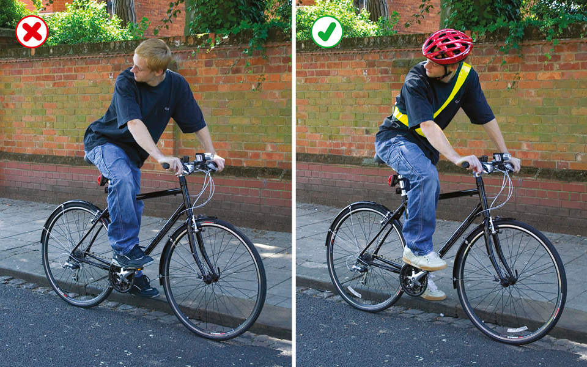

Rules for cyclists (59 to 82)
=============================

Rules for cyclists, including an overview, road junctions, roundabouts and crossing the road.

These rules are in addition to those in the following sections, which apply to all vehicles (except the [motorway section](/pages/motorways-253-to-273.md)). See also [You and your bicycle](/pages/annex-1-you-and-your-bicycle.md).

Overview (rules 59 to 71)
-------------------------

### Rule 59

**Clothing.** You should avoid clothes that may get tangled in the chain, or in a wheel or may obscure your lights when you are cycling.

Light-coloured or fluorescent clothing can help other road users to see you in daylight and poor light, while reflective clothing and/or accessories (belt, arm or ankle bands) can increase your visibility in the dark.

You should wear a cycle helmet that conforms to current regulations, is the correct size and securely fastened. Evidence suggests that a correctly fitted helmet will reduce your risk of sustaining a head injury in certain circumstances.

Rule 59: Help yourself to be seen

### Rule 60

**At night** your cycle **MUST** have white front and red rear lights lit. It **MUST** also be fitted with a red rear reflector (and amber pedal reflectors, if manufactured after 1/10/85). White front reflectors and spoke reflectors will also help you to be seen. Flashing lights are permitted but it is recommended that cyclists who are riding in areas without street lighting use a steady front lamp.

**Law [RVLR regs 13](http://www.legislation.gov.uk/uksi/1989/1796/regulation/13/made), [18](http://www.legislation.gov.uk/uksi/1989/1796/regulation/18/made) & [24](http://www.legislation.gov.uk/uksi/1989/1796/regulation/24/made)**

### Rule 61

**Cycle Routes and Other Facilities.** Cycle lanes are marked by a white line (which may be broken) along the carriageway (see [Rule 140](https://www.gov.uk/guidance/the-highway-code/general-rules-techniques-and-advice-for-all-drivers-and-riders-103-to-158#rule-140)).
Use facilities such as cycle lanes and tracks, advanced stop lines and toucan crossings (see [Rules 62](#rule-62) and [73](#rule-73)) where they make your journey safer and easier. This will depend on your experience and skills and the situation at the time. While such facilities are provided for reasons of safety, cyclists may exercise their judgement and are not obliged to use them.

### Rule 62

**Cycle Tracks.** These are routes for cyclists that are physically protected or located away from motor traffic, other than where they cross side roads (see [Rule 206](https://www.gov.uk/guidance/the-highway-code/road-users-requiring-extra-care-204-to-225#rule-206)). Cycle tracks may run alongside footpaths or pavements and be separated by a feature such as a change of material, a verge, a kerb or a white line. You **MUST** keep to the side intended for cyclists as the pedestrian side remains a pavement or footpath.

Some cycle tracks shared with pedestrians will not be separated by such a feature. On such shared use routes, you should always take care when passing pedestrians, especially children, older or disabled people, and allow them plenty of room. Always be prepared to slow down and stop if necessary (see [Rule H2](/pages/introduction.md#rule-h2)).

**Law [HA 1835 sect 72](http://www.legislation.gov.uk/ukpga/Will4/5-6/50/section/72)**

### Rule 63

**Sharing space with pedestrians, horse riders and horse drawn vehicles.** When riding in places where sharing with pedestrians, horse riders or horse drawn vehicles is permitted, take care when passing pedestrians and horse riders, especially children, older adults or disabled people. Slow down when necessary and let them know you are there; for example, by ringing your bell (it is recommended that a bell is fitted to your bike), or by calling out politely.

Remember that pedestrians may be deaf, blind or partially sighted and that this may not be obvious.

Do not pass pedestrians, horse riders or horse drawn vehicles closely or at high speed, particularly from behind. You should not pass a horse on their left. Remember that horses can be startled if passed without warning. Always be prepared to slow down and stop when necessary.

### Rule 64

You **MUST NOT** cycle on a pavement.

**Laws [HA 1835 sect 72](http://www.legislation.gov.uk/ukpga/Will4/5-6/50/section/72) & [R(S)A sect 129](http://www.legislation.gov.uk/ukpga/1984/54/section/129)**

### Rule 65

**Bus Lanes.** Most bus lanes may be used by cyclists as indicated on signs. Watch out for people getting on or off a bus. Be very careful when overtaking a bus or leaving a bus lane as you will be entering a busier traffic flow. Do not pass between the kerb and a bus when it is at a stop.

### Rule 66

You should

* avoid any actions that could reduce your control of your cycle
* be considerate of the needs of other road users when riding in groups. You can ride two abreast and it can be safer to do so, particularly in larger groups or when accompanying children or less experienced riders. Be aware of drivers behind you and allow them to overtake (for example, by moving into single file or stopping) when you feel it is safe to let them do so
* not ride close behind another vehicle in case it stops suddenly
* not carry anything which will affect your balance or may get tangled up with your wheels or chain
* be considerate of other road users, particularly blind and partially sighted pedestrians, and horse riders (see [Rule H1](/pages/introduction.md#rule-h1)). Let them know you are there when necessary, for example, by calling out or ringing your bell if you have one. It is recommended that a bell be fitted.

### Rule 67

You should

* look all around to make sure it is safe before moving away from the kerb, when pulling out to overtake or to pass stationary vehicles, or when turning at junctions or stopping
* watch out for obstructions in the road, such as drains, service covers and potholes, positioning yourself so you can move to the left (as well as to the right) to avoid them safely
* take care when passing parked vehicles, leaving enough room (a door’s width or 1 metre) to avoid being hit if a car door is opened, and watch out for pedestrians stepping into your path
* be aware of traffic coming up behind you, including other cyclists, and give a clear signal to show other road users what you intend to do see ‘[Signals to other road users](/pages/signals-to-other-road-users.md)’)
* take extra care near road humps, narrowings and other traffic calming features
* when cycling on the road, only pass to the left of large vehicles when they are stationary or slow moving and you should proceed with caution as the driver may not be able to see you. Be particularly careful on the approach to junctions or where a large vehicle could change lanes to the left.

### Rule 68

You **MUST NOT**

* carry a passenger unless your cycle has been built or adapted to carry one
* hold onto a moving vehicle or trailer
* ride in a dangerous, careless or inconsiderate manner
* ride when under the influence of drink or drugs, including medicine.

**Law [RTA 1988 sects 24](http://www.legislation.gov.uk/ukpga/1988/52/section/24), [26](http://www.legislation.gov.uk/ukpga/1988/52/section/26), [28](http://www.legislation.gov.uk/ukpga/1988/52/section/28), [29](http://www.legislation.gov.uk/ukpga/1988/52/section/29) & [30](http://www.legislation.gov.uk/ukpga/1988/52/section/30) as amended by [RTA 1991](http://www.legislation.gov.uk/ukpga/1991/40/contents)**

### Rule 69

You **MUST** obey all traffic signs and traffic light signals.

**Laws [RTA 1988 sect 36](http://www.legislation.gov.uk/ukpga/1988/52/section/36) & [TSRGD schedule 3 part 3](https://www.legislation.gov.uk/uksi/2016/362/schedule/3/made), [schedule 7 part 4](https://www.legislation.gov.uk/uksi/2016/362/schedule/7/made), [schedule 9 parts 4 and 6](https://www.legislation.gov.uk/uksi/2016/362/schedule/9/made), [schedule 13 part 6](https://www.legislation.gov.uk/uksi/2002/3113/schedule/13/made), [schedule 14 part 2](https://www.legislation.gov.uk/uksi/2002/3113/schedule/14/made)**

### Rule 70

When parking your cycle

* find a conspicuous location where it can be seen by passers-by
* use cycle stands or other cycle parking facilities wherever possible
* do not leave it where it would cause an obstruction or hazard to other road users
* secure it well so that it will not fall over and become an obstruction or hazard.

### Rule 71

At traffic light junctions and at cycle-only crossings with traffic lights, you **MUST NOT** cross the stop line when the traffic lights are red.

Some junctions have an advanced stop line to enable you to position yourself ahead of other traffic and wait (see [Rule 178](/pages/using-the-road-159-to-203.md#rule-178)). When the traffic lights are red, you may cross the first stop line, but you **MUST NOT** cross the final stop line.

**Laws [RTA 1988 sect 36](http://www.legislation.gov.uk/ukpga/1988/52/section/36) & [TSRGD Schedule 14 part 1](https://www.legislation.gov.uk/uksi/2016/362/schedule/14/made)**

Road junctions (rules 72 to 75)
-------------------------------

### Rule 72

**Road positioning.** When riding on the roads, there are two basic road positions you should adopt, depending on the situation.

1) Ride in the centre of your lane, to make yourself as clearly visible as possible, in the following situations

* on quiet roads or streets – if a faster vehicle comes up behind you, move to the left to enable them to overtake, if you can do so safely
* in slower-moving traffic - when the traffic around you starts to flow more freely, move over to the left if you can do so safely so that faster vehicles behind you can overtake
* at the approach to junctions or road narrowings where it would be unsafe for drivers to overtake you

2) When riding on busy roads, with vehicles moving faster than you, allow them to overtake where it is safe to do so whilst keeping at least 0.5 metres away, and further where it is safer, from the kerb edge. Remember that traffic on most dual carriageways moves quickly. Take extra care crossing slip roads.

### Rule 73

**Junctions.** Some junctions, particularly those with traffic lights, have special cycle facilities, including small cycle traffic lights at eye-level height, which may allow you to move or cross separately from or ahead of other traffic. Use these facilities where they make your journey safer and easier.

At junctions with no separate cyclist facilities, it is recommended that you proceed as if you were driving a motor vehicle (see [Rules 170 to 190](/pages/using-the-road-159-to-203.md#rule-170)).

Position yourself in the centre of your chosen lane, where you feel able to do this safely, to make yourself as visible as possible and to avoid being overtaken where this would be dangerous. If you do not feel safe to proceed in this way, you may prefer to dismount and wheel your bike across the junction.

### Rule 74

**Turning.** When approaching a junction on the left, watch out for vehicles turning in front of you, out of or into the side road. If you intend to turn left, check first for other cyclists or motorcyclists before signalling. Do not ride on the inside of vehicles signalling or slowing down to turn left.

If you are turning right, check the traffic to ensure it is safe, then signal and move to the centre of the road. Wait until there is a safe gap in the oncoming traffic and give a final look before completing the turn. It may be safer to wait on the left until there is a safe gap or to dismount and push your cycle across the road.

When turning into or out of a side road, you should give way to pedestrians crossing or waiting to cross (see [Rule H2](/pages/introduction.md#rule-h2)).

### Rule 75

**Two Stage Turns.** At some signal-controlled junctions there may be signs and markings informing cyclists to turn right in two stages:

Stage 1: When the traffic lights turn green, cyclists wishing to make the turn should go straight ahead to the location marked by a cycle symbol and turn arrow on the carriageway; then stop and wait there

Stage 2: When the traffic lights on the far side of the junction, now facing the cyclists, turn green, they should then complete the manoeuvre

Roundabouts (rules 76 to 80)
----------------------------

### Rule 76

**Going straight ahead.** If you are going straight ahead at a junction, you have priority over traffic waiting to turn into or out of the side road, unless road signs or markings indicate otherwise (see [Rule H3](/pages/introduction.md#rule-h3)). Check that you can proceed safely, particularly when approaching junctions on the left alongside stationary or slow-moving traffic. Watch out for drivers intending to turn across your path. Remember the driver ahead may not be able to see you, so bear in mind your speed and position in the road.

Take great care when deciding whether it is safe to pass stationary or slow-moving lorries and other long vehicles, especially at the approach to junctions, as their drivers may not be able to see you. Remember that they may have to move over to the right before turning left, and that their rear wheels may then come very close to the kerb while turning (see [Rule 67](#rule-67)).

### Rule 77

**Busy roads.** When crossing faster or busy main roads, you may find it safer and easier to

* dismount and push your cycle across
* wait for a safe gap in the traffic before doing so, especially on faster roads and dual carriageways
* make use of traffic islands or central reservations to help you where appropriate.

### Rule 78

Full details about the correct procedure at roundabouts without cycle facilities are contained in [Rules 184 to 190](/pages/using-the-road-159-to-203.md#rule-184).

Watch out for vehicles crossing your path to leave or join the roundabout, remembering that drivers may not easily see you.

### Rule 79

If you are turning right, you can ride in the left or right-hand lanes and move left when approaching your exit. Position yourself in the centre of your lane if it is safe to do so (see [Rule 72](#rule-72)) and signal right to indicate that you are not leaving the roundabout. Alternatively, you may feel safer walking your cycle round on the pavement or verge.

If you decide to ride round keeping to the left-hand lane you should

* be aware that drivers may not easily see you
* take extra care when cycling across exits. You should signal right to show you are not leaving the roundabout
* watch out for vehicles crossing your path to leave or join the roundabout.

Where a roundabout has separate cycle facilities, you should use these facilities where they make your journey safer and easier although you are not obliged to use them. This will depend on your experience and skills and the situation at the time.

### Rule 80

Give plenty of room to long vehicles on the roundabout as they need more space to manoeuvre. Do not ride in the space they need to get round the roundabout. It may be safer to wait until they have cleared the roundabout.

Crossing the road (rules 81 to 82)
----------------------------------

### Rule 81

Do not ride across equestrian crossings, as they are for horse riders only. Do not ride across a pelican, puffin or zebra crossing. Dismount and wheel your cycle across.

### Rule 82

**Crossings.** Toucan crossings are light-controlled crossings which allow cyclists and pedestrians to share crossing space and cross at the same time. They are push-button operated. Pedestrians and cyclists will see the green signal together. Cyclists are permitted to ride across.

Cycle tracks on opposite sides of the road may be linked by cycle-only signalled crossings. You may ride across but you **MUST NOT** cross until the green cycle symbol is showing.

Cycle track crossings can be in spacious pedestrian environments. Cyclists should look out and be prepared to stop for pedestrians crossing the track informally as well as at these designated points.

Take extra care when crossing level crossings and tramways (see [Rule 306](/pages/road-works-level-crossings-and-tramways-288-to-307.md#rule-306)). You should dismount at level crossings where a ‘cyclist dismount’ sign is displayed.

**Law [TSRGD schedule 14 part 1](https://www.legislation.gov.uk/uksi/2002/3113/schedule/14/made)**
