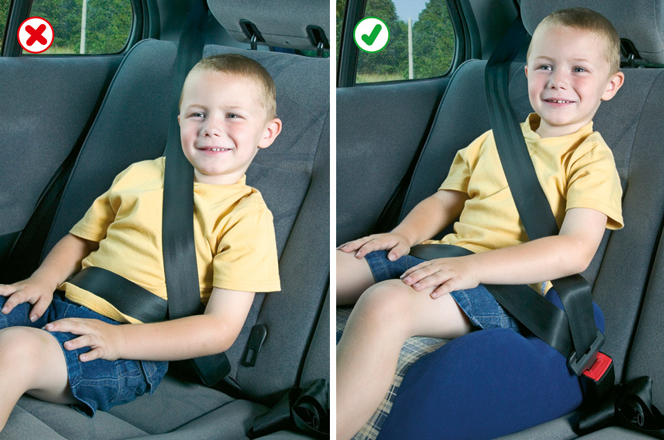

Rules for drivers and motorcyclists (89 to 102)
===============================================

Rules for drivers and motorcyclists, including vehicle condition, fitness to drive, alcohol and drugs, what to do before setting off, vehicle towing and loading, and seat belts and child restraints.

Vehicle condition (rule 89)
---------------------------

 

### Rule 89

**Vehicle condition.** You **MUST** ensure your vehicle and trailer comply with the full requirements of the Road Vehicles (Construction and Use) Regulations and Road Vehicles Lighting Regulations (see ‘[The road user and the law](/pages/annex-4-the-road-user-and-the-law.md)’).

 

Fitness to drive (rules 90 to 94)
---------------------------------

 

### Rule 90

Make sure that you are fit to drive. You **MUST** report to the Driver and Vehicle Licensing Agency (DVLA) any health condition likely to affect your driving.

**Law [RTA 1988 sect 94](http://www.legislation.gov.uk/ukpga/1988/52/section/94)**

### Rule 91

Driving when you are tired greatly increases your risk of collision. To minimise this risk

* make sure you are fit to drive. Do not begin a journey if you are tired. Get sufficient sleep before embarking on a long journey
* avoid undertaking long journeys between midnight and 6 am, when natural alertness is at a minimum
* plan your journey to take sufficient breaks. A minimum break of at least 15 minutes after every two hours of driving is recommended
* if you feel sleepy, stop in a safe place. Do not stop in an emergency area or on a hard shoulder of a motorway (see [Rule 262](/pages/motorways-253-to-273.md#rule-262) for guidance on places to take a break when travelling on motorways).

### Rule 92

**Vision.** You **MUST** be able to read a vehicle number plate, in good daylight, from a distance of 20 metres (or 20.5 metres where the old style number plate is used). If you need to wear glasses (or contact lenses) to do this, you **MUST** wear them at all times while driving. The police have the power to require a driver to undertake an eyesight test.

**Laws [RTA 1988 sect 96](http://www.legislation.gov.uk/ukpga/1988/52/section/96), & [MV(DL)R reg 40](http://www.legislation.gov.uk/uksi/1999/2864/regulation/40/made) & [sched 8](http://www.legislation.gov.uk/uksi/1999/2864/schedule/8/made)**

### Rule 93

Slow down, and if necessary stop, if you are dazzled by bright sunlight.

### Rule 94

At night or in poor visibility, do not use tinted glasses, lenses or visors if they restrict your vision.

 

Alcohol and drugs (rules 95 to 96)
----------------------------------

 

### Rule 95

**Do not drink and drive** as it will seriously affect your judgement and abilities.

In England and Wales you **MUST NOT** drive with a breath alcohol level higher than 35 microgrammes/100 millilitres of breath or a blood alcohol level of more than 80 milligrammes/100 millilitres of blood.

In Scotland the legal limits are lower. You **MUST NOT** drive with a breath alcohol level higher than 22 microgrammes/100 millilitres of breath or a blood alcohol level of more than 50 milligrammes/100 millilitres of blood.

Alcohol will

* give a false sense of confidence
* reduce co-ordination and slow down reactions
* affect judgement of speed, distance and risk
* reduce your driving ability, even if you’re below the legal limit
* take time to leave your body; you may be unfit to drive in the evening after drinking at lunchtime, or in the morning after drinking the previous evening.

The best solution is not to drink at all when planning to drive because any amount of alcohol affects your ability to drive safely. If you are going to drink, arrange another means of transport.

**Laws [RTA 1988 sects 4](http://www.legislation.gov.uk/ukpga/1988/52/section/4), [5](http://www.legislation.gov.uk/ukpga/1988/52/section/5) & [11(2)](http://www.legislation.gov.uk/ukpga/1988/52/section/11), & [PLSR](http://www.legislation.gov.uk/sdsi/2014/9780111024478)**

### Rule 96

You **MUST NOT** drive under the influence of drugs or medicine. For medicines, check with your doctor or pharmacist and do not drive if you are advised that you may be impaired.

You **MUST NOT** drive if you have illegal drugs or certain medicines in your blood above specified limits. It is highly dangerous so never take illegal drugs if you intend to drive; the effects are unpredictable, but can be even more severe than alcohol and result in fatal or serious road crashes. Illegal drugs have been specified at very low levels so even small amounts of use could be above the specified limits. The limits for certain medicines have been specified at higher levels, above the levels generally found in the blood of patients who have taken normal therapeutic doses. If you are found to have a concentration of a drug above its specified limit in your blood because you have been prescribed or legitimately supplied a particularly high dose of medicine, then you can raise a statutory medical defence, provided your driving was not impaired by the medicine you are taking.

**Law [RTA 1988 sects 4](http://www.legislation.gov.uk/ukpga/1988/52/section/4) & [5](http://www.legislation.gov.uk/ukpga/1988/52/section/5)**

 

Before setting off (rule 97)
----------------------------

 

### Rule 97

**Before setting off.** You **MUST** ensure that

* you have a valid licence and insurance to drive the vehicle you intend to use (see [Annex 3](/pages/annex-3-motor-vehicle-documentation-and-learner-driver-requirements.md))
* your vehicle is legal and roadworthy (see [Annexes 3](https://www.gov.uk/pages/annex-3-motor-vehicle-documentation-and-learner-driver-requirements.md) and [6](https://www.gov.uk/guidance/the-highway-code/annex-6-vehicle-maintenance-safety-and-security) for important vehicle maintenance and safety checks).

You **SHOULD** ensure that

* you have planned your route and allowed sufficient time for breaks and possible delays
* you have sufficient fuel or charge for your journey, especially if it includes motorway driving
* you know where all the controls are and how to use them
* clothing and footwear do not prevent you using the controls in the correct manner
* your mirrors and seat are adjusted correctly to ensure comfort, full control and maximum vision
* head restraints are properly adjusted to reduce the risk of neck and spine injuries in the event of a collision.

It is recommended for emergency use that

* you have a mobile telephone containing emergency contacts (e.g. breakdown assistance)
* you have high-visibility clothing.

**Laws [RTA 1988 sects 42](https://www.legislation.gov.uk/ukpga/1988/52/section/42), [45](https://www.legislation.gov.uk/ukpga/1988/52/section/45), [47](https://www.legislation.gov.uk/ukpga/1988/52/section/47), [49](https://www.legislation.gov.uk/ukpga/1988/52/section/49), [53](https://www.legislation.gov.uk/ukpga/1988/52/section/53), [87](https://www.legislation.gov.uk/ukpga/1988/52/section/87), [99(4)](https://www.legislation.gov.uk/ukpga/1988/52/section/99) & [143](https://www.legislation.gov.uk/ukpga/1988/52/section/143), [MV(DL)R reg 16](https://www.legislation.gov.uk/uksi/1999/2864/regulation/16/made), [40](https://www.legislation.gov.uk/uksi/1999/2864/regulation/40/made) & [sched 4](https://www.legislation.gov.uk/uksi/1999/2864/schedule/4/made), [VERA sect 29](https://www.legislation.gov.uk/ukpga/1994/22/section/29), [RVLR 1989 regs 23](https://www.legislation.gov.uk/uksi/1989/1796/regulation/23/made) & [27](https://www.legislation.gov.uk/uksi/1989/1796/regulation/27/made), & [CUR regs 27](https://www.legislation.gov.uk/uksi/1986/1078/regulation/27/made), [30](https://www.legislation.gov.uk/uksi/1986/1078/regulation/30/made), [32](https://www.legislation.gov.uk/uksi/1986/1078/regulation/32/made) & [61](https://www.legislation.gov.uk/uksi/1986/1078/regulation/61/made)**

Rule 97: Make sure head restraints are properly adjusted

 

Vehicle towing and loading (rule 98)
------------------------------------

 

### Rule 98

**Before towing.** As a driver

* you **MUST NOT** tow more than your licence permits. If you passed your car driving test on or after 1 January 1997, you are restricted on the weight of trailer you can tow
* you **MUST** ensure that both your vehicle and your trailer are in a roadworthy condition. This includes checking that all tyres are legal, the trailer braking system is in full working order and all trailer lights are working correctly
* you **MUST NOT** overload your vehicle or trailer. You should not tow a weight greater than that recommended by the manufacturer of your vehicle
* you should distribute the weight in your caravan or trailer evenly with heavy items over the axle(s) and ensure a downward load on the tow ball. The manufacturer’s recommended weight and tow ball load should not be exceeded. This should minimise the possibility of swerving or snaking and loss of control
* you **MUST** secure your load and it **MUST NOT** stick out dangerously. Make sure any heavy or sharp objects and any animals are secured safely. If there is a collision, they might hit someone inside the vehicle and cause serious injury
* if your vehicle is narrower than your trailer or load, or your trailer or load obstructs your rearward view, then towing mirrors **MUST** be used
* your trailer **MUST** be fitted with a secondary coupling device, such as a safety chain
* carrying a load or pulling a trailer may require you to adjust your headlights.

**During towing.** As a driver

* you should be aware that reduced speed limits apply (see [Rule 124](/pages/general-rules-techniques-and-advice-for-all-drivers-and-riders-103-to-158.md#rule-124))
* you should be aware that your stopping distance may increase significantly when towing (see [Rule 126](/pages/general-rules-techniques-and-advice-for-all-drivers-and-riders-103-to-158.md#rule-126))
* you **MUST NOT** drive in the right-hand lane on motorways with three or more lanes (see [Rule 265](/pages/motorways-253-to-273.md#rule-265))
* if the trailer starts to swerve or snake, or you lose control, ease off the accelerator and reduce speed gently to regain control. Do not brake harshly.

**Breakdowns.** In the event of a breakdown, be aware

* that towing a vehicle on a tow rope is potentially dangerous. You should consider using a solid tow bar or professional recovery
* it may take longer to build up speed when rejoining a carriageway (see also [Rule 278](/pages/breakdowns-and-incidents-274-to-287.md#rule-278)).

For additional advice about towing safely, see [Further reading](/pages/other-information.md#best-practice).

**Laws [CUR regs 27](https://www.legislation.gov.uk/uksi/1986/1078/regulation/27/made), [33](https://www.legislation.gov.uk/uksi/1986/1078/regulation/33/made), [86a](https://www.legislation.gov.uk/uksi/1986/1078/regulation/86/made) & [100](https://www.legislation.gov.uk/uksi/1986/1078/regulation/100/made), [RVLR reg 18](https://www.legislation.gov.uk/uksi/1989/1796/regulation/18/made), [MT(E&W)R reg 12](https://www.legislation.gov.uk/uksi/1982/1163/regulation/12/made) & [MV(DL)R reg 6](https://www.legislation.gov.uk/uksi/1999/2864/regulation/6/made), [7](https://www.legislation.gov.uk/uksi/1999/2864/regulation/7/made), [76](https://www.legislation.gov.uk/uksi/1999/2864/regulation/76/made) & [sched 2](https://www.legislation.gov.uk/uksi/1999/2864/schedule/2/made)**

 

Seat belts and child restraints (rules 99 to 102)
-------------------------------------------------

 

### Rule 99

You **MUST** wear a seat belt in cars, vans and other goods vehicles if one is fitted (see table below). Adults, and children aged 14 years and over, **MUST** use a seat belt or child restraint, where fitted, when seated in minibuses, buses and coaches. Exemptions are allowed for the holders of medical exemption certificates and those making deliveries or collections in goods vehicles when travelling less than 50 metres (approx 162 feet).

**Laws [RTA 1988 sects 14](http://www.legislation.gov.uk/ukpga/1988/52/section/14) & [15](http://www.legislation.gov.uk/ukpga/1988/52/section/15), [MV(WSB)R](http://www.legislation.gov.uk/uksi/1993/176/contents/made), [MV(WSBCFS)R](http://www.legislation.gov.uk/uksi/1993/31/contents/made) & [MV(WSB)(A)R 2005](http://www.legislation.gov.uk/uksi/2005/27/contents/made) & [2006](http://www.legislation.gov.uk/uksi/2006/1892/contents/made)**

**Seat belt requirements.** This table summarises the main legal requirements for wearing seat belts in cars, vans and other goods vehicles.

|  | Front seat | Rear seat | Who is responsible? |
| --- | --- | --- | --- |
| **Driver** | Seat belt **MUST** be worn if fitted | - | **Driver** |
| **Child** under 3 years of age | Correct child restraint **MUST** be used | Correct child restraint **MUST** be used. If one is not available in a taxi, may travel unrestrained. | **Driver** |
| **Child** from 3rd birthday up to 1.35 metres in height (or 12th birthday, whichever they reach first) | Correct child restraint **MUST** be used | Correct child restraint **MUST** be used where seat belts fitted. **MUST** use adult belt if correct child restraint is not available in a licensed taxi or private hire vehicle, or for reasons of unexpected necessity over a short distance, or if two occupied restraints prevent fitment of a third. | **Driver** |
| **Child** over 1.35 metres (approx 4ft 5ins) in height or 12 or 13 years | Seat belt **MUST** be worn if available | Seat belt **MUST** be worn if available | **Driver** |
| **Adult** passengers aged 14 and over | Seat belt **MUST** be worn if available | Seat belt **MUST** be worn if available | **Passenger** |

### Rule 100

The driver **MUST** ensure that all children under 14 years of age in cars, vans and other goods vehicles wear seat belts or sit in an approved child restraint where required (see table above). If a child is under 1.35 metres (approx 4 feet 5 inches) tall, a baby seat, child seat, booster seat or booster cushion **MUST** be used suitable for the child’s weight and fitted to the manufacturer’s instructions.

**Laws [RTA 1988 sects 14](http://www.legislation.gov.uk/ukpga/1988/52/section/14) & [15](http://www.legislation.gov.uk/ukpga/1988/52/section/15), [MV(WSB)R](http://www.legislation.gov.uk/uksi/1993/176/contents/made), [MV(WSBCFS)R](http://www.legislation.gov.uk/uksi/1993/31/contents/made) & [MV(WSB)(A)R 2006](http://www.legislation.gov.uk/uksi/2006/1892/contents/made)**

Rule 100: Make sure that a child uses a suitable restraint which is correctly adjusted### Rule 101

A rear-facing baby seat **MUST NOT** be fitted into a seat protected by an active frontal airbag, as in a crash it can cause serious injury or death to the child.

**Laws [RTA 1988 sects 14](http://www.legislation.gov.uk/ukpga/1988/52/section/14) & [15](http://www.legislation.gov.uk/ukpga/1988/52/section/15), [MV(WSB)R](http://www.legislation.gov.uk/uksi/1993/176/contents/made), [MV(WSBCFS)R](http://www.legislation.gov.uk/uksi/1993/31/contents/made) & [MV(WSB)(A)R 2006](http://www.legislation.gov.uk/uksi/2006/1892/contents/made)**

### Rule 102

**Children in cars, vans and other goods vehicles.** Drivers who are carrying children in cars, vans and other goods vehicles should also ensure that

* children should get into the vehicle through the door nearest the kerb
* child restraints are properly fitted to manufacturer’s instructions
* children do not sit behind the rear seats in an estate car or hatchback, unless a special child seat has been fitted
* the child safety door locks, where fitted, are used when children are in the vehicle
* children are kept under control.
