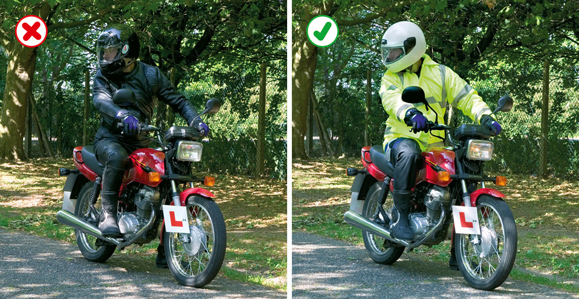

Rules for motorcyclists (83 to 88)
====================================

Rules for motorcyclists, including helmets, carrying passengers, daylight riding and riding in the dark.

These Rules are in addition to those in the following sections which apply to all vehicles. See ‘[Motorcycle licence requirements](/pages/annex-2-motorcycle-licence-requirements.md)’.

 General (rules 83 to 88)
--------------------------

### Rule 83

On all journeys, the rider and pillion passenger on a motorcycle, scooter or moped **MUST** wear a protective helmet. This does not apply to a follower of the Sikh religion while wearing a turban. Helmets **MUST** comply with the Regulations and they **MUST** be fastened securely. Riders and passengers of motor tricycles and quadricycles, also called quadbikes, should also wear a protective helmet. Before each journey check that your helmet visor is clean and in good condition.

**Laws [RTA 1988 sects 16](http://www.legislation.gov.uk/ukpga/1988/52/section/16) & [17](http://www.legislation.gov.uk/ukpga/1988/52/section/17), & [MC(PH)R as amended reg 4](http://www.legislation.gov.uk/uksi/1998/1807/regulation/4/made)**

### Rule 84

It is also advisable to wear eye protectors, which **MUST** comply with the Regulations. Scratched or poorly fitting eye protectors can limit your view when riding, particularly in bright sunshine and the hours of darkness. Consider wearing ear protection. Strong boots, gloves and suitable clothing may help to protect you if you are involved in a collision.

**Laws [RTA 1988 sect 18](http://www.legislation.gov.uk/ukpga/1988/52/section/18) & [MC(EP)R as amended reg 4](http://www.legislation.gov.uk/uksi/1999/535/regulation/4/made)**

### Rule 85

You **MUST NOT** carry more than one pillion passenger who **MUST** sit astride the machine on a proper seat. They should face forward with both feet on the footrests. You **MUST NOT** carry a pillion passenger unless your motorcycle is designed to do so. Provisional licence holders **MUST NOT** carry a pillion passenger.

**Laws [RTA 1988 sect 23](http://www.legislation.gov.uk/ukpga/1988/52/section/23), [MV(DL)R reg 16(6)](http://www.legislation.gov.uk/uksi/1999/2864/regulation/16/made) & [CUR reg 102](http://www.legislation.gov.uk/uksi/1986/1078/regulation/102/made)**

### Rule 86

**Daylight riding.** Make yourself as visible as possible from the side as well as the front and rear. You could wear a light or brightly coloured helmet and fluorescent clothing or strips. Dipped headlights, even in good daylight, may also make you more conspicuous. However, be aware that other vehicle drivers may still not have seen you, or judged your distance or speed correctly, especially at junctions.

Rule 86: Help yourself to be seen

### Rule 87

**Riding in the dark.** Wear reflective clothing or strips to improve your visibility in the dark. These reflect light from the headlamps of other vehicles, making you visible from a longer distance. See [Rules 113 to 116](/pages/general-rules-techniques-and-advice-for-all-drivers-and-riders-103-to-158.md#rule-113) for lighting requirements.

### Rule 88

**Manoeuvring.** You should be aware of what is behind and to the sides before manoeuvring. Look behind you; use mirrors if they are fitted. When in traffic queues look out for pedestrians crossing between vehicles and vehicles emerging from junctions or changing lanes. Position yourself so that drivers in front can see you in their mirrors. Additionally, when filtering in slow-moving traffic, take care and keep your speed low.

**Remember: Observation – Signal – Manoeuvre**
