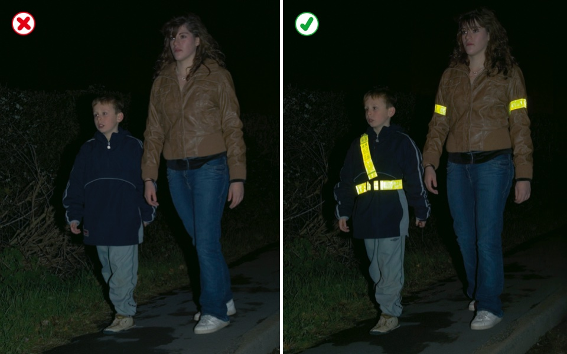
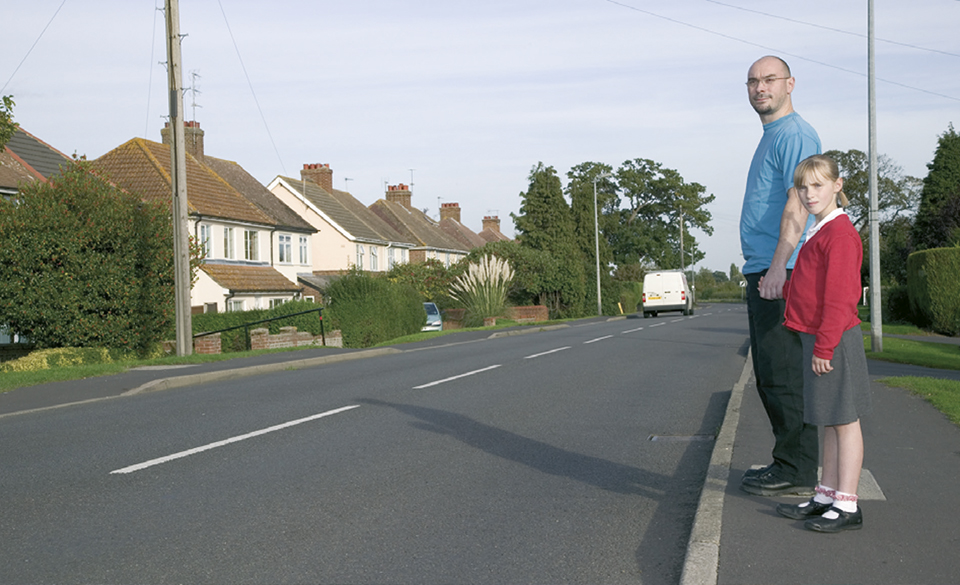
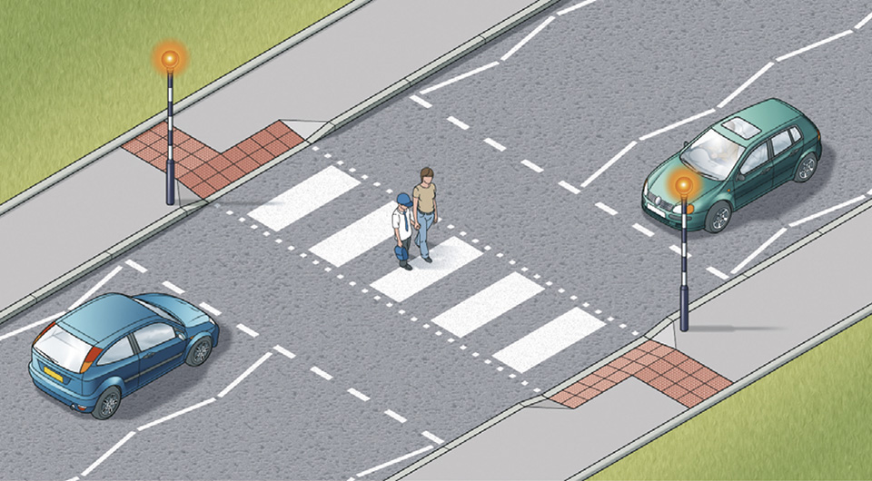
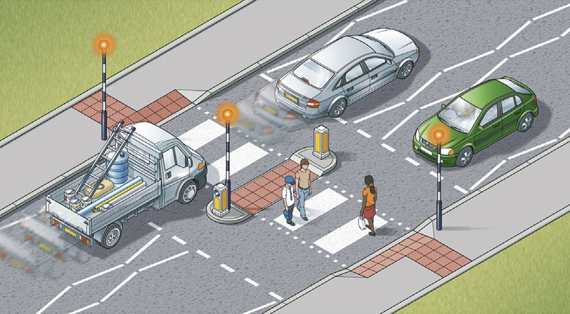
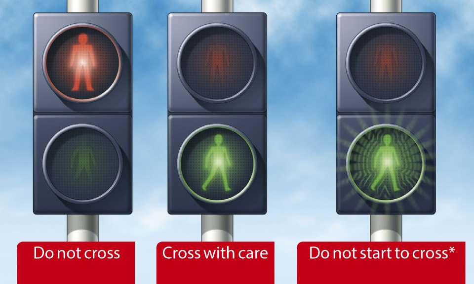
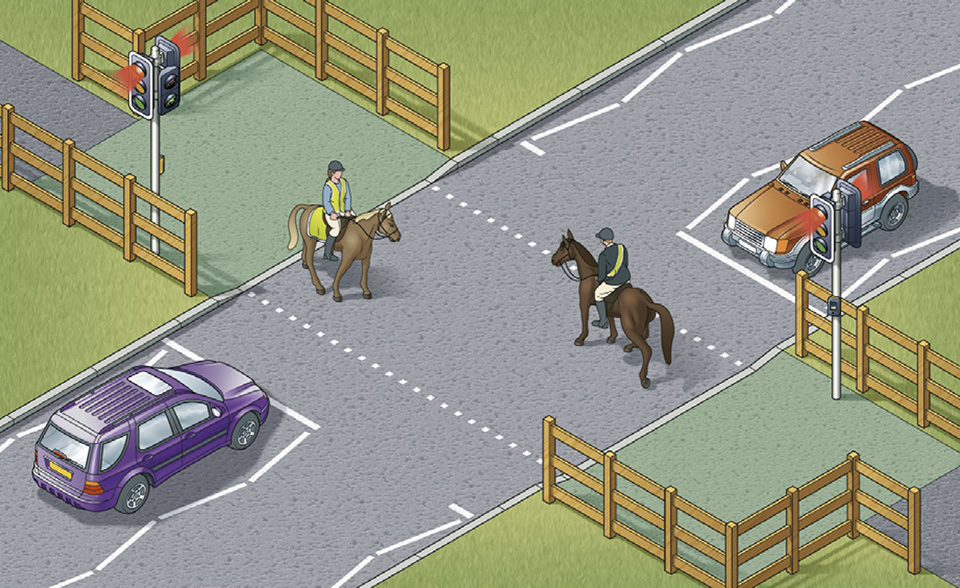
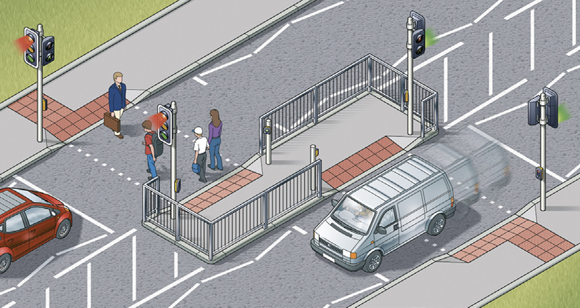

Rules for pedestrians (1 to 35)
=================================

Rules for pedestrians, including general guidance, crossing the road, crossings, and situations needing extra care.

General guidance (rules 1 to 6)
-------------------------------

### Rule 1

**Pavements and footways** (including any path along the side of a road) should be used if provided. Where possible, avoid being next to the kerb with your back to the traffic. If you have to step into the road, look both ways first. Always remain aware of your environment and avoid unnecessary distractions. Always show due care and consideration for others.

### Rule 2

**If there is no pavement,** keep to the right-hand side of the road so that you can see oncoming traffic. You should take extra care and

* be prepared to walk in single file, especially on narrow roads or in poor light
* keep close to the side of the road.

It may be safer to cross the road well before a sharp right-hand bend so that oncoming traffic has a better chance of seeing you. Cross back after the bend.

### Rule 3

**Help other road users to see you.** Wear or carry something light-coloured, bright or fluorescent in poor daylight conditions. When it is dark, use reflective materials (eg armbands, sashes, waistcoats, jackets, footwear), which can be seen by drivers using headlights up to three times as far away as non-reflective materials.

Rule 3: Help yourself to be seen

### Rule 4

**Young children** should not be out alone on the pavement or road (see [Rule 7](#rule-7)). When taking children out, keep between them and the traffic and hold their hands firmly. Strap very young children into pushchairs or use reins. When pushing a young child in a buggy, do not push the buggy into the road when checking to see if it is clear to cross, particularly from between parked vehicles.

### Rule 5

**Organised walks or parades** involving large groups of people walking along a road should use a pavement if available; if one is not available, they should keep to the left. Look-outs should be positioned at the front and back of the group, and they should wear fluorescent clothes in daylight and reflective clothes in the dark. At night, the look-out in front should show a white light and the one at the back a red light. People on the outside of large groups should also carry lights and wear reflective clothing.

### Rule 6

**Motorways.** Pedestrians **MUST NOT** be on motorways or slip roads except in an emergency (see [Rules 272](/pages/motorways-253-to-273.md#rule-272) and [277](/pages/breakdowns-and-incidents-274-to-287.md#rule-277)).

**Laws [RTRA sect 17](https://www.legislation.gov.uk/ukpga/1984/27/section/17), [MT(E&W)R reg 15(1)(b)](https://www.legislation.gov.uk/uksi/1982/1163/regulation/15/made) & [MT(S)R reg 13](https://www.legislation.gov.uk/uksi/1995/2507/regulation/13/made)**

Crossing the road (rules 7 to 17)
---------------------------------

### Rule 7

**The Green Cross Code.** The advice given below on crossing the road is for all pedestrians. Children should be taught the Code and should not be allowed out alone until they can understand and use it properly. The age when they can do this is different for each child. Many children cannot judge how fast vehicles are going or how far away they are. Children learn by example, so parents and carers should always use the Code in full when out with their children. They are responsible for deciding at what age children can use it safely by themselves.

**A First find a safe place to cross** and where there is space to reach the pavement on the other side. Where there is a crossing nearby, use it. It is safer to cross using a subway, a footbridge, an island, a zebra, pelican, toucan or puffin crossing, or where there is a crossing point controlled by a police officer, a school crossing patrol or a traffic warden. Otherwise choose a place where you can see clearly in all directions. Try to avoid crossing between parked cars (see [Rule 14](#rule-14)), on a blind bend, or close to the brow of a hill. Move to a space where drivers and riders can see you clearly. Do not cross the road diagonally.

Rule 7: Look all around and listen for traffic before crossing

**B Stop just before you get to the kerb,** where you can see if anything is coming. Do not get too close to the traffic. If there’s no pavement, keep back from the edge of the road but make sure you can still see approaching traffic.

**C Look all around for traffic and listen.** Traffic could come from any direction. Listen as well, because you can sometimes hear traffic before you see it.

**D If traffic is coming, let it pass**. Look all around again and listen. Do not cross until there is a safe gap in the traffic and you are certain that there is plenty of time. Remember, even if traffic is a long way off, it may be approaching very quickly.

**E When it is safe, go straight across the road – do not run.** Keep looking and listening for traffic while you cross, in case there is any traffic you did not see, or in case other traffic appears suddenly. Look out for cyclists and motorcyclists travelling between lanes of traffic. Do not walk diagonally across the road.

### Rule 8

**At a junction.** When you are crossing or waiting to cross the road, other traffic should give way. Look out for traffic turning into the road, especially from behind you, and cross at a place where drivers can see you. If you have started crossing and traffic wants to turn into the road, you have priority and they should give way (see [Rules H2](/pages/introduction.md#rule-h2) and [170](/pages/using-the-road-159-to-203.md#rule-170)).

### Rule 9

**Pedestrian Safety Barriers.** Where there are barriers, cross the road only at the gaps provided for pedestrians. Do not climb over the barriers or walk between them and the road.

### Rule 10

**Tactile paving.** Raised surfaces that can be felt underfoot provide warning and guidance to blind or partially sighted people. The most common surfaces are a series of raised studs, which are used at crossing points with a dropped kerb, or a series of rounded raised bars which are used at level crossings, at the top and bottom of steps and at some other hazards.

### Rule 11

**One-way streets.** Check which way the traffic is moving. Do not cross until it is safe to do so without stopping. Bus and cycle lanes may operate in the opposite direction to the rest of the traffic.

### Rule 12

**Bus and cycle lanes.** Take care when crossing these lanes as traffic may be moving faster than in the other lanes, or against the flow of traffic.

### Rule 13

**Routes shared with cyclists.** Cycle tracks may run alongside footpaths or pavements and be separated from them by a feature such as a change of material, a verge, a kerb or a white line. Such routes may also incorporate short lengths of tactile paving to help visually impaired people stay on the correct side. On the pedestrian side this may comprise a series of flat-topped bars running across the direction of travel (ladder pattern). On the cyclist side the same bars are orientated in the direction of travel (tramline pattern).

Some routes shared with cyclists will not be separated by such a feature allowing cyclists and pedestrians to share the same space. Cyclists should respect your safety (see [Rule 62](/pages/rules-for-cyclists-59-to-82.md#rule-62)) but you should also take care not to obstruct or endanger them. Always remain aware of your environment and avoid unnecessary distractions.

Where signs indicate, some routes are shared between pedestrians, cyclists, horse riders and horse drawn vehicles. Cyclists, horse riders and drivers of horse drawn vehicles should respect your safety, but you should take care not to obstruct or endanger them. Always remain aware of your environment and avoid unnecessary distractions.

### Rule 14

**Parked vehicles.** If you have to cross between parked vehicles, use the outside edges of the vehicles as if they were the kerb. Stop there and make sure you can see all around and that the traffic can see you. Make sure there is a gap between any parked vehicles on the other side, so you can reach the pavement. Never cross the road in front of, or behind, any vehicle with its engine running, especially a large vehicle, as the driver may not be able to see you.

### Rule 15

**Reversing vehicles.** Never cross behind a vehicle which is reversing, showing white reversing lights or sounding a warning.

### Rule 16

**Moving vehicles.** You **MUST NOT** get onto or hold onto a moving vehicle.

**Law [RTA 1988 sect 26](http://www.legislation.gov.uk/ukpga/1988/52/section/26)**

### Rule 17

**At night.** Wear something reflective to make it easier for others to see you (see [Rule 3](#rule-3)). If there is no pedestrian crossing nearby, cross the road near a street light so that traffic can see you more easily.

Crossings (rules 18 to 30)
--------------------------

### Rule 18

**At all crossings.** When using any type of crossing you should

* always check that the traffic has stopped before you start to cross or push a pram onto a crossing
* always cross between the studs or over the zebra markings. Do not cross at the side of the crossing or on the zig-zag lines, as it can be dangerous.

You **MUST NOT** loiter on any type of crossing.

**Laws [TSRGD Schedule 14 part 5](https://www.legislation.gov.uk/uksi/2016/362/schedule/14/made) and [RTRA sect 25(5)](http://www.legislation.gov.uk/ukpga/1984/27/section/25)**

### Rule 19

**Zebra crossings.** Give traffic plenty of time to see you and to stop before you start to cross. Vehicles will need more time when the road is slippery. Wait until traffic has stopped from both directions or the road is clear before crossing. Remember that traffic does not have to stop until someone has moved onto the crossing. Drivers and riders should give way to pedestrians waiting to cross and **MUST** give way to pedestrians on a zebra crossing (see [Rule H2](/pages/introduction.md#rule-h2)). Keep looking both ways, and listening, in case a driver or rider has not seen you and attempts to overtake a vehicle that has stopped.

Rule 19: Zebra crossings have flashing beacons

A zebra crossing with a central island is two separate crossings (see [Rule 20](#rule-20)).

**Law [TSRGD Schedule 14 part 5](https://www.legislation.gov.uk/uksi/2016/362/schedule/14/made)**

### Rule 20

Where there is an island in the middle of a zebra crossing, wait on the island and follow [Rule 19](#rule-19) before you cross the second half of the road - it is a separate crossing.

Rule 20: Zebra crossings with a central island are two separate crossings

### Rule 21

**At traffic lights.** There may be special signals for pedestrians. You should only start to cross the road when the green figure shows. If you have started to cross the road and the green figure goes out, you should still have time to reach the other side, but do not delay. If no pedestrian signals have been provided, watch carefully and do not cross until the traffic lights are red and the traffic has stopped. Keep looking and check for traffic that may be turning the corner. Remember that traffic lights may let traffic move in some lanes while traffic in other lanes has stopped.

Rule 21: At traffic lights, puffin and pelican crossings. \*At pelican crossings only.

### Rule 22

**Pelican crossings.** These are signal-controlled crossings operated by pedestrians. Push the control button to activate the traffic signals. When the red figure shows, do not cross. When a steady green figure shows, check the traffic has stopped then cross with care. When the green figure begins to flash you should not start to cross. If you have already started you should have time to finish crossing safely.

### Rule 23

**Puffin crossings** differ from pelican crossings as the red and green figures are above the control box on your side of the road and there is no flashing green figure phase. Press the button and wait for the green figure to show.

### Rule 24

When the road is congested, traffic on your side of the road may be forced to stop even though their lights are green. Traffic may still be moving on the other side of the road, so press the button and wait for the signal to cross.

### Rule 25

**Toucan crossings** are light-controlled crossings which allow cyclists and pedestrians to share crossing space and cross at the same time. They are push-button operated. Pedestrians and cyclists will see the green signal together. Cyclists are permitted to ride across.

Rule 25: Toucan crossings can be used by both cyclists and pedestrians

### Rule 26

At some crossings there is a bleeping sound or voice signal to indicate to blind or partially sighted people when the steady green figure is showing, and there may be a tactile signal to help deafblind people.

### Rule 27

**Equestrian crossings** are for horse riders. They have pavement barriers, wider crossing spaces, horse and rider figures in the light panels and either two sets of controls (one higher), or just one higher control panel.

Rule 27: Equestrian crossings are used by horse riders. There is often a parallel crossing

### Rule 28

**Staggered’ pelican or puffin crossings.** When the crossings on each side of the central refuge are not in line they are two separate crossings. On reaching the central island, press the button again and wait for a steady green figure.

Rule 28: Staggered crossings (with an island in the middle) are two separate crossings

### Rule 29

**Crossings controlled by an authorised person.** Do not cross the road unless you are signalled to do so by a police officer, traffic warden or school crossing patrol. Always cross in front of them.

### Rule 30

Where there are no controlled crossing points available it is advisable to cross where there is an island in the middle of the road. Use the Green Cross Code (see [Rule 7](/pages/rules-for-pedestrians-1-to-35.md#rule-7)) to cross to the island and then stop and use it again to cross the second half of the road.

Situations needing extra care (rules 31 to 35)
----------------------------------------------

### Rule 31

**Emergency vehicles.** If an ambulance, fire engine, police or other emergency vehicle approaches using flashing blue lights, headlights and/or sirens, keep off the road.

### Rule 32

**Buses.** Get on or off a bus only when it has stopped to allow you to do so. Watch out for cyclists when you are getting off. Never cross the road directly behind or in front of a bus. Wait until it has moved off and you can see clearly in both directions.

### Rule 33

**Tramways.** These may run through pedestrian areas. Their path will be marked out by shallow kerbs, changes in the paving or other road surface, white lines or yellow dots. Cross at designated crossings where provided. Elsewhere treat trams as you would other road vehicles and look both ways along the track before crossing. Do not walk along the track as trams may come up behind you. Trams move quietly and cannot steer to avoid you.

### Rule 34

**Railway level crossings.** You **MUST NOT** cross or pass a stop line when the red lights show, (including a red pedestrian figure). Also do not cross if an alarm is sounding or the barriers are being lowered. The tone of the alarm may change if another train is approaching. If there are no lights, alarms or barriers, stop, look both ways and listen before crossing. A tactile surface comprising rounded bars running across the direction of pedestrian travel may be installed on the footpath approaching a level crossing to warn visually impaired people of its presence. The tactile surface should extend across the full width of the footway and should be located at an appropriate distance from the barrier or projected line of the barrier.

**Law [TSRGD schedule 14 part 1](https://www.legislation.gov.uk/uksi/2016/362/schedule/14/made)**

### Rule 35

**Street and pavement repairs.** A pavement may be closed temporarily because it is not safe to use. Take extra care if you are directed to walk in or to cross the road.
