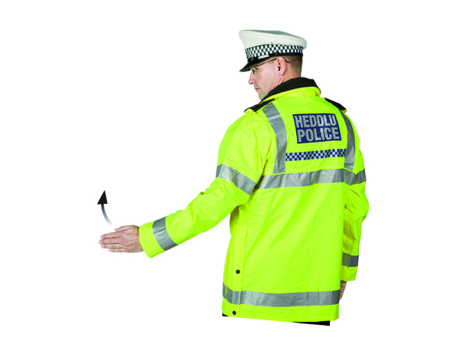
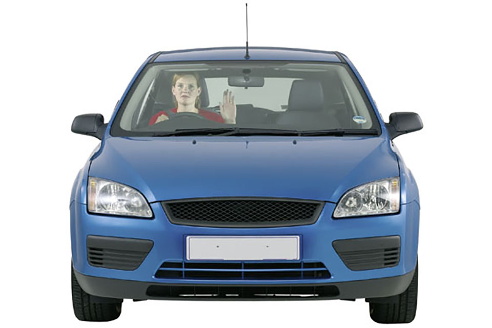
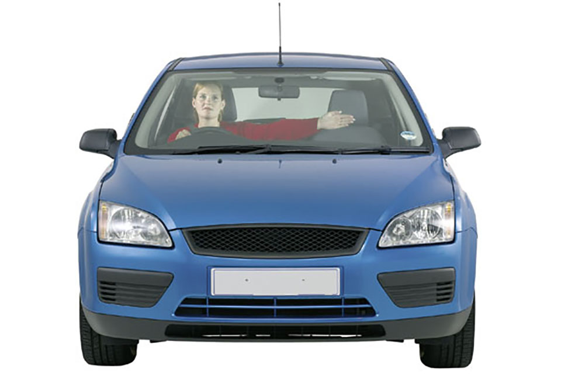
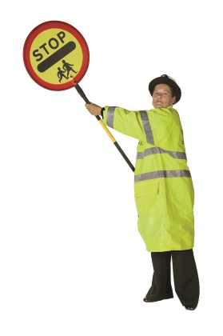
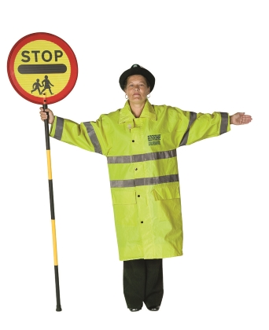

Signals by authorised persons
===============================

Signals used by authorised persons, including police officers, arm signals to persons controlling traffic, Driver and Vehicle Standards Agency officers and traffic officers and school crossing patrols.

[Download ‘Signals by authorised persons’ (PDF, 468KB)](https://assets.digital.cabinet-office.gov.uk/media/560aa62bed915d035c00001b/the-highway-code-signals-by-authorised-persons.pdf)

Police officers
---------------

### Stop

Traffic approaching from the front

Traffic approaching from both front and behind

Traffic approaching from behind

### To beckon traffic on

From the side

From the front

From behind\*

\*In Wales, bilingual signs appear on emergency services vehicles and clothing

Arm signals to persons controlling traffic
------------------------------------------

I want to go straight on

I want to turn left; use either hand

I want to turn right

Driver and Vehicle Standards Agency officers and traffic officers
-----------------------------------------------------------------

Traffic officer

DVSA officer

These officers now have new powers to stop/direct vehicles and will be using hand signals and light
signals similar to those used by police. You **MUST** obey any signals given (see [Rules 107](/pages/general-rules-techniques-and-advice-for-all-drivers-and-riders-103-to-158.md#rule-107) and [108](/pages/general-rules-techniques-and-advice-for-all-drivers-and-riders-103-to-158.md#rule-108)).

School crossing patrols
-----------------------

Not ready to cross pedestrians

Barrier to stop pedestrians crossing

Ready to cross pedestrians, vehicles must be prepared to stop

All vehicles must stop
