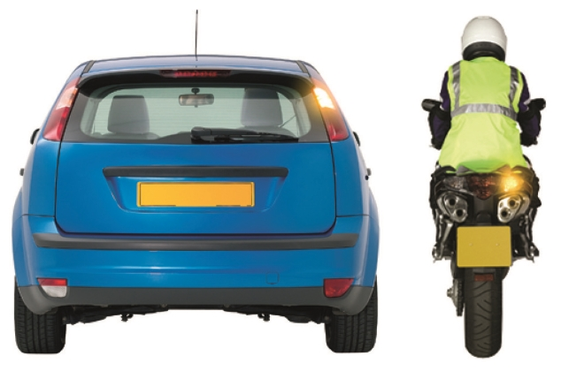
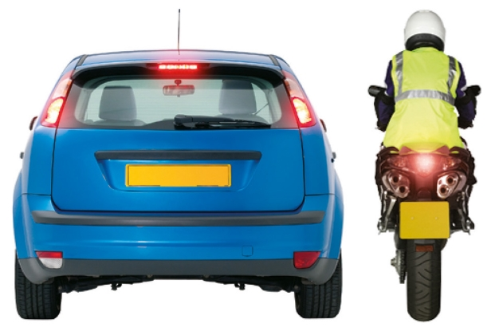
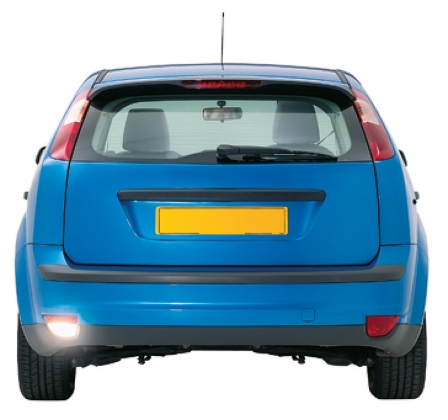
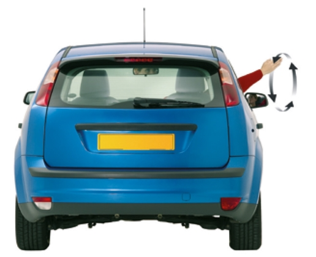
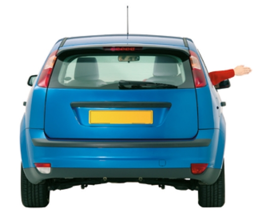
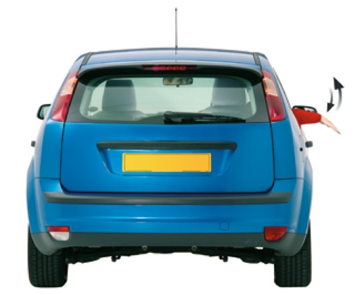
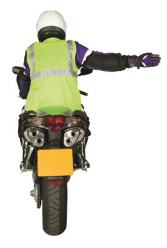
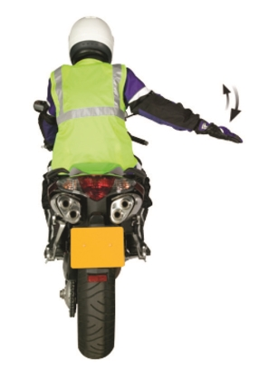
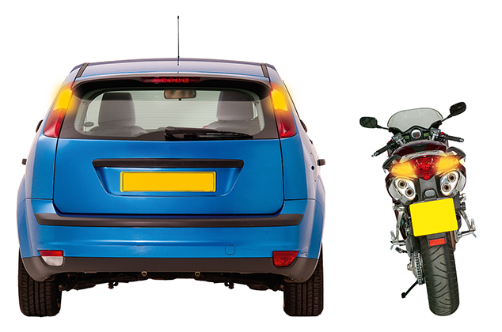

Signals to other road users
===========================

Signals used to other road users, including direction indicator signals, brake light signals, reversing light signals and arm signals. 

[Download ‘Signals to other road users’ (PDF, 100KB)](https://assets.digital.cabinet-office.gov.uk/media/560aa58be5274a036c00001a/the-highway-code-signals-to-other-road-users.pdf)

Direction indicator signals
---------------------------

 

I intend to move out to the right or turn right

I intend to move in to the left or turn left or stop on the left**These signals should not be used except for the purpose described.**

 

Brake light signals
-------------------

 

I am applying the brakes**This signal should not be used except for the purpose described.**

 

Reversing light signals
-----------------------

 

I intend to reverse**This signal should not be used except for the purpose described.**

 

Arm signals
-----------

 

For use when direction indicator signals are not used, or when necessary to reinforce direction indicator signals and stop lights. **Also for use by pedal cyclists and those in charge of horses.**

I intend to move in to the left or turn left

I intend to move out to the right or turn right

I intend to slow down or stop

I intend to move in to the left or turn left

I intend to move out to the right or turn right

I intend to slow down or stop**These signals should not be used except for the purpose described.**

 

Hazard lights
-------------

 

I am temporarily obstructing traffic or warning of a hazard or obstruction ahead (see Rule 116)
