Traffic signs
===============

Traffic signs used, including signs giving orders, warning signs, direction signs, information signs and road works signs.

Although **The Highway Code** shows many of the signs commonly in use, a comprehensive explanation of our signing system is given in the Department’s booklet [Know Your Traffic Signs](https://www.gov.uk/government/publications/know-your-traffic-signs), which is on sale at booksellers. The booklet also illustrates and explains the vast majority of signs the road user is likely to encounter.

The signs illustrated in **The Highway Code** are not all drawn to the same scale. In Wales, bilingual versions of some signs are used including Welsh and English versions of place names. Some older designs of signs may still be seen on the roads.

[Download ‘Traffic signs’ (PDF, 821KB)](https://assets.publishing.service.gov.uk/media/58170307ed915d61c5000000/the-highway-code-traffic-signs.pdf)

Signs giving orders
-------------------

**Signs with red circles are mostly prohibitive. Plates below signs qualify their message.**

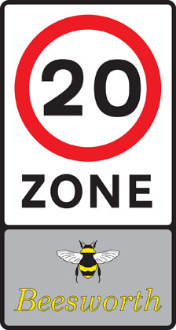

Entry to 20 mph zone

End of 20 mph zone

Maximum speed

National speed limit applies

School crossing patrol

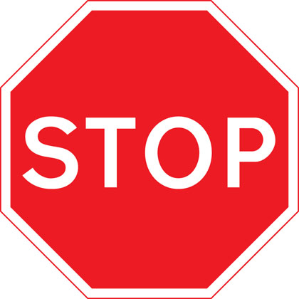

Stop and give way

Give way to traffic on major road

Manually operated temporary STOP and GO signs

Manually operated temporary STOP and GO signs

No entry for vehicular traffic

No vehicles except bicycles being pushed

No cycling

No motor vehicles

No buses (over 8 passenger seats)

No overtaking

No towed caravans

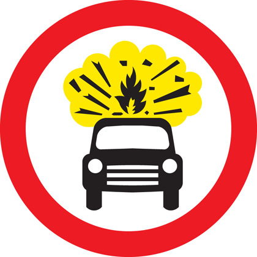

No vehicles carrying explosives

No vehicle or combination of vehicles over length shown

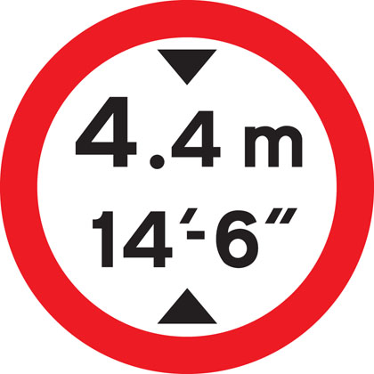

No vehicles over height shown

No vehicles over width shown

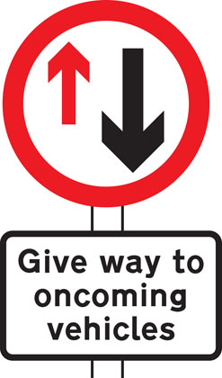

Give priority to vehicles from opposite direction

No right turn

No left turn

No U-turns

No goods vehicles over maximum gross weight shown (in tonnes) except for loading and unloading

No vehicles over maximum gross weight shown (in tonnes)

Parking restricted to permit holders

No stopping during period indicated except for buses

No stopping during times shown except for as long as necessary to set down or pick up passengers

No waiting

No stopping (Clearway)

### Signs with blue circles but no red border mostly give positive instruction.

Ahead only

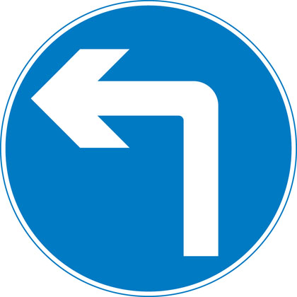

Turn left ahead (right if symbol reversed)

Turn left (right if symbol reversed)

Keep left (right if symbol reversed)

Vehicles may pass either side to reach same destination

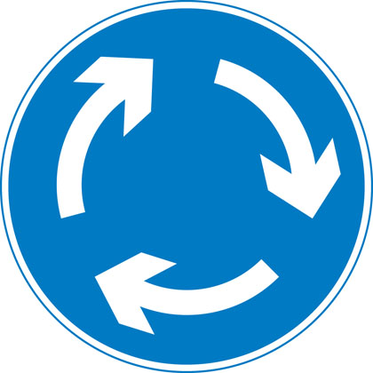

Mini-roundabout (roundabout circulation - give way to vehicles from the immediate right)

Route to be used by pedal cycles only

Segregated pedal cycle and pedestrian route

Minimum speed

End of minimum speed

Buses and cycles only

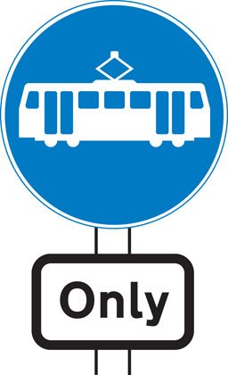

Trams only

Pedestrian crossing point over tramway

One-way traffic (note: compare circular ‘Ahead only’ sign)

With-flow bus and cycle lane

Contra-flow bus lane

With-flow pedal cycle lane

Warning signs
-------------

### Mostly triangular

Distance to ‘STOP’ line ahead

Dual carriageway ends

Road narrows on right (left if symbol reversed)

Road narrows on both sides

Distance to ‘Give Way’ line ahead

Crossroads

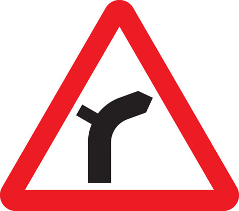

Junction on bend ahead

T-junction with priority over vehicles from the right

Staggered junction

Traffic merging from left ahead

**The priority through route is indicated by the broader line.**

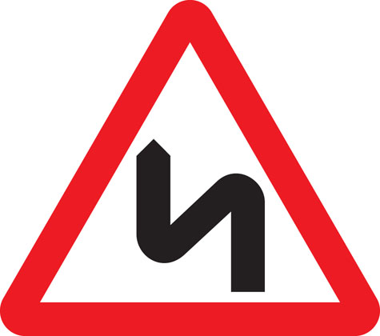

Double bend first to left (symbol may be reversed)

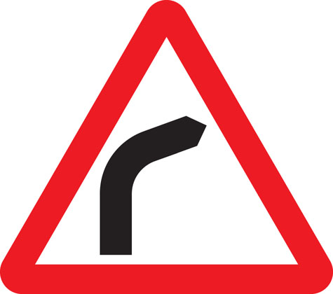

Bend to right (or left if symbol reversed)

Roundabout

Uneven road

Plate below some signs

Two-way traffic crosses one-way road

Two-way traffic straight ahead

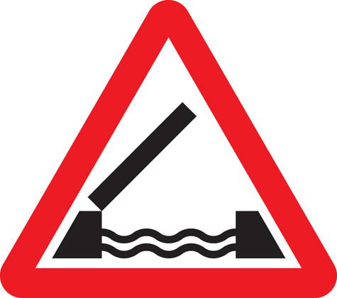

Opening or swing bridge ahead

Low-flying aircraft or sudden aircraft noise

Falling or fallen rocks

Traffic signals not in use

Traffic signals

Slippery road

Steep hill downwards

Steep hill upwards

**Gradients may be shown as a ratio i.e. 20% = 1:5**

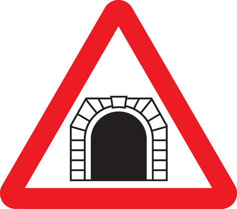

Tunnel ahead

Trams crossing ahead

Level crossing with barrier or gate ahead

Level crossing without barrier or gate ahead

Level crossing without barrier

School crossing patrol ahead (some signs have amber lights which flash when crossings are in use)

Frail (or blind or disabled if shown) pedestrians likely to cross road ahead

Pedestrians in road ahead

Zebra crossing

Overhead electric cable; plate indicates maximum height of vehicles which can pass safely

Available width of headroom indicated

Sharp deviation of route to left (or right if chevrons reversed)

Light signals ahead at level crossing, airfield or bridge

Miniature warning lights at level crossings

Cattle

Wild animals

Wild horses or ponies

Accompanied horses or ponies

Cycle route ahead

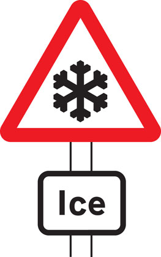

Risk of ice

Traffic queues likely ahead

Distance over which road humps extend

Other danger; plate indicates nature of danger

Soft verges

Side winds

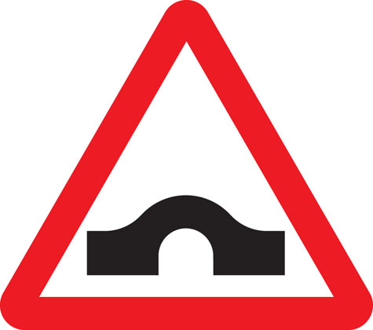

Hump bridge

Worded warning sign

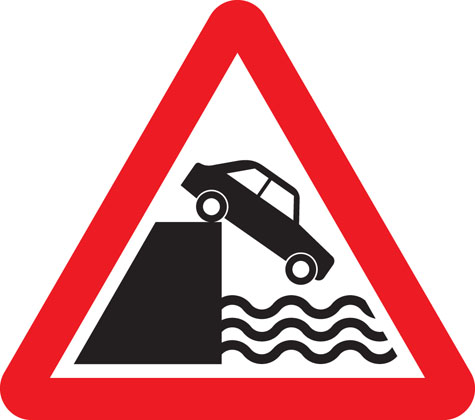

Quayside or river bank

Risk of grounding

Direction signs
---------------

### Mostly rectangular

### Signs on motorways - blue backgrounds

At a junction leading directly into a motorway (junction number may be shown on a black background)

On approaches to junctions (junction number on black background)

Route confirmatory sign after junction

Downward pointing arrows mean ‘Get in lane’
The left-hand lane leads to a different destination from the other lanes.

The panel with the inclined arrow indicates the destinations which can be reached by leaving the motorway at the next junction

### Signs on primary routes - green backgrounds

Blue panels indicate that the motorway starts at the junction ahead.
Motorways shown in brackets can also be reached along the route indicated. White panels indicate local or non-primary routes leading from the junction ahead.
Brown panels show the route to tourist attractions.
The name of the junction may be shown at the top of the sign.
The aircraft symbol indicates the route to an airport.
A symbol may be included to warn of a hazard or restriction along that route.

On approaches to junctions

At the junction

Route confirmatory sign after junction

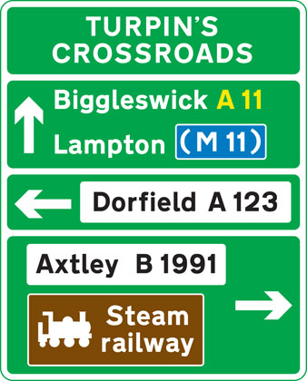

On approaches to junctions

On approach to a junction in Wales (bilingual)

Primary route forming part of a ring road

Primary route forming part of a ring road

### Signs on non-primary and local routes - black borders

Green panels indicate that the primary route starts at the junction ahead. Route numbers on a blue background show the direction to a motorway. Route numbers on a green background show the direction to a primary route.

On approaches to junctions

On approaches to junctions

At the junction

Direction to toilets with access for the disabled

### Other direction signs

Picnic site

Ancient monument in the care of English Heritage

Direction to a car park

Tourist attraction

Direction to camping and caravan site

Advisory route for lorries

Route for pedal cycles forming part of a network

Recommended route for pedal cycles to place shown

Route for pedestrians

Symbols showing emergency diversion route for motorway and other main road traffic

Symbols showing emergency diversion route for motorway and other main road traffic

Symbols showing emergency diversion route for motorway and other main road traffic

Symbols showing emergency diversion route for motorway and other main road traffic

Diversion route

Information signs
-----------------

### All rectangular

Entrance to controlled parking zone

Entrance to congestion charging zone

End of controlled parking zone

Advance warning of restriction or prohibition ahead

Parking place for solo motorcycles

With-flow bus lane ahead which pedal cycles and taxis may also use

Lane designated for use by high occupancy vehicles (HOV) - see [rule 142](/pages/general-rules-techniques-and-advice-for-all-drivers-and-riders-103-to-158.md#rule-142)

Vehicles permitted to use an HOV lane ahead

End of motorway

Start of motorway and point from which motorway regulations apply

Appropriate traffic lanes at junction ahead

Traffic on the main carriageway coming from right has priority over joining traffic

Additional traffic joining from left ahead. Traffic on main carriageway has priority over joining traffic from right hand lane of slip road

Traffic in right hand lane of slip road joining the main carriageway has priority over left hand lane

Variable speed limit with camera enforcement sign.

‘Countdown’ markers at exit from motorway (each bar represents 100 yards to the exit). Green-backed markers may be used on primary routes and white-backed markers with black bars on other routes. At approaches to concealed level crossings white-backed markers with red bars may be used. Although these will be erected at equal distances the bars do not represent 100 yard intervals.

Motorway service area sign showing the operator’s name

Traffic has priority over oncoming vehicles

Hospital ahead with Accident and Emergency facilities

Tourist information point

No through road for vehicles

Recommended route for pedal cycles

Home Zone Entry

Area in which cameras are used to enforce traffic regulations

Bus lane on road at junction ahead

Road work signs
---------------

Road works

Loose chippings

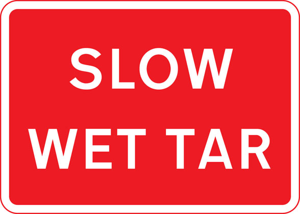

Temporary hazard at road works

Temporary lane closure (the number and position of arrows and red bars may be varied according to lanes open and closed)

Slow-moving or stationary works vehicle blocking a traffic lane. Pass in the direction shown by the arrow.

Mandatory speed limit ahead

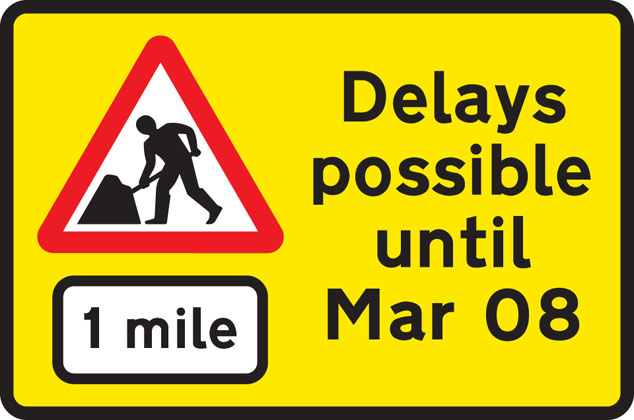

Road works 1 mile ahead

End of road works and any temporary restrictions including speed limits

Signs used on the back of slow-moving or stationary vehicles warning of a lane closed ahead by a works vehicle. There are no cones on the road.

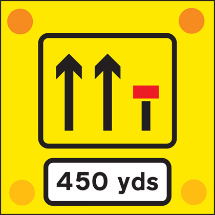

Signs used on the back of slow-moving or stationary vehicles warning of a lane closed ahead by a works vehicle. There are no cones on the road.

Lane restrictions at road works ahead

One lane crossover at contraflow road works
