Using the road (159 to 203)
=============================

Rules for using the road, including general rules, overtaking, road junctions, roundabouts, pedestrian crossings and reversing.

General rules (rules 159 to 161)
--------------------------------

### Rule 159

Before moving off you should

* use all mirrors to check the road is clear
* look round to check the blind spots (the areas you are unable to see in the mirrors)
* signal if necessary before moving out
* look round for a final check.

Move off only when it is safe to do so.

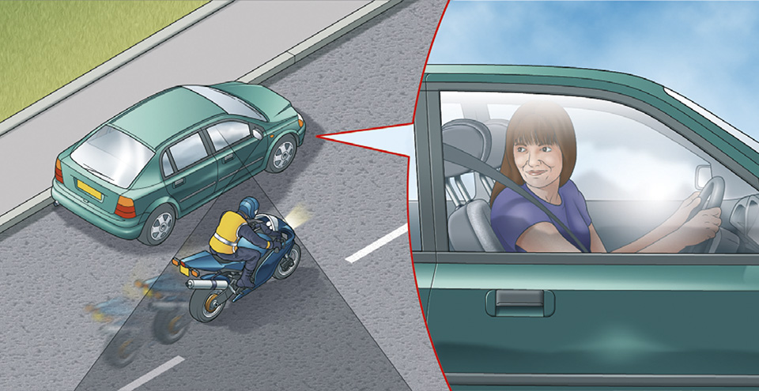

Rule 159: Check the blind spot before moving off

### Rule 160

**Once moving** you should

* keep to the left, unless road signs or markings indicate otherwise. The exceptions are when you want to overtake, turn right or pass parked vehicles or pedestrians in the road
* keep well to the left on right-hand bends. This will improve your view of the road and help avoid the risk of colliding with traffic approaching from the opposite direction
* drive or ride with both hands on the wheel or handlebars where possible. This will help you to remain in full control of the vehicle at all times. You may use driver assistance systems while you are driving. Make sure you use any system according to the manufacturer’s instructions.
* be aware of other road users, especially cycles and motorcycles who may be filtering through the traffic. These are more difficult to see than larger vehicles and their riders are particularly vulnerable. Give them plenty of room, especially if you are driving a long vehicle or towing a trailer. You should give way to cyclists when you are changing direction or lane – do not cut across them.
* select a lower gear before you reach a long downhill slope. This will help to control your speed
* when towing, remember the extra length will affect overtaking and manoeuvring. The extra weight will also affect the braking and acceleration.

### Rule 161

**Mirrors.** All mirrors should be used effectively throughout your journey. You should

* use your mirrors frequently so that you always know what is behind and to each side of you
* use them in good time before you signal or change direction or speed
* be aware that mirrors do not cover all areas and there will be blind spots.
You will need to look round and check.

**Remember: Mirrors – Signal – Manoeuvre**

Overtaking (rules 162 to 169)
-----------------------------

### Rule 162

**Before overtaking** you should make sure

* the road is sufficiently clear ahead
* road users are not beginning to overtake you
* there is a suitable gap in front of the road user you plan to overtake.

### Rule 163

**Overtake only** when it is safe and legal to do so. You should

* not get too close to the vehicle you intend to overtake
* use your mirrors, signal when it is safe to do so, take a quick sideways glance if necessary into the blind spot area and then start to move out
* not assume that you can simply follow a vehicle ahead which is overtaking; there may only be enough room for one vehicle
* move quickly past the vehicle you are overtaking, once you have started to overtake. Allow plenty of room. Move back to the left as soon as you can but do not cut in
* take extra care at night and in poor visibility when it is harder to judge speed and distance
* give way to oncoming vehicles before passing parked vehicles or other obstructions on your side of the road
* only overtake on the left if the vehicle in front is signalling to turn right, and there is room to do so
* stay in your lane if traffic is moving slowly in queues. If the queue on your right is moving more slowly than you are, you may pass on the left. Cyclists may pass slower moving or stationary traffic on their right or left and should proceed with caution as the driver may not be able to see you. Be careful about doing so, particularly on the approach to junctions, and especially when deciding whether it is safe to pass lorries or other large vehicles.
* give motorcyclists, cyclists and horse riders and horse drawn vehicles at least as much room as you would when overtaking a car (see [Rules 211 to 215](/pages/road-users-requiring-extra-care-204-to-225.md#motorcyclists-and-cyclists-rules-211-to-213)). As a guide:
	+ leave at least 1.5 metres when overtaking cyclists at speeds of up to 30mph, and give them more space when overtaking at higher speeds
	+ pass horse riders and horse-drawn vehicles at speeds under 10 mph and allow at least 2 metres of space
	+ allow at least 2 metres of space and keep to a low speed when passing a pedestrian who is walking in the road (for example, where there is no pavement)
	+ take extra care and give more space when overtaking motorcyclists, cyclists, horse riders, horse drawn vehicles and pedestrians in bad weather (including high winds) and at night
	+ you should wait behind the motorcyclist, cyclist, horse rider, horse drawn vehicle or pedestrian and not overtake if it is unsafe or not possible to meet these clearances.

**Remember: Mirrors – Signal – Manoeuvre**

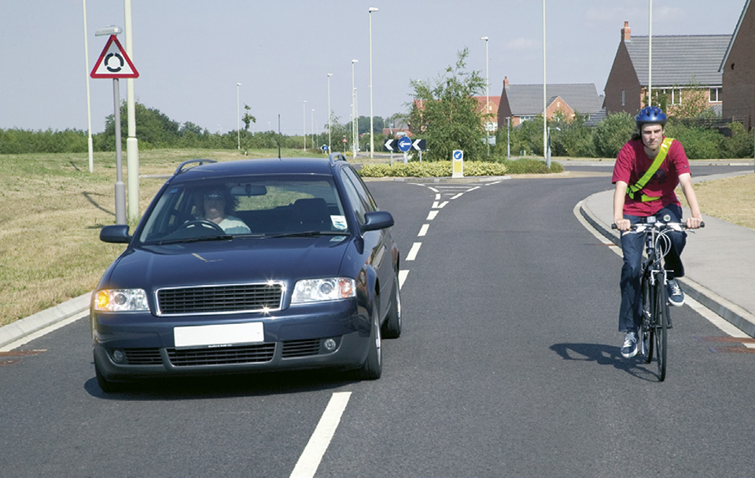

Rule 163: Give vulnerable road users at least as much space as you would a car

### Rule 164

**Large vehicles.** Overtaking these is more difficult. You should

* drop back. This will increase your ability to see ahead and should allow the driver of the large vehicle to see you in their mirrors. Getting too close to large vehicles, including agricultural vehicles such as a tractor with a trailer or other fixed equipment, will obscure your view of the road ahead and there may be another slow-moving vehicle in front
* make sure that you have enough room to complete your overtaking manoeuvre before committing yourself. It takes longer to pass a large vehicle. If in doubt do not overtake
* not assume you can follow a vehicle ahead which is overtaking a long vehicle. If a problem develops, they may abort overtaking and pull back in

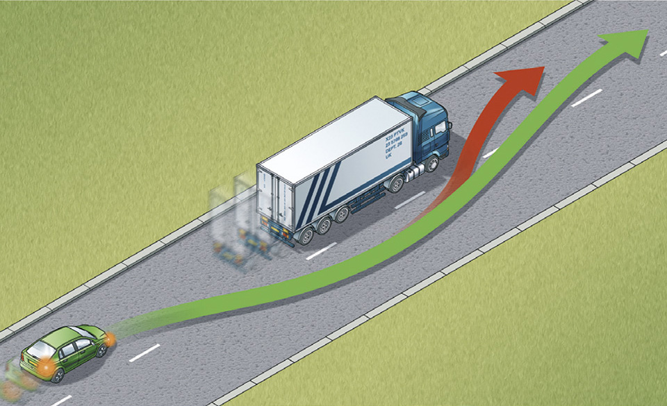

Rule 164: Do not cut in too quickly

### Rule 165

You **MUST NOT** overtake

* if you would have to cross or straddle double white lines with a solid line nearest to you (but see [Rule 129](/pages/general-rules-techniques-and-advice-for-all-drivers-and-riders-103-to-158.md#rule-129))
* if you would have to enter an area designed to divide traffic, if it is surrounded by a solid white line
* the nearest vehicle to a pedestrian crossing, especially when it has stopped to let pedestrians cross
* if you would have to enter a lane reserved for buses, trams or cycles during its hours of operation
* after a ‘No Overtaking’ sign and until you pass a sign cancelling the restriction.

**Laws [RTA 1988 sect 36](http://www.legislation.gov.uk/ukpga/1988/52/section/36) & [TSRGD schedule 1](https://www.legislation.gov.uk/uksi/2002/3113/schedule/1/made), [schedule 9 part 7](https://www.legislation.gov.uk/uksi/2002/3113/schedule/9/made), [schedule 14 part 1](https://www.legislation.gov.uk/uksi/2002/3113/schedule/14/made)**

### Rule 166

**DO NOT** overtake if there is any doubt, or where you cannot see far enough ahead to be sure it is safe. For example, when you are approaching

* a corner or bend
* a hump bridge
* the brow of a hill.

### Rule 167

**DO NOT** overtake where you might come into conflict with other road users. For example

* approaching or at a road junction on either side of the road
* where the road narrows
* when approaching a school crossing patrol
* on the approach to crossing facilities
* where a vehicle ahead is slowing to stop for a pedestrian that is crossing from a pedestrian island (see [Rule 165](/pages/using-the-road-159-to-203.md#rule-165))
* between the kerb and a bus or tram when it is at a stop
* where traffic is queuing at junctions or road works
* when you would force another road user to swerve or slow down
* at a level crossing
* when a road user is indicating right, even if you believe the signal should have been cancelled. Do not take a risk; wait for the signal to be cancelled
* stay behind if you are following a cyclist approaching a roundabout or junction, and you intend to turn left. Do not cut across cyclists going ahead, including those using cycle lanes and cycle tracks (see [Rule H3](/pages/introduction.md#rule-h3))
* stay behind if you are following a horse rider or horse drawn vehicle approaching a roundabout or junction, and you intend to turn left. Do not cut across a horse rider or horse drawn vehicle going ahead
* when a tram is standing at a kerbside tram stop and there is no clearly marked passing lane for other traffic.

### Rule 168

**Being overtaken.** If a driver is trying to overtake you, maintain a steady course and speed, slowing down if necessary to let the vehicle pass. Never obstruct drivers who wish to pass. Speeding up or driving unpredictably while someone is overtaking you is dangerous. Drop back to maintain a two-second gap if someone overtakes and pulls into the gap in front of you.

### Rule 169

Do not hold up a long queue of traffic, especially if you are driving a large or slow-moving vehicle. Check your mirrors frequently, and if necessary, pull in where it is safe and let traffic pass.

Road junctions (rules 170 to 183)
---------------------------------

### Rule 170

Take extra care at junctions. You should

* watch out for cyclists, motorcyclists and pedestrians including powered wheelchairs/mobility scooter users as they are not always easy to see. Be aware that they may not have seen or heard you if you are approaching from behind
* give way to pedestrians crossing or waiting to cross a road into which or from which you are turning. If they have started to cross they have priority, so give way (see [Rule H2](/pages/introduction.md#rule-h2))
* remain behind cyclists, horse riders, horse drawn vehicles and motorcyclists at junctions even if they are waiting to turn and are positioned close to the kerb
* watch out for long vehicles which may be turning at a junction ahead; they may have to use the whole width of the road to make the turn (see [Rule 221](/pages/road-users-requiring-extra-care-204-to-225.md#rule-221))
* watch out for horse riders who may take a different line on the road from that which you would expect
* not assume, when waiting at a junction, that a vehicle coming from the right and signalling left will actually turn. Wait and make sure
* look all around before emerging. Do not cross or join a road until there is a gap large enough for you to do so safely.

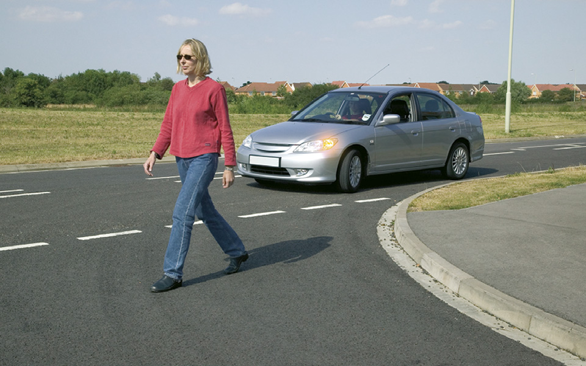

Rule 170: Give way to pedestrians who have started to cross

### Rule 171

You **MUST** stop behind the line at a junction with a ‘Stop’ sign and a solid white line across the road. Wait for a safe gap in the traffic before you move off.

**Laws [RTA 1988 sect 36](http://www.legislation.gov.uk/ukpga/1988/52/section/36) & [TSRGD schedule 9 parts 7 and 8](https://www.legislation.gov.uk/uksi/2002/3113/schedule/9/made)**

### Rule 172

The approach to a junction may have a ‘Give Way’ sign or a triangle marked on the road. You **MUST** give way to traffic on the main road when emerging from a junction with broken white lines across the road.

**Laws [RTA 1988 sect 36](http://www.legislation.gov.uk/ukpga/1988/52/section/36) & [TSRGD schedule 9 parts 7 and 8](https://www.legislation.gov.uk/uksi/2002/3113/schedule/9/made)**

### Rule 173

**Dual carriageways.** When crossing or turning right, first assess whether the central reservation is deep enough to protect the full length of your vehicle.

* If it is, then you should treat each half of the carriageway as a separate road. Wait in the central reservation until there is a safe gap in the traffic on the second half of the road.
* If the central reservation is too shallow for the length of your vehicle, wait until you can cross both carriageways in one go.

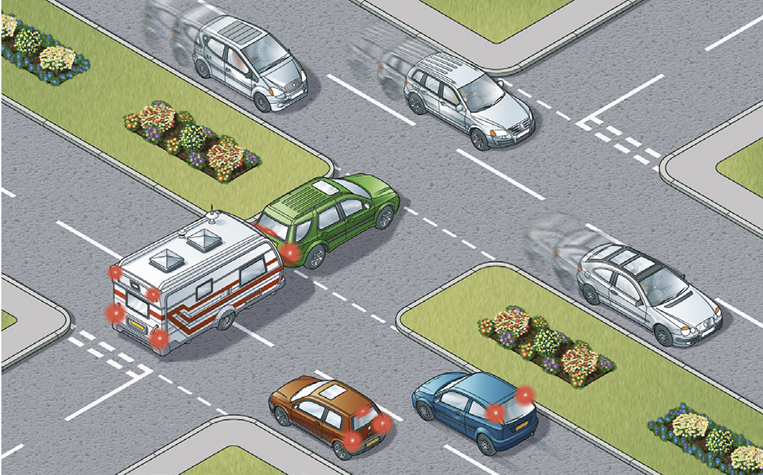

Rule 173: Assess your vehicle’s length and do not obstruct traffic

### Rule 174

**Box junctions.** These have criss-cross yellow lines painted on the road (see ‘[Road markings](/pages/road-markings.md)’). You **MUST NOT** enter the box until your exit road or lane is clear. However, you may enter the box and wait when you want to turn right, and are only stopped from doing so by oncoming traffic, or by other vehicles waiting to turn right. At signalled roundabouts you **MUST NOT** enter the box unless you can cross over it completely without stopping.

**Law [TSRGD schedule 9 parts 7 and 8](https://www.legislation.gov.uk/uksi/2002/3113/schedule/9/made)**

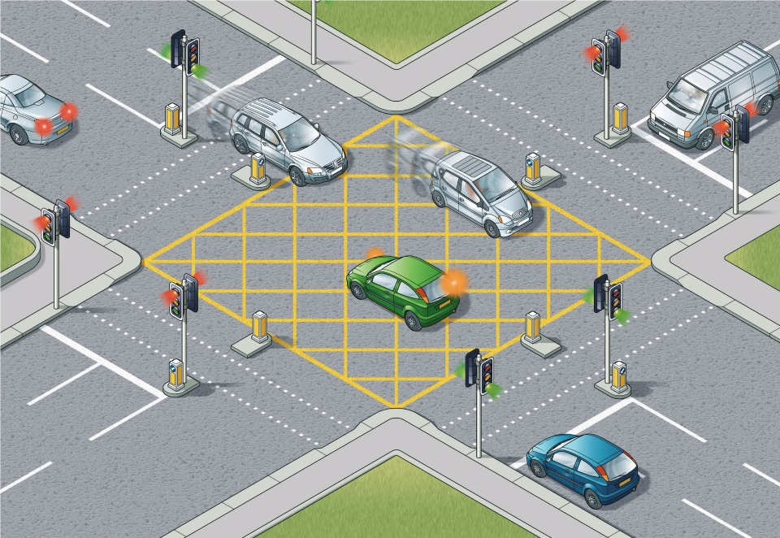

Rule 174: Enter a box junction only if your exit road is clear

### Junctions controlled by traffic lights

### Rule 175

You **MUST** stop behind the white ‘Stop’ line across your side of the road unless the light is green. If the amber light appears you may go on only if you have already crossed the stop line or are so close to it that to stop might cause a collision.

**Laws [RTA 1988 sect 36](http://www.legislation.gov.uk/ukpga/1988/52/section/36) & [TSRGD schedule 14 parts 1 and 4](https://www.legislation.gov.uk/uksi/2002/3113/schedule/14/made)**

### Rule 176

You **MUST NOT** move forward over the white line when the red light is showing. Only go forward when the traffic lights are green if there is room for you to clear the junction safely or you are taking up a position to turn right. If the traffic lights are not working, treat the situation as you would an unmarked junction and proceed with great care.

**Laws [RTA 1988 sect 36](http://www.legislation.gov.uk/ukpga/1988/52/section/36) & [TSRGD schedule 14 parts 1 and 4](https://www.legislation.gov.uk/uksi/2002/3113/schedule/14/made)**

### Rule 177

**Green filter arrow.** This indicates a filter lane only. Do not enter that lane unless you want to go in the direction of the arrow. You may proceed in the direction of the green arrow when it, or the full green light shows. Give other traffic, especially cyclists, time and room to move into the correct lane.

### Rule 178

**Advanced stop lines.** Some signal-controlled junctions have advanced stop lines to allow cyclists to be positioned ahead of other traffic. Motorists, including motorcyclists, **MUST** stop at the first white line reached if the lights are amber or red and should avoid blocking the way or encroaching on the marked area at other times, e.g. if the junction ahead is blocked. If your vehicle has proceeded over the first white line at the time that the signal goes red, you should stop as soon as possible and **MUST** stop at the second white line. Allow cyclists, including any moving or waiting alongside you, enough time and space to move off when the green signal shows.

Drivers of large vehicles should stop sufficiently far behind the first white line so that they can see the whole area where cyclists may be waiting, allowing for any blind spot in front of the vehicle.

**Laws [RTA 1988 sect 36](http://www.legislation.gov.uk/ukpga/1988/52/section/36) & [TSRGD Schedule 14 part 1](http://www.legislation.gov.uk/uksi/2016/362/schedule/14/made)**

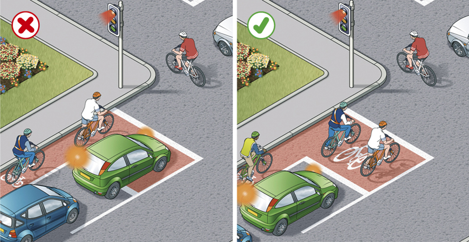

Rule 178: Do not unnecessarily encroach on the cyclists waiting area

### Turning right

### Rule 179

**Well before** you turn right you should

* use your mirrors to make sure you know the position and movement of traffic behind you
* give a right-turn signal
* take up a position just left of the middle of the road or in the space marked for traffic turning right
* leave room for other vehicles to pass on the left, if possible.

### Rule 180

Wait until there is a safe gap between you and any oncoming vehicle. Watch out for cyclists, motorcyclists, pedestrians and other road users. Check your mirrors and blind spot again to make sure you are not being overtaken, then make the turn. Do not cut the corner. Take great care when turning into a main road; you will need to watch for traffic in both directions and wait for a safe gap.

**Remember: Mirrors – Signal – Manoeuvre**

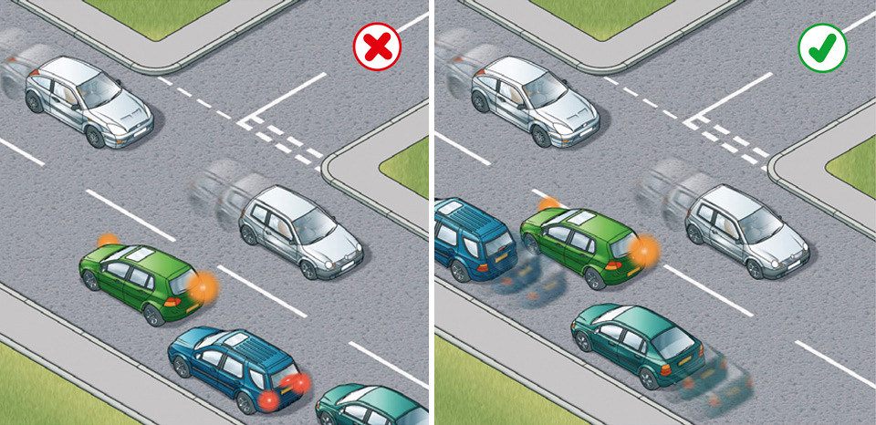

Rule 180: Position your vehicle correctly to avoid obstructing traffic

### Rule 181

**When turning** right at crossroads where an oncoming vehicle is also turning right, there is a choice of two methods

* turn right side to right side; keep the other vehicle on your right and turn behind it. This is generally the safer method as you have a clear view of any approaching traffic when completing your turn
* left side to left side, turning in front of each other. This can block your view of oncoming vehicles, so take extra care. Cyclists and motorcyclists in particular may be hidden from your view. Road layout, markings or how the other vehicle is positioned can determine which course should be taken.

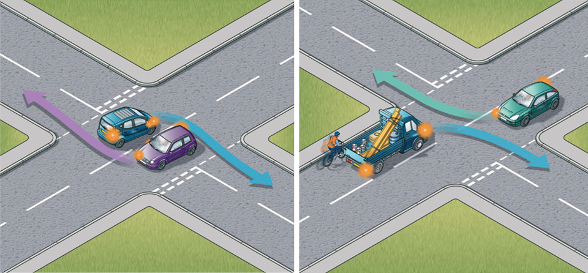

Rule 181: Left - Turning right side to right side. Right - Turning left side to left side

### Turning left

### Rule 182

Use your mirrors and give a left-turn signal well before you turn left. Do not overtake just before you turn left and watch out for traffic coming up on your left before you make the turn, especially if driving a large vehicle. Cyclists, motorcyclists and other road users in particular may be hidden from your view.

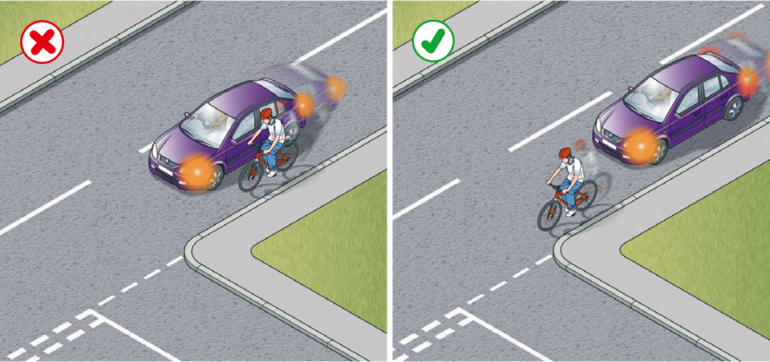

Rule 182: Do not cut in on cyclists

### Rule 183

When turning

* keep as close to the left as is safe and practicable
* give way to any vehicles using a bus lane, cycle lane, cycle track or tramway from either direction, including when they are passing slow moving or stationary vehicles on either side.

Roundabouts (rules 184 to 190)
------------------------------

### Rule 184

**On approaching a roundabout** take notice and act on all the information available to you, including traffic signs, traffic lights and lane markings which direct you into the correct lane. You should

* use **Mirrors – Signal – Manoeuvre** at all stages
* decide as early as possible which exit you need to take
* give an appropriate signal (see [Rule 186](#rule-186), below). Time your signals so as not to confuse other road users
* get into the correct lane
* adjust your speed and position to fit in with traffic conditions
* be aware of the speed and position of all the road users around you.

### Rule 185

**When reaching the roundabout** you should

* give priority to traffic approaching from your right, unless directed otherwise by signs, road markings or traffic lights
* check whether road markings allow you to enter the roundabout without giving way. If so, proceed, but still look to the right before joining
* watch out for all other road users already on the roundabout; be aware they may not be signalling correctly or at all
* look forward before moving off to make sure traffic in front has moved off.

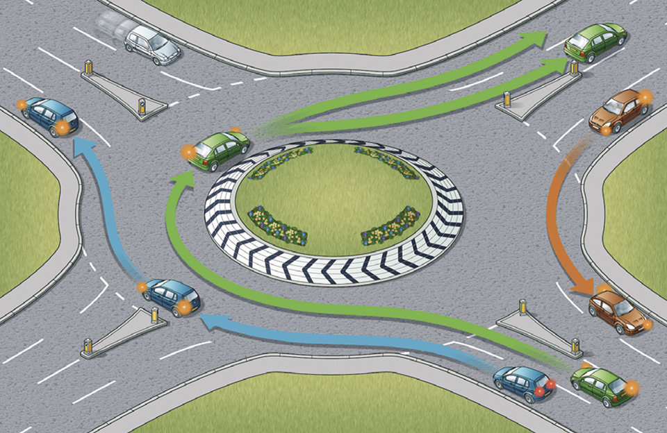

Rule 185: Follow the correct procedure at roundabouts

### Rule 186

**Signals and position.**
When taking the first exit to the left, unless signs or markings indicate otherwise

* signal left and approach in the left-hand lane
* keep to the left on the roundabout and continue signalling left to leave.

When taking an exit to the right or going full circle, unless signs or markings indicate otherwise

* signal right and approach in the right-hand lane
* keep to the right on the roundabout until you need to change lanes to exit the roundabout
* signal left after you have passed the exit before the one you want.

When taking any intermediate exit, unless signs or markings indicate otherwise

* select the appropriate lane on approach to the roundabout
* you should not normally need to signal on approach
* stay in this lane until you need to alter course to exit the roundabout
* signal left after you have passed the exit before the one you want.

When there are more than three lanes at the entrance to a roundabout, use the most appropriate lane on approach and through it.

You should give priority to cyclists on the roundabout. They will be travelling more slowly than motorised traffic. Give them plenty of room and do not attempt to overtake them within their lane. Allow them to move across your path as they travel around the roundabout.

Cyclists, horse riders and horse drawn vehicles may stay in the left-hand lane when they intend to continue across or around the roundabout and should signal right to show you they are not leaving the roundabout. Drivers should take extra care when entering a roundabout to ensure that they do not cut across cyclists, horse riders or horse drawn vehicles in the left-hand lane, who are continuing around the roundabout.

### Rule 187

**In all cases watch out for** and give plenty of room to

* pedestrians who may be crossing the approach and exit roads
* traffic crossing in front of you on the roundabout, especially vehicles intending to leave by the next exit
* traffic which may be straddling lanes or positioned incorrectly
* motorcyclists
* long vehicles (including those towing trailers). These might have to take a different course or straddle lanes either approaching or on the roundabout because of their length. Watch out for their signals.

### Rule 188

**Mini-roundabouts.** Approach these in the same way as normal roundabouts. All vehicles **MUST** pass round the central markings except large vehicles which are physically incapable of doing so. Remember, there is less space to manoeuvre and less time to signal. Avoid making U-turns at mini-roundabouts. Beware of others doing this.

**Laws [RTA 1988 sect 36](http://www.legislation.gov.uk/ukpga/1988/52/section/36) & [TSRGD schedule 9 parts 7 and 8](https://www.legislation.gov.uk/uksi/2002/3113/schedule/9/made)**

### Rule 189

At double mini-roundabouts treat each roundabout separately and give way to traffic from the right.

### Rule 190

**Multiple roundabouts**. At some complex junctions, there may be a series of mini-roundabouts at each intersection. Treat each mini-roundabout separately and follow the normal rules.

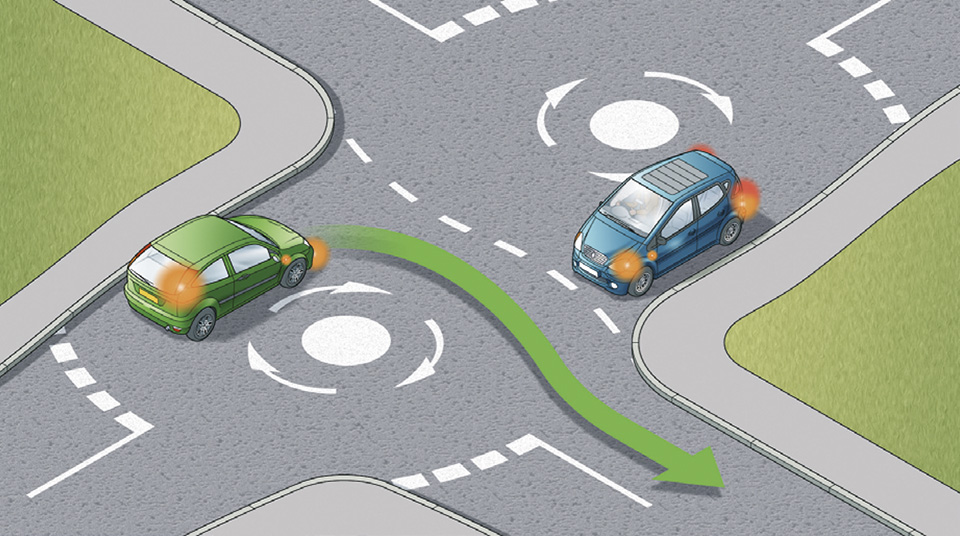

Rule 190: Treat each roundabout separately

Pedestrian crossings (rules 191 to 199)
---------------------------------------

### Rule 191

You **MUST NOT** park on a crossing or in the area covered by the zig-zag lines. You **MUST NOT** overtake the moving vehicle nearest the crossing or the vehicle nearest the crossing which has stopped to give way to pedestrians.

**Laws [RTRA sect 25(5)](https://www.legislation.gov.uk/ukpga/1984/27/section/25) & [TSRGD schedule 14 parts 1 and 5](https://www.legislation.gov.uk/uksi/2016/362/schedule/14/made)**

### Rule 192

In slow-moving and queuing traffic you should keep crossings completely clear, as blocking these makes it difficult and dangerous for pedestrians to cross. You should not enter a pedestrian crossing if you are unable to completely clear the crossing. Nor should you block advanced stop lines for cycles.

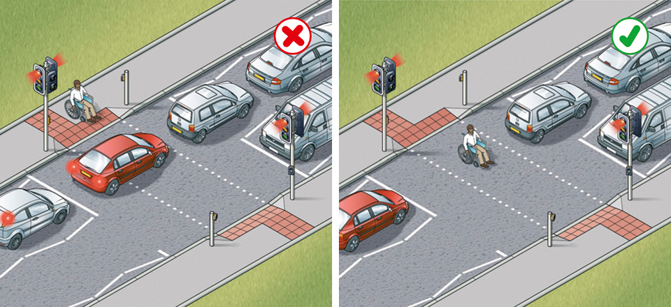

Rule 192: Keep the crossing clear

### Rule 193

You should take extra care where the view of either side of the crossing is blocked by queuing traffic or incorrectly parked vehicles. Pedestrians may be crossing between stationary vehicles.

### Rule 194

Allow pedestrians plenty of time to cross and do not harass them by revving your engine or edging forward.

### Rule 195

**Zebra and parallel crossings.** As you approach a zebra crossing

* look out for pedestrians waiting to cross and be ready to slow down or stop to let them cross
* you should give way to pedestrians waiting to cross
* you **MUST** give way when a pedestrian has moved onto a crossing
* allow more time for stopping on wet or icy roads
* do not wave, flash your lights or use your horn to invite pedestrians across; this could be dangerous if another vehicle is approaching
* be patient, do not sound your horn or rev your engine as this can be intimidating
* be aware of pedestrians approaching from the side of the crossing.

A zebra crossing with a central island is two separate crossings (see [Rules 19](/pages/rules-for-pedestrians-1-to-35.md#rule-19) and [20](/pages/rules-for-pedestrians-1-to-35.md#rule-20)).

Parallel crossings are similar to zebra crossings, but include a cycle route alongside the black and white stripes.

As you approach a parallel crossing

* look out for pedestrians or cyclists waiting to cross and slow down or stop
* you should give way to pedestrians or cyclists waiting to cross
* you **MUST** give way when a pedestrian or cyclist has moved onto a crossing
* allow more time for stopping on wet or icy roads
* do not wave, flash your lights or use your horn to invite pedestrians or cyclists across; this could be dangerous if another vehicle is approaching
* be patient, do not sound your horn or rev your engine as this can be intimidating
* be aware of pedestrians or cyclists approaching from the side of the crossing.

A parallel crossing with a central island is two separate crossings (see [Rules 19](/pages/rules-for-pedestrians-1-to-35.md#rule-19) and [20](/pages/rules-for-pedestrians-1-to-35.md#rule-20)).

**Law [TSRGD schedule 14 part 5](http://www.legislation.gov.uk/uksi/2016/362/schedule/14/made)**

### Signal-controlled crossings

### Rule 196

**Pelican crossings.** These are signal-controlled crossings where flashing amber follows the red ‘Stop’ light. You **MUST** stop when the red light shows. When the amber light is flashing, you **MUST** give way to any pedestrians on the crossing. If the amber light is flashing and there are no pedestrians on the crossing, you may proceed with caution.

**Laws [TSRGD reg 14](https://www.legislation.gov.uk/uksi/2002/3113/schedule/14/made) & [RTRA sect 25(5)](https://www.legislation.gov.uk/ukpga/1984/27/section/25)**

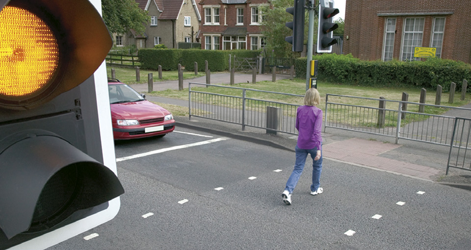

Rule 196: Allow pedestrians to cross when the amber light is flashing

### Rule 197

Pelican crossings which go straight across the road are one crossing, even when there is a central island. You **MUST** wait for pedestrians who are crossing from the other side of the island.

**Law [TSRGD reg 14](https://www.legislation.gov.uk/uksi/2002/3113/schedule/14/made)**

### Rule 198

Give way to anyone still crossing after the signal for vehicles has changed to green. This advice applies to all crossings.

### Rule 199

**Toucan, puffin and equestrian crossings.** These are similar to pelican crossings, but there is no flashing amber phase; the light sequence for traffic at these three crossings is the same as at traffic lights. If the signal-controlled crossing is not working, proceed with extreme caution. Do not enter the crossing if you are unable to completely clear it, to avoid obstructing pedestrians, cyclists or horse riders.

Reversing (200 to 203)
----------------------

### Rule 200

Choose an appropriate place to manoeuvre. If you need to turn your vehicle around, wait until you find a safe place. Try not to reverse or turn round in a busy road; find a quiet side road or drive round a block of side streets.

### Rule 201

Do not reverse from a side road into a main road. When using a driveway, reverse in and drive out if you can.

### Rule 202

Look carefully before you start reversing. You should

* use all your mirrors
* check the ‘blind spot’ behind you (the part of the road you cannot see easily in the mirrors)
* check there are no pedestrians (particularly children), cyclists, other road users or obstructions in the road behind you.

Reverse slowly while

* checking all around
* looking mainly through the rear window
* being aware that the front of your vehicle will swing out as you turn.

Get someone to guide you if you cannot see clearly.

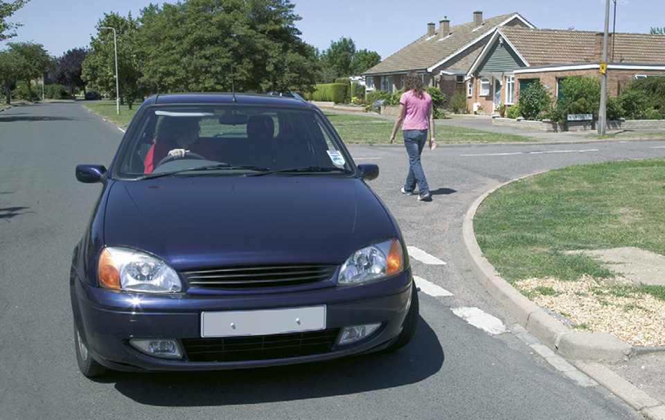

Rule 202: Check all round when reversing

### Rule 203

You **MUST NOT** reverse your vehicle further than necessary.

**Law [CUR reg 106](http://www.legislation.gov.uk/uksi/1986/1078/regulation/106/made)**
