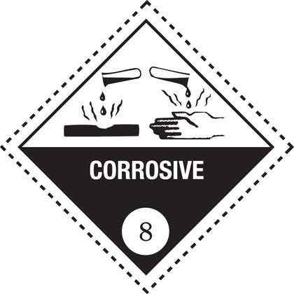

Vehicle markings
================

Vehicle markings used, including large goods vehicle rear markings, hazard warning plates, projection markers and other markings.

[Download ‘Vehicle markings’ (PDF, 537KB)](https://assets.digital.cabinet-office.gov.uk/media/560aa745e5274a036c000020/the-highway-code-vehicle-markings.pdf)

Large goods vehicle rear markings
----------------------------------

Motor vehicles over 7500 kilograms maximum gross weight and trailers over 3500 kilograms maximum gross weight

Left - Central - RightThe vertical markings are also required to be fitted to builders’ skips placed in the road, commercial vehicles or combinations longer than 13 metres (optional on combinations between 11 and 13 metres)

Hazard warning plates
----------------------

Certain tank vehicles carrying dangerous goods must display hazard information panels

The panel illustrated is for flammable liquid. Diamond symbols indicating other risks include:

The above panel will be displayed by vehicles carrying certain dangerous goods in packages

Toxic substance

Oxidizing substance

Non-flammable compressed gas

Radioactive substance

Spontaneously combustible substance

Corrosive substance

Projections markers
--------------------

Side marker

End markerBoth required when load or equipment (eg crane jib) overhangs front or rear by more than two metres

Other
------

School bus (displayed in front or rear window of bus or coach)
