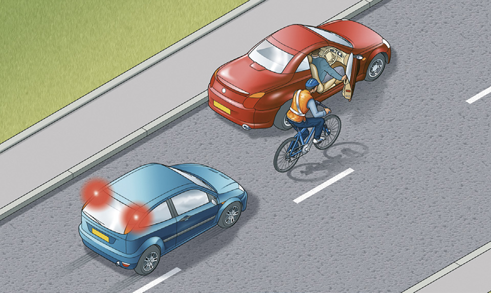

Waiting and parking (238 to 252)
================================

Rules for waiting and parking, including rules on parking at night and decriminalised parking enforcement.

General (rule 238)
------------------

### Rule 238

You **MUST NOT** wait or park on yellow lines during the times of operation shown on nearby time plates (or zone entry signs if in a Controlled Parking Zone) – see [‘Traffic signs’](/pages/traffic-signs.md) and [‘Road markings’](/pages/road-markings.md). Double yellow lines indicate a prohibition of waiting at any time even if there are no upright signs. You **MUST NOT** wait or park, or stop to set down and pick up passengers, on school entrance markings (see [‘Road markings’](/pages/road-markings.md)) when upright signs indicate a prohibition of stopping.

**Law [RTRA sects 5](http://www.legislation.gov.uk/ukpga/1984/27/section/5) & [8](http://www.legislation.gov.uk/ukpga/1984/27/section/8)**

Parking (rules 239 to 247)
--------------------------

### Rule 239

Use off-street parking areas, or bays marked out with white lines on the road as parking places, wherever possible. If you have to stop on the roadside:

* do not park facing against the traffic flow
* stop as close as you can to the side
* do not stop too close to a vehicle displaying a Blue Badge: remember, the occupant may need more room to get in or out
* you **MUST** switch off the engine, headlights and fog lights
* you **MUST** apply the handbrake before leaving the vehicle
* you **MUST** ensure you do not hit anyone when you open your door. Check for cyclists or other traffic by looking all around and using your mirrors
* where you are able to do so, you should open the door using your hand on the opposite side to the door you are opening; for example, use your left hand to open a door on your right-hand side. This will make you turn your head to look over your shoulder. You are then more likely to avoid causing injury to cyclists or motorcyclists passing you on the road, or to people on the pavement
* it is safer for your passengers (especially children) to get out of the vehicle on the side next to the kerb
* put all valuables out of sight and make sure your vehicle is secure
* lock your vehicle.

Before using a hand-held device to help you to park, you **MUST** make sure it is safe to do so. Then, you should move the vehicle into the parking space in the safest way, and by the shortest route possible.

When you use a hand-held device to help you to park, you **MUST** remain in control of the vehicle at all times. Do not use the hand-held device for anything else while you are using it to help you park, and do not put anyone in danger. Use the hand-held device according to the manufacturer’s instructions.

When using an electric vehicle charge point, you should park close to the charge point and avoid creating a trip hazard for pedestrians from trailing cables. Display a warning sign if you can. After using the charge point, you should return charging cables and connectors neatly to minimise the danger to pedestrians and avoid creating an obstacle for other road users.

**Laws [CUR regs 98](http://www.legislation.gov.uk/uksi/1986/1078/regulation/98/made), [105](http://www.legislation.gov.uk/uksi/1986/1078/regulation/105/made), [107](http://www.legislation.gov.uk/uksi/1986/1078/regulation/107/made) & [110](http://www.legislation.gov.uk/uksi/2018/592/regulation/2/made#f00003), [RVLR reg 27](http://www.legislation.gov.uk/uksi/1989/1796/regulation/27/made) & [RTA 1988 sect 42](http://www.legislation.gov.uk/ukpga/1988/52/section/42)**

Rule 239: Check before opening your door

### Rule 240

You **MUST NOT** stop or park on

* the carriageway, an emergency area or a hard shoulder of a motorway except in an emergency (see [Rules 270](/pages/motorways-253-to-273.md#rule-270) and [271](/pages/motorways-253-to-273.md#rule-271))
* a pedestrian crossing, including the area marked by the zig-zag lines (see [Rule 191](/pages/using-the-road-159-to-203.md#rule-191))
* a clearway (see [Traffic signs](/pages/traffic-signs.md))
* taxi bays as indicated by upright signs and markings
* an urban clearway within its hours of operation, except to pick up or set down passengers (see [Traffic signs](/pages/traffic-signs.md))
* a road marked with double white lines, even when a broken white line is on your side of the road, except to pick up or set down passengers, or to load or unload goods
* a tram or cycle lane during its period of operation
* a cycle track
* red lines, in the case of specially designated ‘red routes’, unless otherwise indicated by signs. Any vehicle may enter a bus lane to stop, load or unload where this is not prohibited (see [Rule 141](https://www.gov.uk/guidance/the-highway-code/general-rules-techniques-and-advice-for-all-drivers-and-riders-103-to-158#rule-141)).

**Laws [MT(E&W)R regs 7](https://www.legislation.gov.uk/uksi/1982/1163/regulation/7/made) & [9](https://www.legislation.gov.uk/uksi/1982/1163/regulation/9/made) as amended by [MT(E&W)(A)(E)R](https://www.legislation.gov.uk/uksi/2015/392/contents/made), [MT(S)R regs 6](http://www.legislation.gov.uk/uksi/1995/2507/regulation/6/made) & [8](http://www.legislation.gov.uk/uksi/1995/2507/regulation/8/made), [RTRA sects 5](http://www.legislation.gov.uk/ukpga/1984/27/section/5), [6](http://www.legislation.gov.uk/ukpga/1984/27/section/6) and [8](http://www.legislation.gov.uk/ukpga/1984/27/section/8), [TSRGD schedule 7 parts 2, 3, 4, 5 and 7](https://www.legislation.gov.uk/uksi/2002/3113/schedule/7/made), [schedule 9 part 6](https://www.legislation.gov.uk/uksi/2002/3113/schedule/9/made), [schedule 14 parts 1 and 5](https://www.legislation.gov.uk/uksi/2002/3113/schedule/14/made)**

### Rule 241

You **MUST NOT** park in parking spaces reserved for specific users, such as Blue Badge holders, residents or motorcycles, unless entitled to do so.

**Laws [CSDPA sect 21](http://www.legislation.gov.uk/ukpga/1970/44/section/21) & [RTRA sects 5](http://www.legislation.gov.uk/ukpga/1984/27/section/5) & [8](http://www.legislation.gov.uk/ukpga/1984/27/section/8)**

### Rule 242

You **MUST NOT** leave your vehicle or trailer in a dangerous position or where it causes any unnecessary obstruction of the road.

**Laws [RTA 1988 sect 22](http://www.legislation.gov.uk/ukpga/1988/52/section/22) & [CUR reg 103](http://www.legislation.gov.uk/uksi/1986/1078/regulation/103/made)**

### Rule 243

**DO NOT** stop or park:

* near a school entrance
* anywhere you would prevent access for Emergency Services
* at or near a bus or tram stop or taxi rank
* on the approach to a level crossing/tramway crossing
* opposite or within 10 metres (32 feet) of a junction, except in an authorised parking space
* near the brow of a hill or hump bridge
* opposite a traffic island or (if this would cause an obstruction) another parked vehicle
* where you would force other traffic to enter a tram lane
* where the kerb has been lowered to help wheelchair users and powered mobility vehicles
* in front of an entrance to a property
* on a bend
* where you would obstruct cyclists’ use of cycle facilities

**except** when forced to do so by stationary traffic.

### Rule 244

You **MUST NOT** park partially or wholly on the pavement in London, and should not do so elsewhere unless signs permit it. Parking on the pavement can obstruct and seriously inconvenience pedestrians, people in wheelchairs or with visual impairments and people with prams or pushchairs.

**Law [GL(GP)A sect 15](http://www.legislation.gov.uk/ukla/1974/24/section/15)**

### Rule 245

**Controlled Parking Zones.** The zone entry signs indicate the times when the waiting restrictions within the zone are in force. Parking may be allowed in some places at other times. Otherwise parking will be within separately signed and marked bays.

### Rule 246

**Goods vehicles.** Vehicles with a maximum laden weight of over 7.5 tonnes (including any trailer) **MUST NOT** be parked on a verge, pavement or any land situated between carriageways, without police permission. The only exception is when parking is essential for loading and unloading, in which case the vehicle **MUST NOT** be left unattended.

**Law [RTA 1988 sect 19](http://www.legislation.gov.uk/ukpga/1988/52/section/19)**

### Rule 247

**Loading and unloading.** Do not load or unload where there are yellow markings on the kerb and upright signs advise restrictions are in place (see [‘Road markings’](/pages/road-markings.md)). This may be permitted where parking is otherwise restricted. On red routes, specially marked and signed bays indicate where and when loading and unloading is permitted.

**Law [RTRA sects 5](http://www.legislation.gov.uk/ukpga/1984/27/section/5) & [8](http://www.legislation.gov.uk/ukpga/1984/27/section/8)**

Parking at night (rules 248 to 252)
-----------------------------------

### Rule 248

You **MUST NOT** park on a road at night facing against the direction of the traffic flow unless in a recognised parking space.

**Laws [CUR reg 101](http://www.legislation.gov.uk/uksi/1986/1078/regulation/101/made) & [RVLR reg 24](http://www.legislation.gov.uk/uksi/1989/1796/regulation/24/made)**

### Rule 249

All vehicles **MUST** display parking lights when parked on a road or a lay-by on a road with a speed limit greater than 30 mph (48 km/h).

**Law [RVLR reg 24](http://www.legislation.gov.uk/uksi/1989/1796/regulation/24/made)**

### Rule 250

Cars, goods vehicles not exceeding 2500 kg laden weight, invalid carriages, motorcycles and pedal cycles may be parked without lights on a road (or lay-by) with a speed limit of 30 mph (48 km/h) or less if they are:

* at least 10 metres (32 feet) away from any junction, close to the kerb and facing in the direction of the traffic flow
* in a recognised parking place or lay-by.

Other vehicles and trailers, and all vehicles with projecting loads, **MUST NOT** be left on a road at night without lights.

**Laws [RVLR reg 24](http://www.legislation.gov.uk/uksi/1989/1796/regulation/24/made) & [CUR reg 82(7)](http://www.legislation.gov.uk/uksi/1986/1078/regulation/82/made)**

### Rule 251

**Parking in fog.** It is especially dangerous to park on the road in fog. If it is unavoidable, leave your parking lights or sidelights on.

### Rule 252

**Parking on hills.** If you park on a hill you should:

* park close to the kerb and apply the handbrake firmly
* select a forward gear and turn your steering wheel away from the kerb when facing uphill
* select reverse gear and turn your steering wheel towards the kerb when facing downhill
* use ‘park’ if your car has an automatic gearbox.

Rule 252: Turn your wheels away from the kerb when parking facing uphill. Turn them towards the kerb when parking facing downhill

Decriminalised Parking Enforcement (DPE)
----------------------------------------

DPE is becoming increasingly common as more authorities take on this role. The local traffic authority assumes responsibility for enforcing many parking contraventions in place of the police. Further details on DPE may be found at the following websites:

[Traffic Penalty Tribunal](http://www.trafficpenaltytribunal.gov.uk) (outside London)

[London Tribunals](http://www.londontribunals.gov.uk) (inside London)
